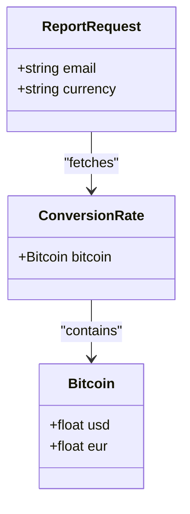
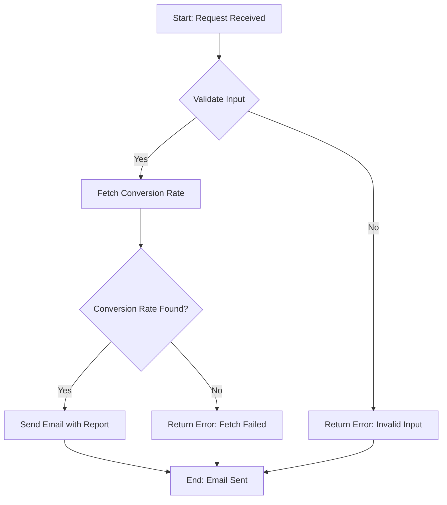

Here are the requested Mermaid diagrams based on the provided JSON design document.

### Entity Relationship (ER) Diagram

```mermaid
erDiagram
    REPORT_REQUEST {
        string email
        string currency
    }
    
    CONVERSION_RATE {
        bitcoin: {
            float usd
            float eur
        }
    }

    REPORT_REQUEST ||--o{ CONVERSION_RATE : "fetches"
```

### Class Diagram

```mermaid
classDiagram
    class ReportRequest {
        +string email
        +string currency
    }

    class ConversionRate {
        +Bitcoin bitcoin
    }

    class Bitcoin {
        +float usd
        +float eur
    }

    ReportRequest --> ConversionRate : "fetches"
    ConversionRate --> Bitcoin : "contains"
```

### Flow Chart for Workflow

#### Workflow for `report_request`

```mermaid
flowchart TD
    A[Start: Request Received] --> B{Validate Input}
    B -- Yes --> C[Fetch Conversion Rate]
    B -- No --> D[Return Error: Invalid Input]
    C --> E{Conversion Rate Found?}
    E -- Yes --> F[Send Email with Report]
    E -- No --> G[Return Error: Fetch Failed]
    F --> H[End: Email Sent]
    D --> H
    G --> H
```

### Summary
- The **ER Diagram** shows the relationship between the `report_request` and `conversion_rate` entities.
- The **Class Diagram** illustrates the structure of the `ReportRequest`, `ConversionRate`, and `Bitcoin` classes.
- The **Flow Chart** outlines the workflow for processing a report request, including validation, fetching conversion rates, and sending emails.

Feel free to ask if you need further modifications or additional diagrams!