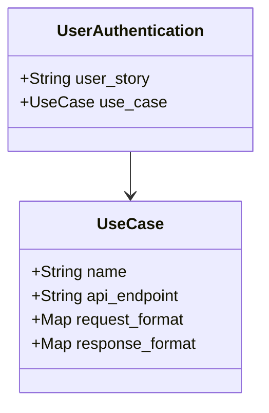
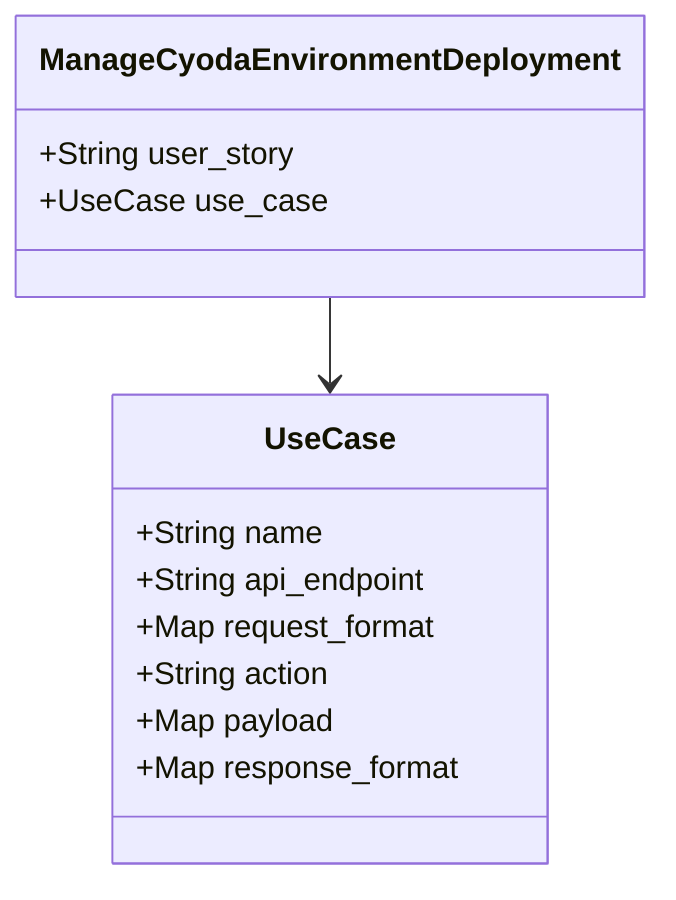
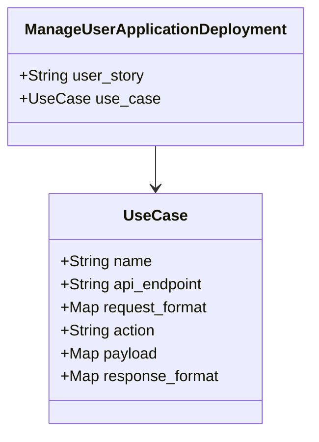
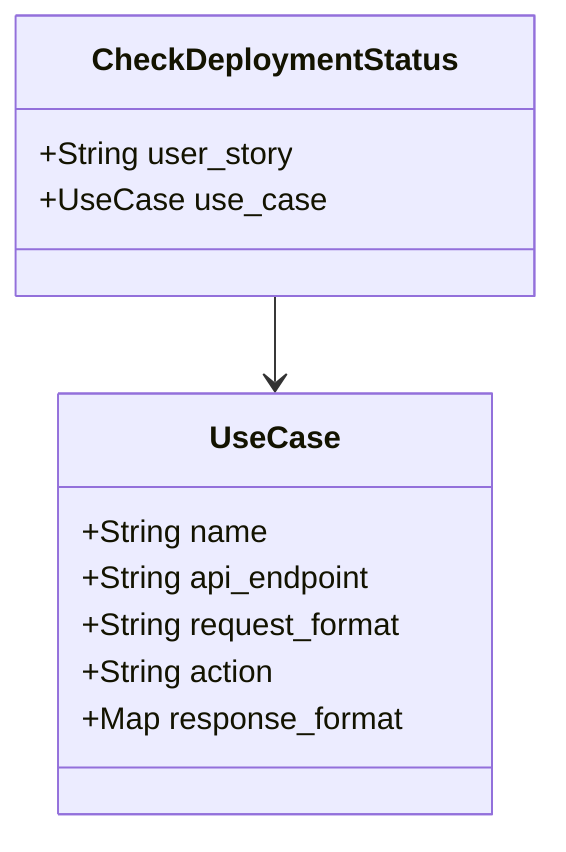
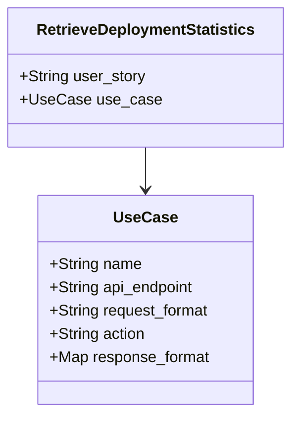
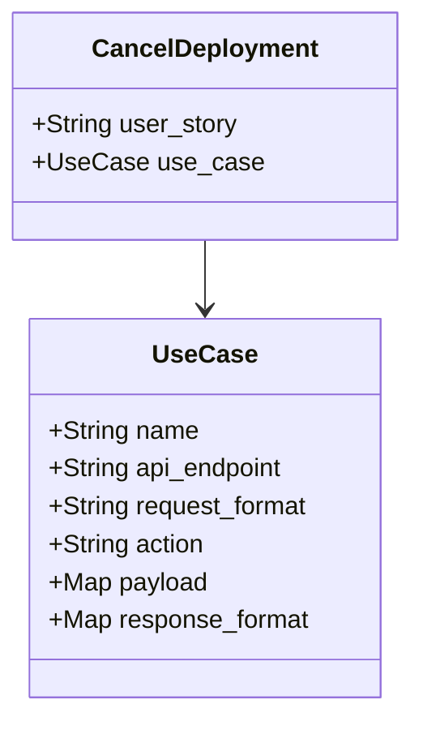

Here are the Mermaid diagrams for each entity presented in the JSON list you provided. Each entity has been transformed into an ER or class diagram format. 

### 1. User Authentication Entity Diagram

```mermaid
classDiagram
    class UserAuthentication {
        +String user_story
        +UseCase use_case
    }
    class UseCase {
        +String name
        +String api_endpoint
        +Map request_format
        +Map response_format
    }

    UserAuthentication --> UseCase
```

### 2. Manage Cyoda Environment Deployment Entity Diagram

```mermaid
classDiagram
    class ManageCyodaEnvironmentDeployment {
        +String user_story
        +UseCase use_case
    }
    class UseCase {
        +String name
        +String api_endpoint
        +Map request_format
        +String action
        +Map payload
        +Map response_format
    }

    ManageCyodaEnvironmentDeployment --> UseCase
```

### 3. Manage User Application Deployment Entity Diagram

```mermaid
classDiagram
    class ManageUserApplicationDeployment {
        +String user_story
        +UseCase use_case
    }
    class UseCase {
        +String name
        +String api_endpoint
        +Map request_format
        +String action
        +Map payload
        +Map response_format
    }

    ManageUserApplicationDeployment --> UseCase
```

### 4. Check Deployment Status Entity Diagram

```mermaid
classDiagram
    class CheckDeploymentStatus {
        +String user_story
        +UseCase use_case
    }
    class UseCase {
        +String name
        +String api_endpoint
        +String request_format
        +String action
        +Map response_format
    }

    CheckDeploymentStatus --> UseCase
```

### 5. Retrieve Deployment Statistics Entity Diagram

```mermaid
classDiagram
    class RetrieveDeploymentStatistics {
        +String user_story
        +UseCase use_case
    }
    class UseCase {
        +String name
        +String api_endpoint
        +String request_format
        +String action
        +Map response_format
    }

    RetrieveDeploymentStatistics --> UseCase
```

### 6. Cancel Deployment Entity Diagram

```mermaid
classDiagram
    class CancelDeployment {
        +String user_story
        +UseCase use_case
    }
    class UseCase {
        +String name
        +String api_endpoint
        +String request_format
        +String action
        +Map payload
        +Map response_format
    }

    CancelDeployment --> UseCase
```

### Notes:
- Each entity contains a user story and a use case breakdown.
- The `UseCase` class represents shared structure across entities, including properties like `name`, `api_endpoint`, `request_format`, `action`, `payload`, and `response_format`, which may vary by context.
- The diagrams can be rendered using Mermaid-compatible tools or Markdown editors supporting Mermaid syntax. 

Feel free to modify or extend them as needed!