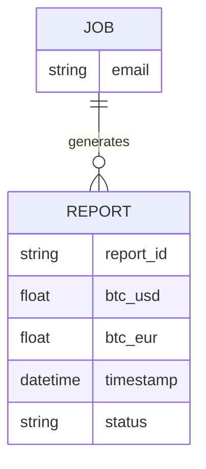
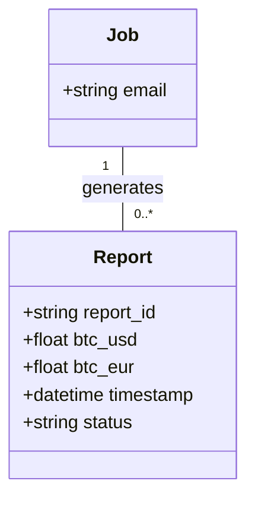
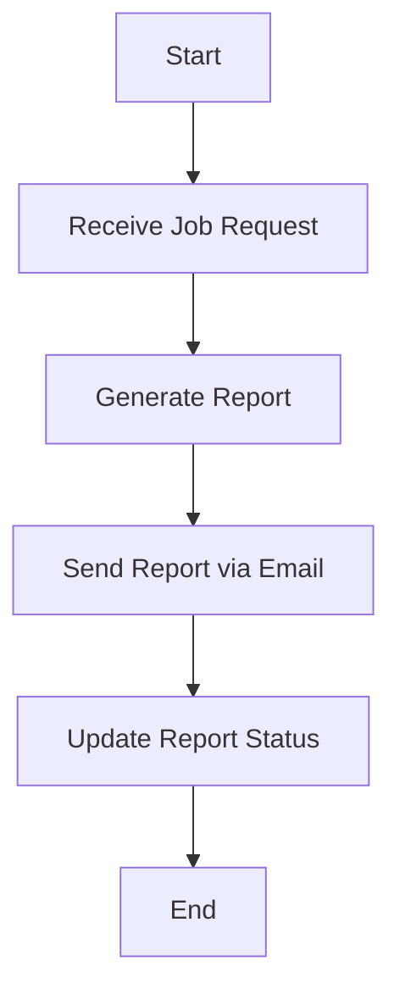

Based on the provided JSON design document, here are the Mermaid diagrams for the entities and workflows.

### Entity-Relationship Diagram (ERD)

```mermaid
erDiagram
    JOB {
        string email
    }
    
    REPORT {
        string report_id
        float btc_usd
        float btc_eur
        datetime timestamp
        string status
    }

    JOB ||--o{ REPORT : generates
```

### Class Diagram

```mermaid
classDiagram
    class Job {
        +string email
    }

    class Report {
        +string report_id
        +float btc_usd
        +float btc_eur
        +datetime timestamp
        +string status
    }

    Job "1" -- "0..*" Report : generates
```

### Flow Chart for Workflow

Assuming the workflow involves generating a report from a job, here is a simple flowchart:

```mermaid
flowchart TD
    A[Start] --> B[Receive Job Request]
    B --> C[Generate Report]
    C --> D[Send Report via Email]
    D --> E[Update Report Status]
    E --> F[End]
```

These diagrams represent the entities and their relationships as well as a basic workflow for generating a report based on the provided JSON design document.