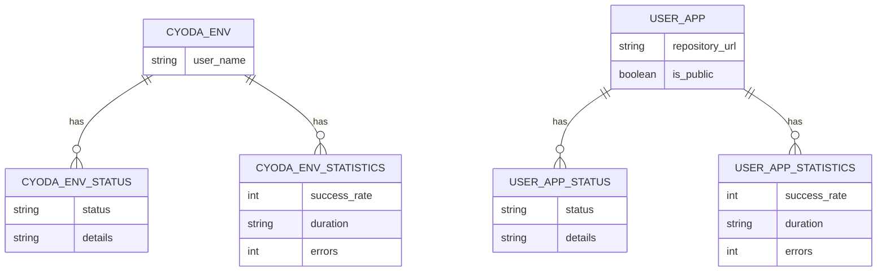
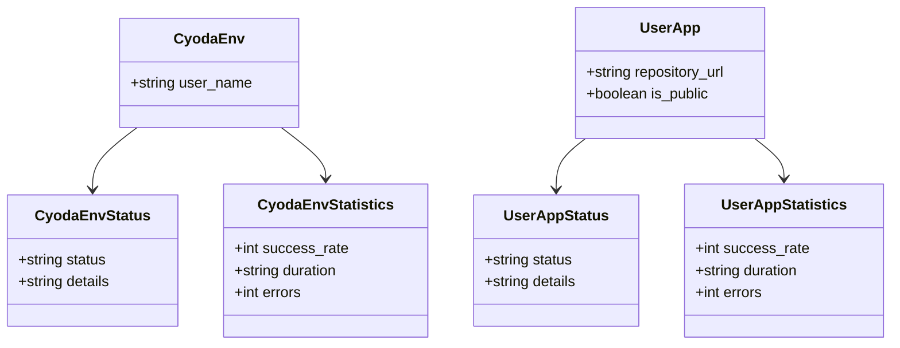
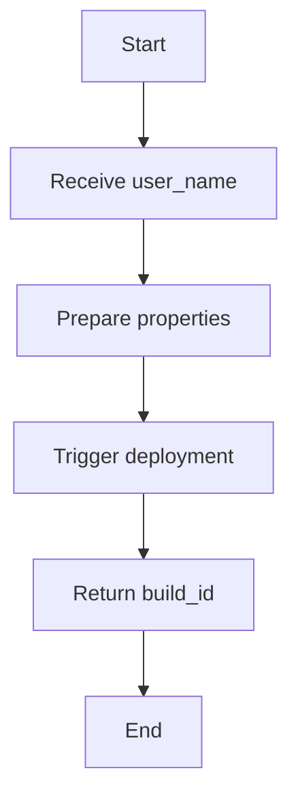
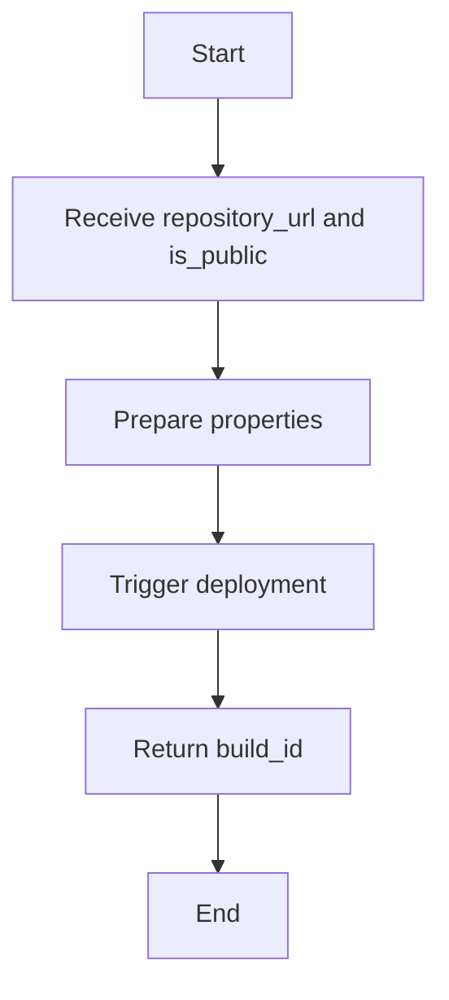

Here are the requested Mermaid diagrams based on the provided JSON design document. The diagrams include Entity-Relationship (ER) diagrams, class diagrams for each entity, and flow charts for each workflow.

### Entity-Relationship (ER) Diagram

```mermaid
erDiagram
    CYODA_ENV {
        string user_name
    }
    
    USER_APP {
        string repository_url
        boolean is_public
    }
    
    CYODA_ENV_STATUS {
        string status
        string details
    }
    
    CYODA_ENV_STATISTICS {
        int success_rate
        string duration
        int errors
    }
    
    USER_APP_STATUS {
        string status
        string details
    }
    
    USER_APP_STATISTICS {
        int success_rate
        string duration
        int errors
    }

    CYODA_ENV ||--o{ CYODA_ENV_STATUS : has
    CYODA_ENV ||--o{ CYODA_ENV_STATISTICS : has
    USER_APP ||--o{ USER_APP_STATUS : has
    USER_APP ||--o{ USER_APP_STATISTICS : has
```

### Class Diagrams

```mermaid
classDiagram
    class CyodaEnv {
        +string user_name
    }

    class UserApp {
        +string repository_url
        +boolean is_public
    }

    class CyodaEnvStatus {
        +string status
        +string details
    }

    class CyodaEnvStatistics {
        +int success_rate
        +string duration
        +int errors
    }

    class UserAppStatus {
        +string status
        +string details
    }

    class UserAppStatistics {
        +int success_rate
        +string duration
        +int errors
    }

    CyodaEnv --> CyodaEnvStatus
    CyodaEnv --> CyodaEnvStatistics
    UserApp --> UserAppStatus
    UserApp --> UserAppStatistics
```

### Flow Charts for Each Workflow

#### Workflow for Deploying Cyoda Environment

```mermaid
flowchart TD
    A[Start] --> B[Receive user_name]
    B --> C[Prepare properties]
    C --> D[Trigger deployment]
    D --> E[Return build_id]
    E --> F[End]
```

#### Workflow for Deploying User Application

```mermaid
flowchart TD
    A[Start] --> B[Receive repository_url and is_public]
    B --> C[Prepare properties]
    C --> D[Trigger deployment]
    D --> E[Return build_id]
    E --> F[End]
```

### Explanation:
- **ER Diagram**: Shows the relationships between entities, indicating that each deployment entity can have associated status and statistics.
- **Class Diagrams**: Illustrate the attributes of each entity as classes, showing their properties.
- **Flow Charts**: Represent the workflows for deploying both the Cyoda environment and user application, detailing the steps involved in each process.

These diagrams provide a clear visual representation of the system's structure and workflows based on the provided design document.