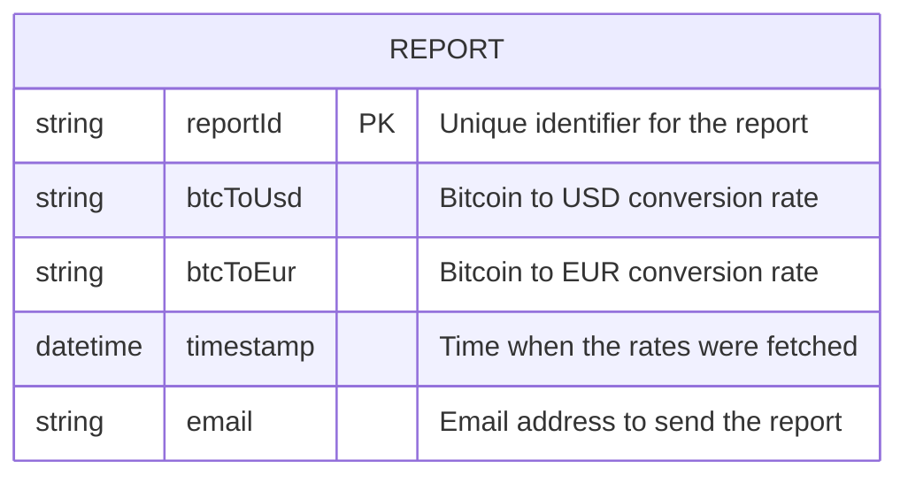
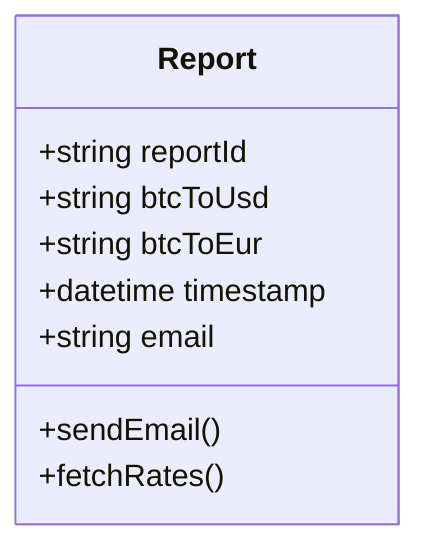
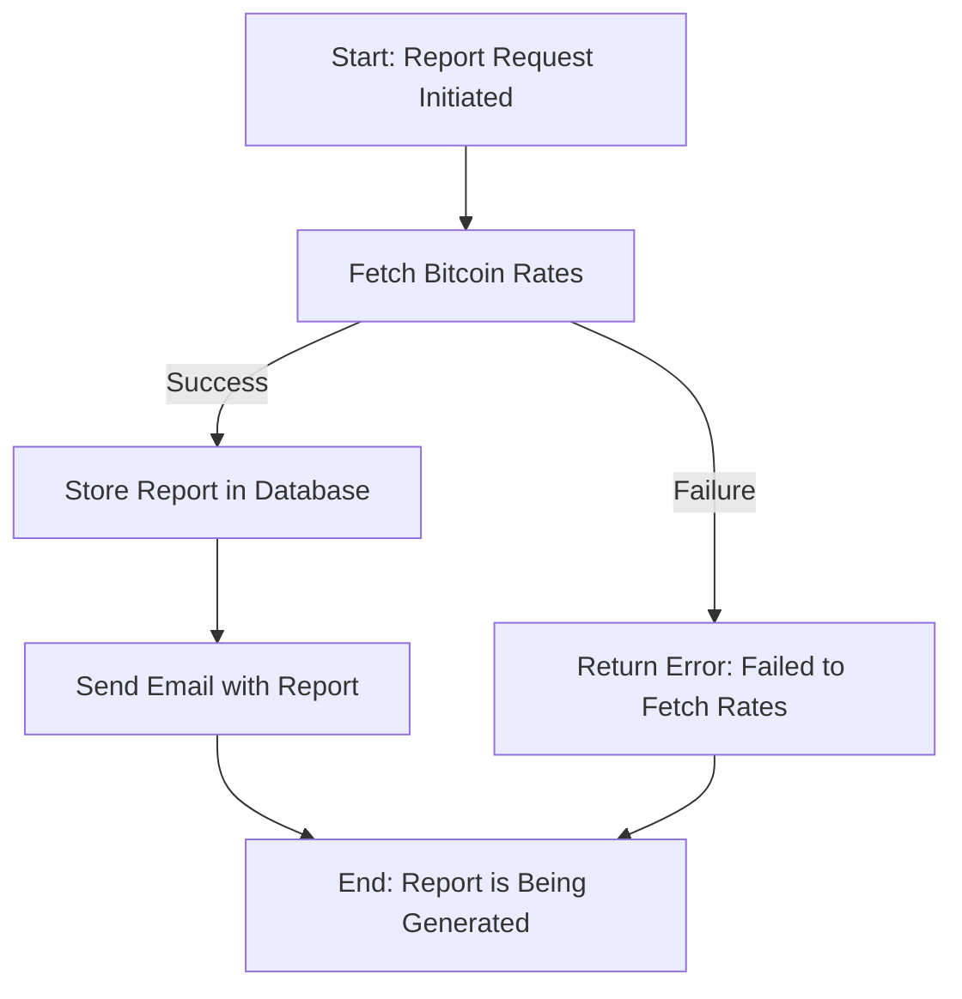

Here are the requested Mermaid diagrams based on the provided JSON design document.

### Entity-Relationship (ER) Diagram

```mermaid
erDiagram
    REPORT {
        string reportId PK "Unique identifier for the report"
        string btcToUsd "Bitcoin to USD conversion rate"
        string btcToEur "Bitcoin to EUR conversion rate"
        datetime timestamp "Time when the rates were fetched"
        string email "Email address to send the report"
    }
```

### Class Diagram

```mermaid
classDiagram
    class Report {
        +string reportId
        +string btcToUsd
        +string btcToEur
        +datetime timestamp
        +string email
        +sendEmail()
        +fetchRates()
    }
```

### Flow Chart for Workflow

#### Workflow for Report Creation

```mermaid
flowchart TD
    A[Start: Report Request Initiated] --> B[Fetch Bitcoin Rates]
    B -->|Success| C[Store Report in Database]
    C --> D[Send Email with Report]
    D --> E[End: Report is Being Generated]
    B -->|Failure| F[Return Error: Failed to Fetch Rates]
    F --> E
```

### Explanation

- **ER Diagram**: This diagram represents the `REPORT` entity with its attributes, indicating that `reportId` is the primary key.
  
- **Class Diagram**: This diagram illustrates the `Report` class, showing its attributes and methods that might be part of the class implementation.

- **Flow Chart**: This flow chart outlines the workflow for creating a report, detailing the steps from initiating the report request to either successfully sending the email or handling an error.

These diagrams provide a visual representation of the data structure and workflows based on the provided design document. If you need any further modifications or additional diagrams, please let me know!