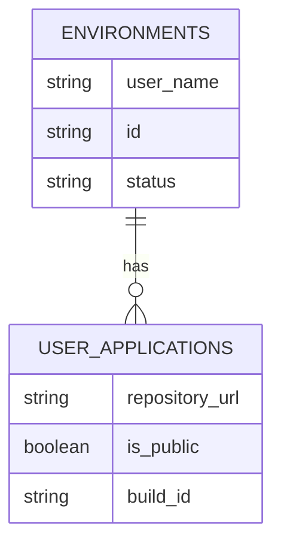
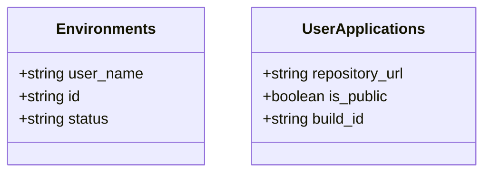
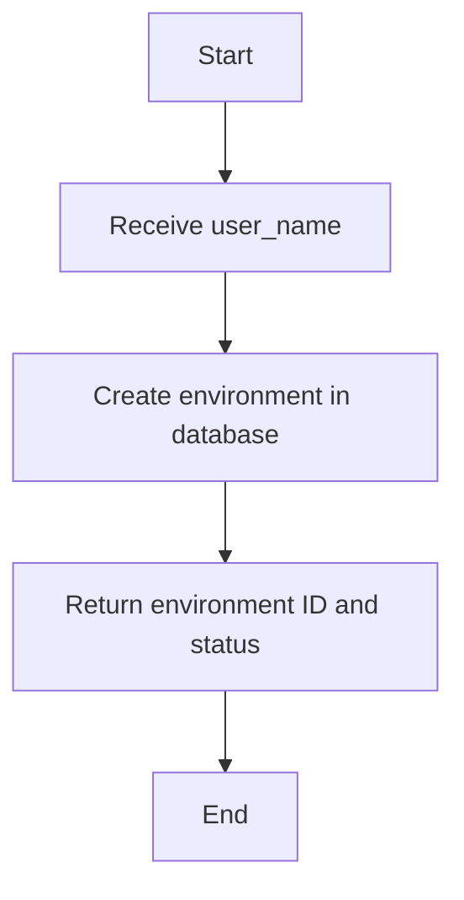
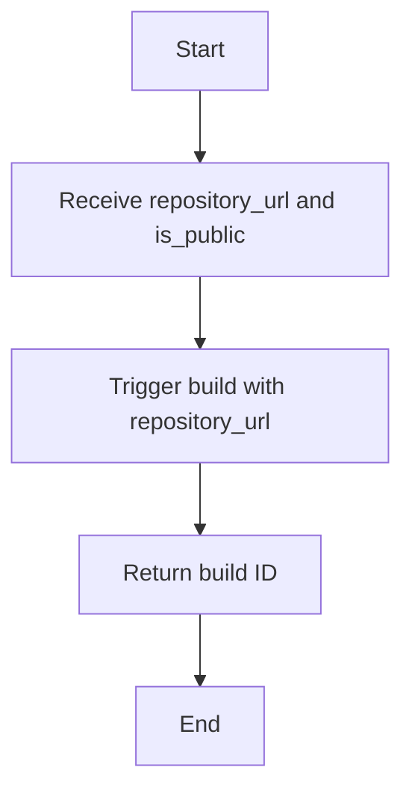
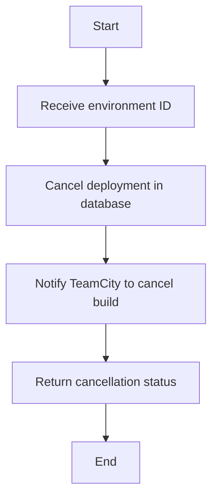
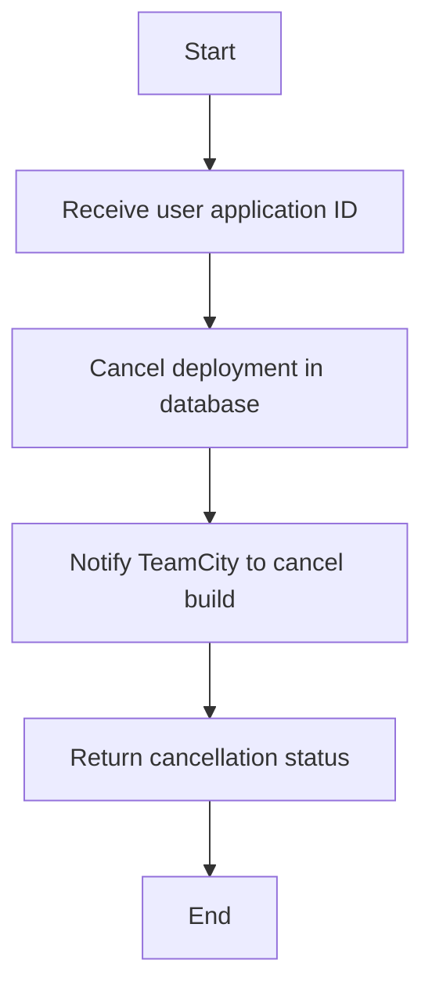

Here are the requested Mermaid diagrams based on the provided JSON design document for the entities and workflows.

### Entity Relationship (ER) Diagram

```mermaid
erDiagram
    ENVIRONMENTS {
        string user_name
        string id
        string status
    }

    USER_APPLICATIONS {
        string repository_url
        boolean is_public
        string build_id
    }

    ENVIRONMENTS ||--o{ USER_APPLICATIONS : "has"
```

### Class Diagram

```mermaid
classDiagram
    class Environments {
        +string user_name
        +string id
        +string status
    }

    class UserApplications {
        +string repository_url
        +boolean is_public
        +string build_id
    }
```

### Flow Chart for Create Environment Workflow

```mermaid
flowchart TD
    A[Start] --> B[Receive user_name]
    B --> C[Create environment in database]
    C --> D[Return environment ID and status]
    D --> E[End]
```

### Flow Chart for Deploy User Application Workflow

```mermaid
flowchart TD
    A[Start] --> B[Receive repository_url and is_public]
    B --> C[Trigger build with repository_url]
    C --> D[Return build ID]
    D --> E[End]
```

### Flow Chart for Cancel Environment Deployment Workflow

```mermaid
flowchart TD
    A[Start] --> B[Receive environment ID]
    B --> C[Cancel deployment in database]
    C --> D[Notify TeamCity to cancel build]
    D --> E[Return cancellation status]
    E --> F[End]
```

### Flow Chart for Cancel User Application Deployment Workflow

```mermaid
flowchart TD
    A[Start] --> B[Receive user application ID]
    B --> C[Cancel deployment in database]
    C --> D[Notify TeamCity to cancel build]
    D --> E[Return cancellation status]
    E --> F[End]
```

These diagrams represent the relationships between entities, their attributes, and the workflows associated with creating and managing deployments. Let me know if you need any further modifications or additional diagrams!