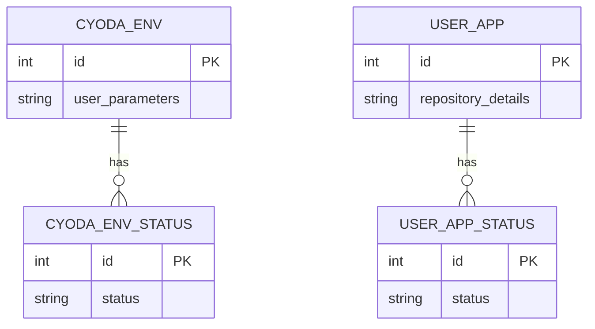
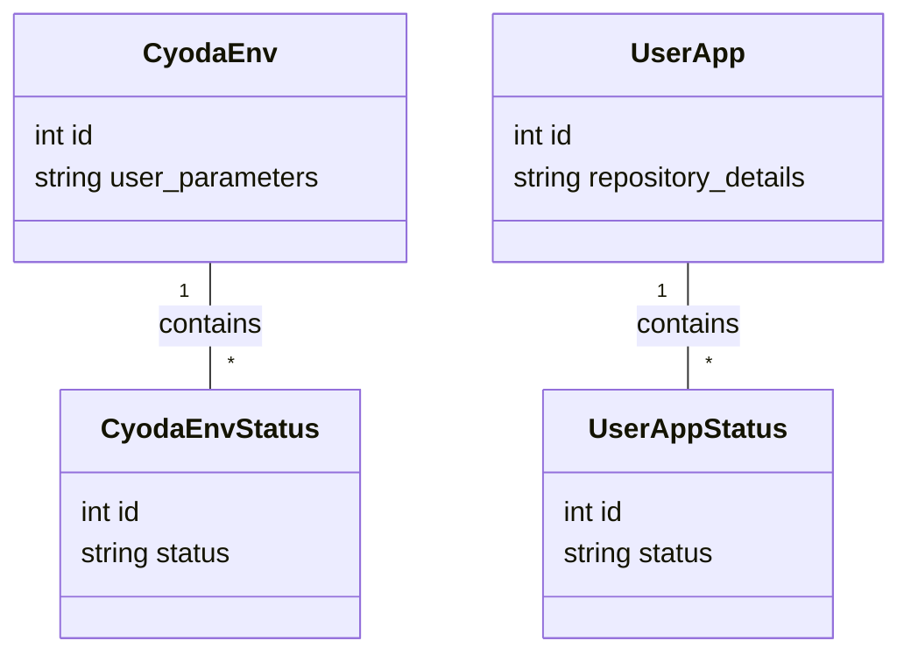
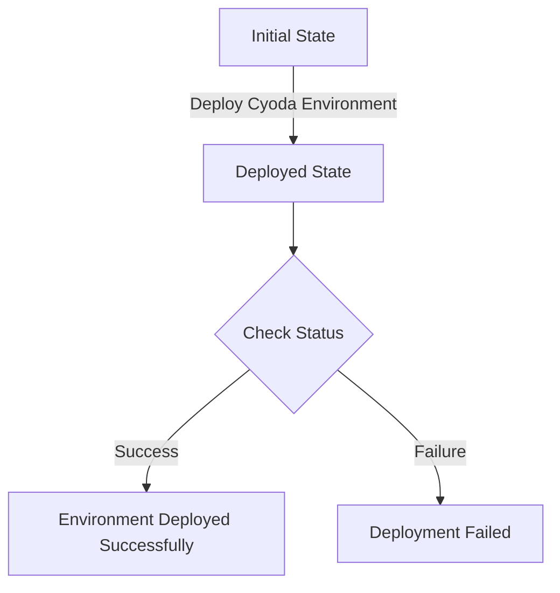
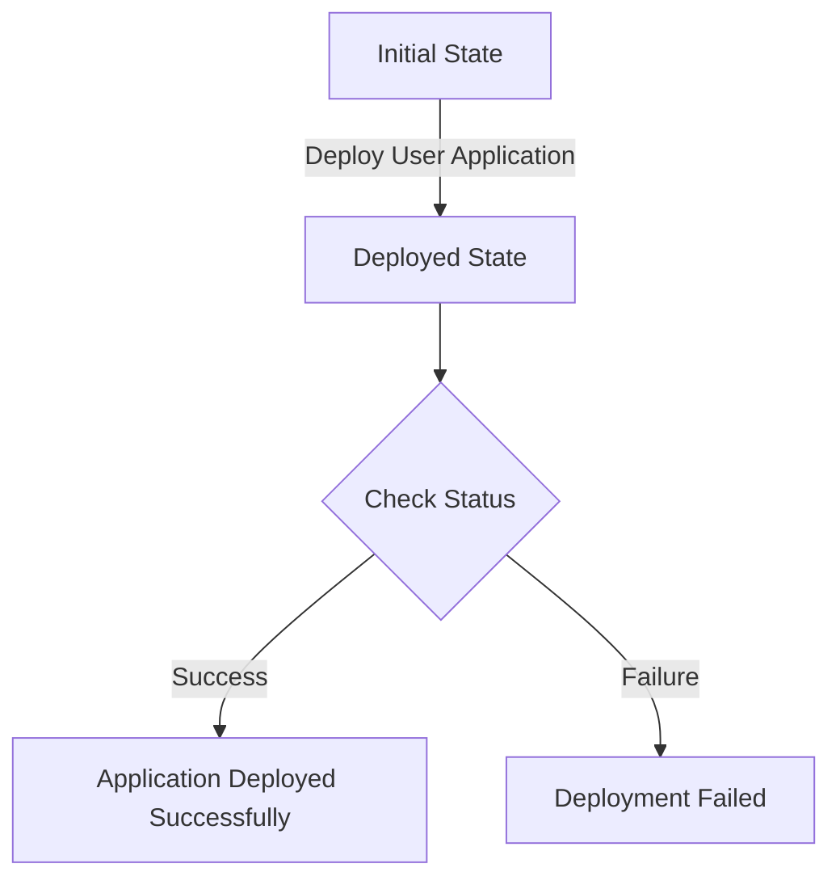
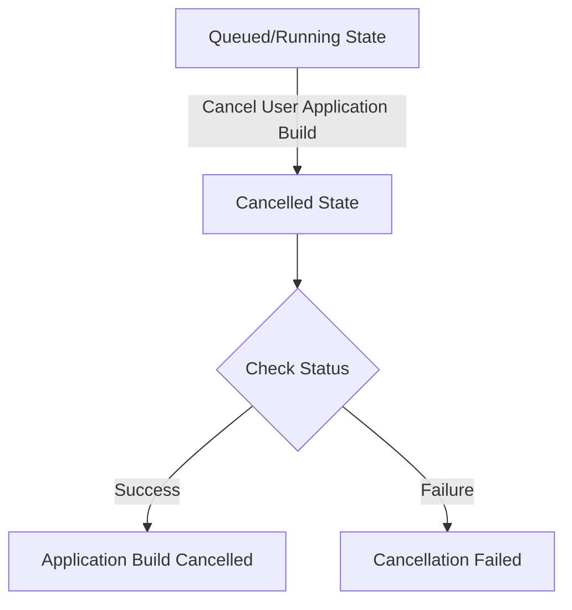

Certainly! Below are Mermaid diagrams for the provided entities and workflows:

### Entity-Relationship Diagrams (ERD)

```mermaid
erDiagram
    CYODA_ENV {
        int id PK
        string user_parameters
    }
    USER_APP {
        int id PK
        string repository_details
    }
    CYODA_ENV_STATUS {
        int id PK
        string status
    }
    USER_APP_STATUS {
        int id PK
        string status
    }

    CYODA_ENV ||--o{ CYODA_ENV_STATUS : has
    USER_APP ||--o{ USER_APP_STATUS : has
```

### Class Diagrams

```mermaid
classDiagram
    class CyodaEnv {
        int id
        string user_parameters
    }
    
    class UserApp {
        int id
        string repository_details
    }
    
    class CyodaEnvStatus {
        int id
        string status
    }
    
    class UserAppStatus {
        int id
        string status
    }

    CyodaEnv "1" -- "*" CyodaEnvStatus : contains
    UserApp "1" -- "*" UserAppStatus : contains
```

### Flows for Each Workflow

#### Workflow for Deploying Cyoda Environment

```mermaid
flowchart TD
    A[Initial State] -->|Deploy Cyoda Environment| B[Deployed State]
    B --> C{Check Status}
    C -->|Success| D[Environment Deployed Successfully]
    C -->|Failure| E[Deployment Failed]
```

#### Workflow for Deploying User Application

```mermaid
flowchart TD
    A[Initial State] -->|Deploy User Application| B[Deployed State]
    B --> C{Check Status}
    C -->|Success| D[Application Deployed Successfully]
    C -->|Failure| E[Deployment Failed]
```

#### Workflow for Cancelling User Application Build

```mermaid
flowchart TD
    A[Queued/Running State] -->|Cancel User Application Build| B[Cancelled State]
    B --> C{Check Status}
    C -->|Success| D[Application Build Cancelled]
    C -->|Failure| E[Cancellation Failed]
```

### Summary
- We've created an ERD and class diagrams for `cyoda-env`, `user_app`, and their respective statuses.
- We've also outlined the workflows for deploying a Cyoda environment, deploying a user application, and cancelling a user application build.

You can use the Mermaid syntax to visualize these diagrams in any Mermaid-compatible Markdown editor or viewer. Let me know if you need further assistance!