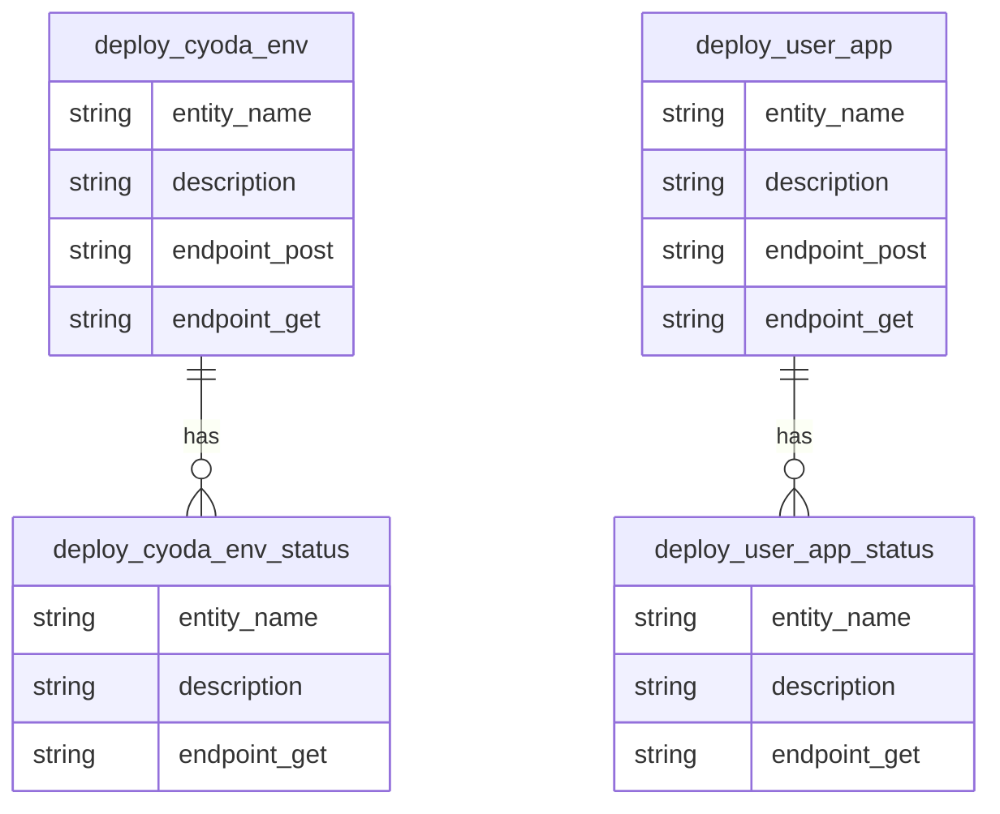
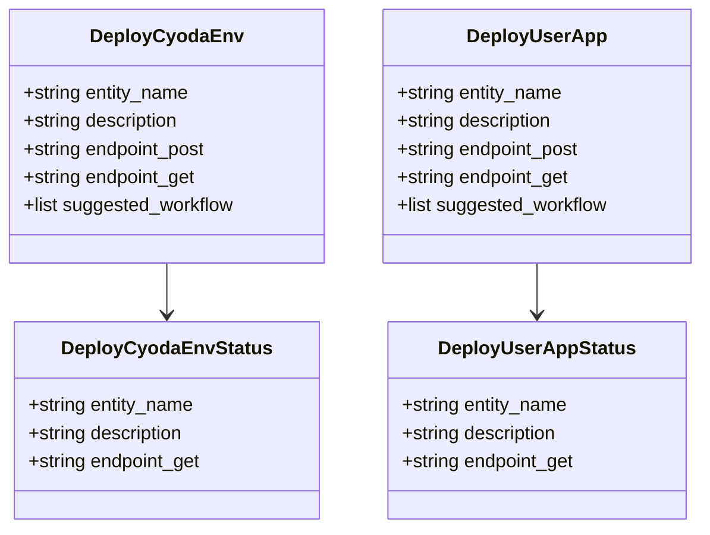
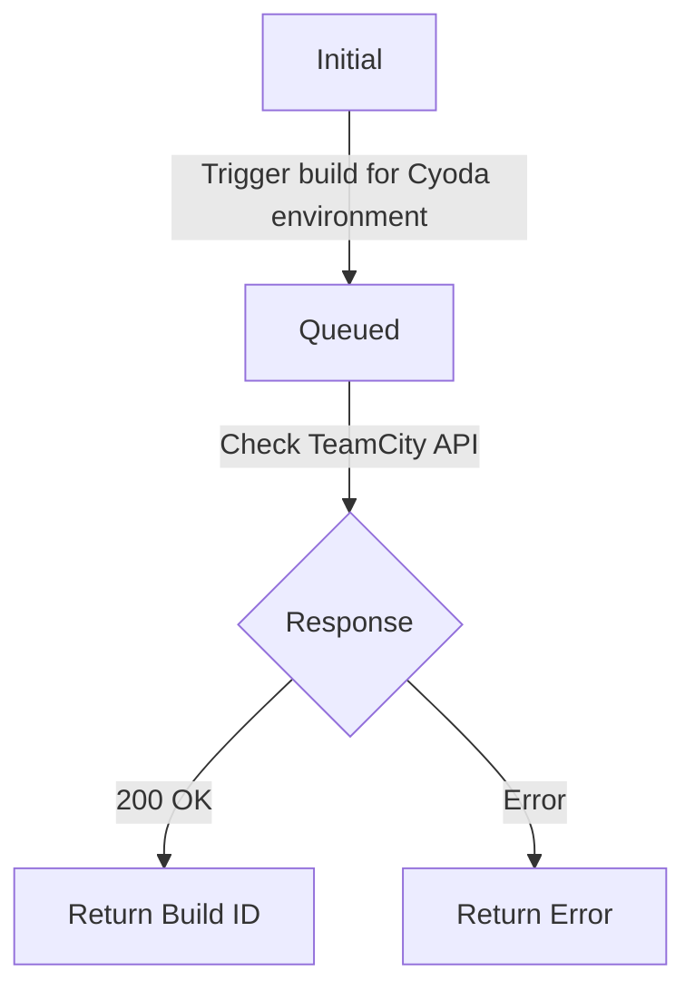
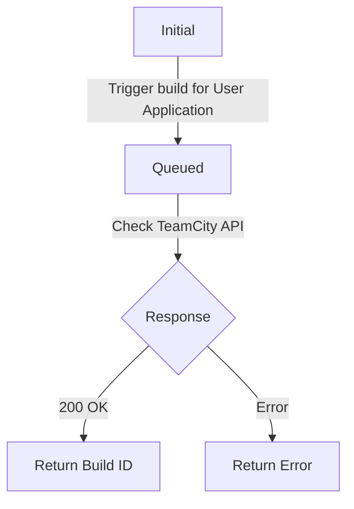
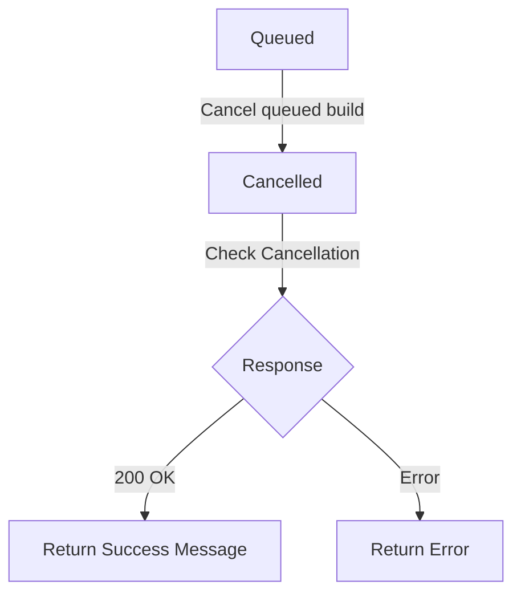
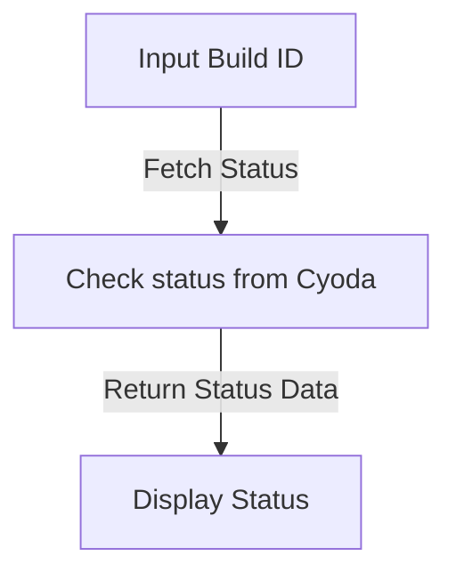
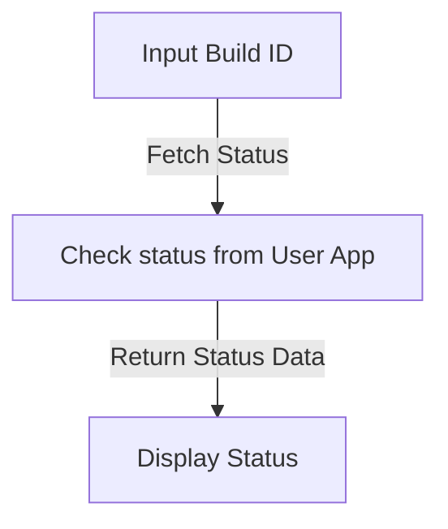

Certainly! Below are the Mermaid syntax representations for the ER diagrams, class diagrams, and flow charts based on the provided JSON structure. 

### Entity-Relationship (ER) Diagram

```mermaid
erDiagram
    deploy_cyoda_env {
        string entity_name
        string description
        string endpoint_post
        string endpoint_get
    }
    
    deploy_user_app {
        string entity_name
        string description
        string endpoint_post
        string endpoint_get
    }
    
    deploy_cyoda_env_status {
        string entity_name
        string description
        string endpoint_get
    }
    
    deploy_user_app_status {
        string entity_name
        string description
        string endpoint_get
    }

    deploy_cyoda_env ||--o{ deploy_cyoda_env_status : "has"
    deploy_user_app ||--o{ deploy_user_app_status : "has"
```

### Class Diagram

```mermaid
classDiagram
    class DeployCyodaEnv {
        +string entity_name
        +string description
        +string endpoint_post
        +string endpoint_get
        +list suggested_workflow
    }
    
    class DeployUserApp {
        +string entity_name
        +string description
        +string endpoint_post
        +string endpoint_get
        +list suggested_workflow
    }

    class DeployCyodaEnvStatus {
        +string entity_name
        +string description
        +string endpoint_get
    }

    class DeployUserAppStatus {
        +string entity_name
        +string description
        +string endpoint_get
    }

    DeployCyodaEnv --> DeployCyodaEnvStatus
    DeployUserApp --> DeployUserAppStatus
```

### Flow Charts

#### Flow Chart for `deploy/cyoda-env` POST

```mermaid
flowchart TD
    A[Initial] -->|Trigger build for Cyoda environment| B[Queued]
    B -->|Check TeamCity API| C{Response}
    C -->|200 OK| D[Return Build ID]
    C -->|Error| E[Return Error]
```

#### Flow Chart for `deploy/user_app` POST

```mermaid
flowchart TD
    A[Initial] -->|Trigger build for User Application| B[Queued]
    B -->|Check TeamCity API| C{Response}
    C -->|200 OK| D[Return Build ID]
    C -->|Error| E[Return Error]
```

#### Flow Chart for Canceling User Application Deployment

```mermaid
flowchart TD
    A[Queued] -->|Cancel queued build| B[Cancelled]
    B -->|Check Cancellation| C{Response}
    C -->|200 OK| D[Return Success Message]
    C -->|Error| E[Return Error]
```

### Additional Flow Charts for Status Checks

#### Flow Chart for `deploy/cyoda-env/status`

```mermaid
flowchart TD
    A[Input Build ID] -->|Fetch Status| B[Check status from Cyoda]
    B -->|Return Status Data| C[Display Status]
```

#### Flow Chart for `deploy/user_app/status`

```mermaid
flowchart TD
    A[Input Build ID] -->|Fetch Status| B[Check status from User App]
    B -->|Return Status Data| C[Display Status]
```

### Summary

The provided diagrams depict the structure of the entities involved in the deployment workflows, the relationships between them, and the individual steps of the workflows for triggering deployments and checking statuses. Adjustments can be made to better fit any specific requirements or additional details you may wish to include.