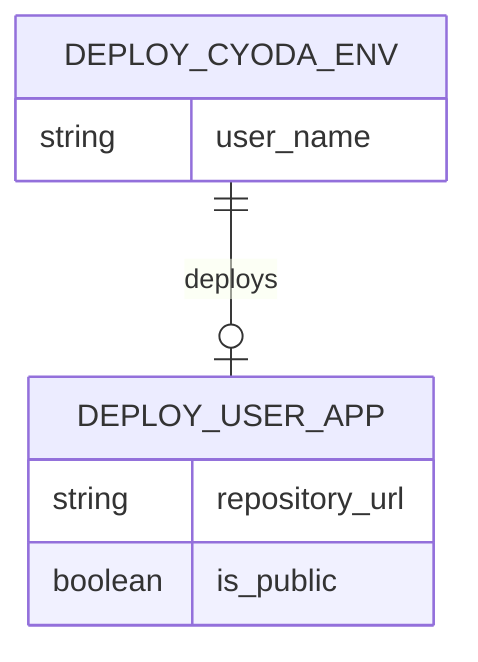
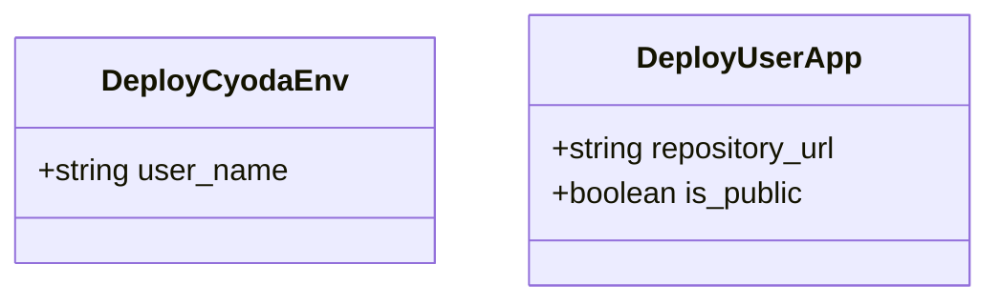
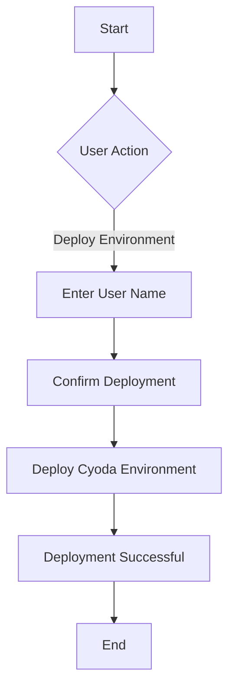
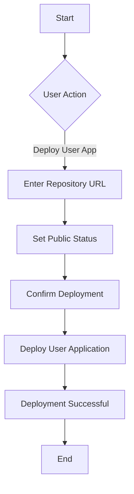

Sure! Below are the Mermaid diagrams based on the provided JSON design document, which specifies two entities: `deploy_cyoda_env` and `deploy_user_app`.

### Entity-Relationship (ER) Diagram

```mermaid
erDiagram
    DEPLOY_CYODA_ENV {
        string user_name
    }
    
    DEPLOY_USER_APP {
        string repository_url
        boolean is_public
    }
    
    DEPLOY_CYODA_ENV ||--o| DEPLOY_USER_APP : deploys
```

### Class Diagrams

```mermaid
classDiagram
    class DeployCyodaEnv {
        +string user_name
    }

    class DeployUserApp {
        +string repository_url
        +boolean is_public
    }
```

### Flow Chart for Each Workflow

1. **Workflow for `deploy_cyoda_env`**

```mermaid
flowchart TD
    A[Start] --> B{User Action}
    B -->|Deploy Environment| C[Enter User Name]
    C --> D[Confirm Deployment]
    D --> E[Deploy Cyoda Environment]
    E --> F[Deployment Successful]
    F --> G[End]
```

2. **Workflow for `deploy_user_app`**

```mermaid
flowchart TD
    A[Start] --> B{User Action}
    B -->|Deploy User App| C[Enter Repository URL]
    C --> D[Set Public Status]
    D --> E[Confirm Deployment]
    E --> F[Deploy User Application]
    F --> G[Deployment Successful]
    G --> H[End]
```

These diagrams and flowcharts reflect the structure and requirements outlined in the JSON document provided. If you have any more specifications or need further assistance, feel free to ask!