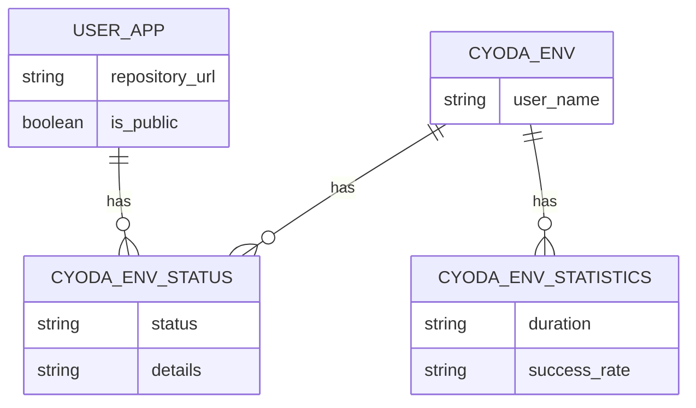
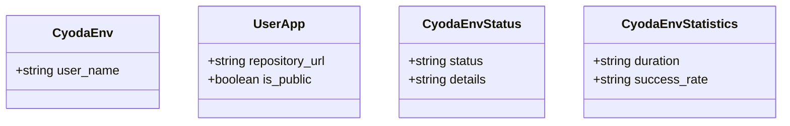
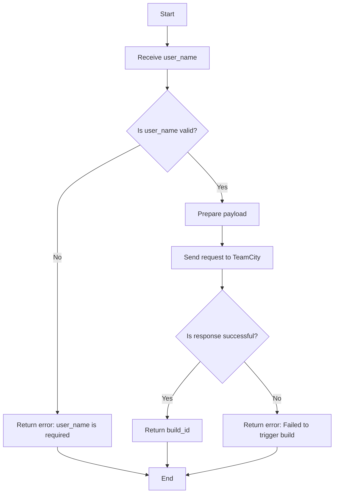
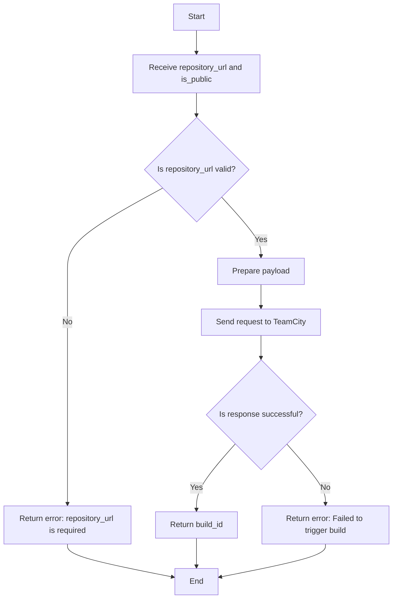

Here are the Mermaid diagrams based on the provided JSON design document, including entity-relationship (ER) diagrams, class diagrams for each entity, and flowcharts for each workflow.

### Entity-Relationship (ER) Diagram

```mermaid
erDiagram
    CYODA_ENV {
        string user_name
    }
    
    USER_APP {
        string repository_url
        boolean is_public
    }
    
    CYODA_ENV_STATUS {
        string status
        string details
    }
    
    CYODA_ENV_STATISTICS {
        string duration
        string success_rate
    }

    CYODA_ENV ||--o{ CYODA_ENV_STATUS : has
    CYODA_ENV ||--o{ CYODA_ENV_STATISTICS : has
    USER_APP ||--o{ CYODA_ENV_STATUS : has
```

### Class Diagrams

```mermaid
classDiagram
    class CyodaEnv {
        +string user_name
    }

    class UserApp {
        +string repository_url
        +boolean is_public
    }

    class CyodaEnvStatus {
        +string status
        +string details
    }

    class CyodaEnvStatistics {
        +string duration
        +string success_rate
    }
```

### Flowchart for Deploy Cyoda Environment Workflow

```mermaid
flowchart TD
    A[Start] --> B[Receive user_name]
    B --> C{Is user_name valid?}
    C -- Yes --> D[Prepare payload]
    C -- No --> E[Return error: user_name is required]
    D --> F[Send request to TeamCity]
    F --> G{Is response successful?}
    G -- Yes --> H[Return build_id]
    G -- No --> I[Return error: Failed to trigger build]
    E --> J[End]
    H --> J
    I --> J
```

### Flowchart for Deploy User Application Workflow

```mermaid
flowchart TD
    A[Start] --> B[Receive repository_url and is_public]
    B --> C{Is repository_url valid?}
    C -- Yes --> D[Prepare payload]
    C -- No --> E[Return error: repository_url is required]
    D --> F[Send request to TeamCity]
    F --> G{Is response successful?}
    G -- Yes --> H[Return build_id]
    G -- No --> I[Return error: Failed to trigger build]
    E --> J[End]
    H --> J
    I --> J
```

These diagrams represent the structure and workflows of the entities as specified in your design document. You can use these diagrams to visualize the relationships and processes in your application.