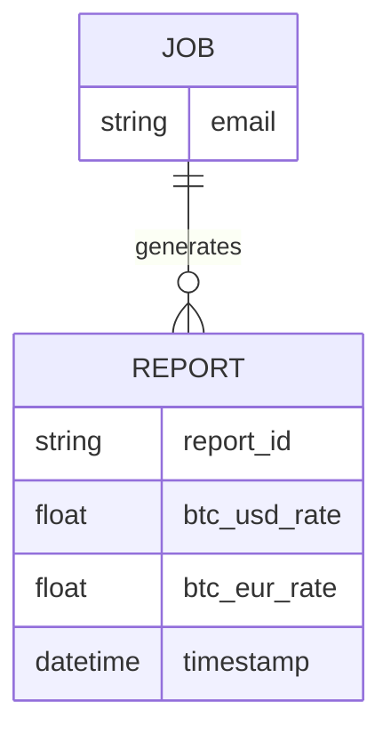
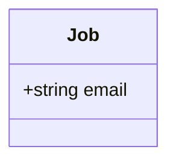
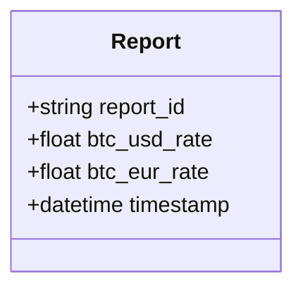
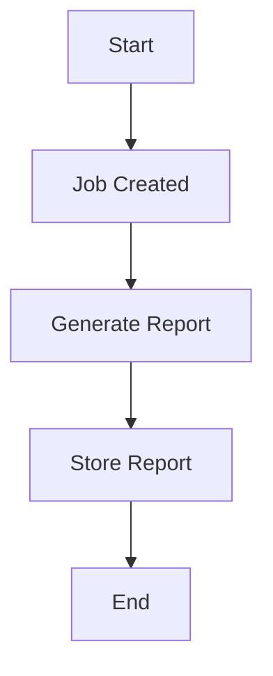

Based on the provided JSON design document, I will create the requested Mermaid diagrams: an Entity-Relationship (ER) diagram for the entities, a class diagram for each entity, and a flowchart for the workflow. 

### Mermaid ER Diagram

```mermaid
erDiagram
    JOB {
        string email
    }
    
    REPORT {
        string report_id
        float btc_usd_rate
        float btc_eur_rate
        datetime timestamp
    }

    JOB ||--o{ REPORT : generates
```

### Mermaid Class Diagrams

#### Class Diagram for Job

```mermaid
classDiagram
    class Job {
        +string email
    }
```

#### Class Diagram for Report

```mermaid
classDiagram
    class Report {
        +string report_id
        +float btc_usd_rate
        +float btc_eur_rate
        +datetime timestamp
    }
```

### Mermaid Flowchart for Workflow

Assuming a simple workflow where a job generates a report, the flowchart can be represented as follows:

```mermaid
flowchart TD
    A[Start] --> B[Job Created]
    B --> C[Generate Report]
    C --> D[Store Report]
    D --> E[End]
```

### Summary

- The ER diagram shows the relationship between the `Job` and `Report` entities.
- The class diagrams define the attributes of each entity.
- The flowchart illustrates a basic workflow of how a job generates a report.

Feel free to ask if you need further modifications or additional details!