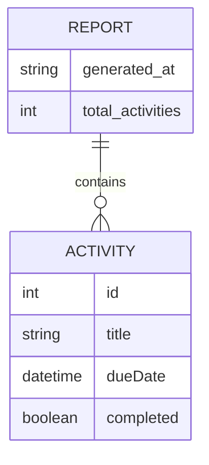
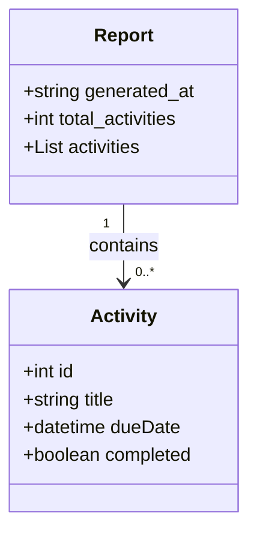
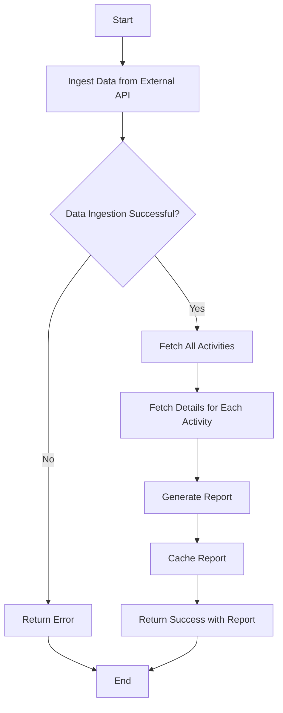

Based on the provided JSON design document, here are the Mermaid diagrams for the entity relationship (ER) diagrams, class diagrams for each entity, and flow charts for each workflow.

### 1. Entity Relationship (ER) Diagram

```mermaid
erDiagram
    REPORT {
        string generated_at
        int total_activities
    }

    ACTIVITY {
        int id
        string title
        datetime dueDate
        boolean completed
    }

    REPORT ||--o{ ACTIVITY : contains
```

### Explanation:
- The `REPORT` entity contains attributes such as `generated_at` and `total_activities`.
- The `ACTIVITY` entity has attributes like `id`, `title`, `dueDate`, and `completed`.
- The relationship indicates that a report can contain multiple activities (`contains`).

---

### 2. Class Diagram

```mermaid
classDiagram
    class Report {
        +string generated_at
        +int total_activities
        +List<Activity> activities
    }

    class Activity {
        +int id
        +string title
        +datetime dueDate
        +boolean completed
    }

    Report "1" --> "0..*" Activity : contains
```

### Explanation:
- The `Report` class includes attributes for the generation time, total number of activities, and a list of activities.
- The `Activity` class includes properties for ID, title, due date, and completion status.
- The association indicates that one report can contain zero or more activities.

---

### 3. Flow Chart for Workflow of Generating a Report

```mermaid
flowchart TD
    A[Start] --> B[Ingest Data from External API]
    B --> C{Data Ingestion Successful?}
    C -- Yes --> D[Fetch All Activities]
    C -- No --> E[Return Error]
    D --> F[Fetch Details for Each Activity]
    F --> G[Generate Report]
    G --> H[Cache Report]
    H --> I[Return Success with Report]
    E --> J[End]
    I --> J
```

### Explanation:
- The flow chart illustrates the workflow for generating a report.
- It starts with ingesting data from the external API.
- It checks if the data ingestion is successful. If it is, it proceeds to fetch all activities and their details.
- After generating the report, it caches the report and returns success. If there is an error during data ingestion, it directly returns an error.

These diagrams provide a clear representation of the entities, their relationships, and the workflows based on the JSON design document you provided. If you have any further requests or need additional details, feel free to ask!