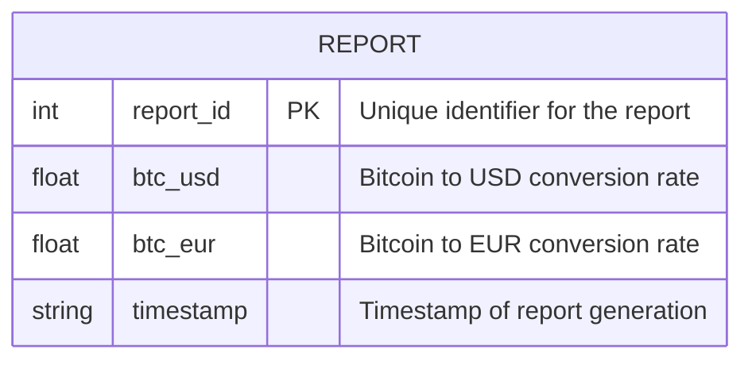
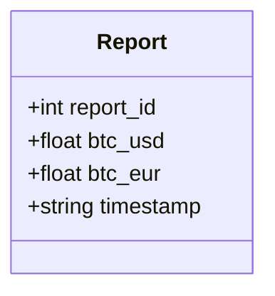
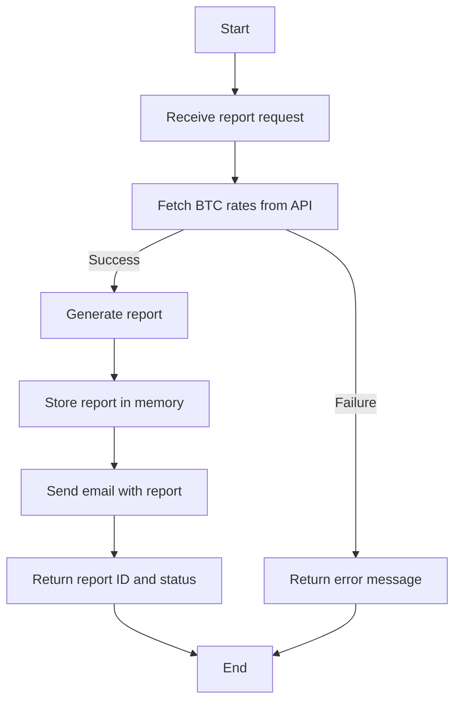

Here are the requested Mermaid diagrams based on the provided JSON design document. 

### Entity-Relationship (ER) Diagram

This ER diagram represents the `report` entity and its attributes.

```mermaid
erDiagram
    REPORT {
        int report_id PK "Unique identifier for the report"
        float btc_usd "Bitcoin to USD conversion rate"
        float btc_eur "Bitcoin to EUR conversion rate"
        string timestamp "Timestamp of report generation"
    }
```

### Class Diagram

This class diagram represents the `report` entity as a class with its attributes.

```mermaid
classDiagram
    class Report {
        +int report_id
        +float btc_usd
        +float btc_eur
        +string timestamp
    }
```

### Flow Chart for Workflow

This flow chart represents the workflow for the `request_report` process, which includes fetching Bitcoin rates, generating a report, and sending an email.

```mermaid
flowchart TD
    A[Start] --> B[Receive report request]
    B --> C[Fetch BTC rates from API]
    C -->|Success| D[Generate report]
    D --> E[Store report in memory]
    E --> F[Send email with report]
    F --> G[Return report ID and status]
    C -->|Failure| H[Return error message]
    G --> I[End]
    H --> I
```

These diagrams provide a visual representation of the `report` entity and the workflow associated with generating a report. If you need further modifications or additional diagrams, feel free to ask!