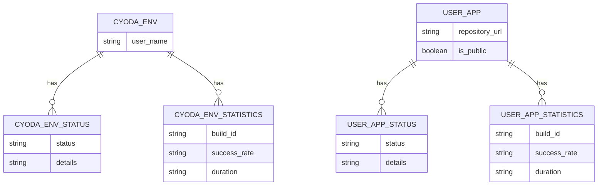
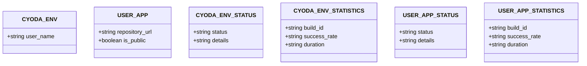
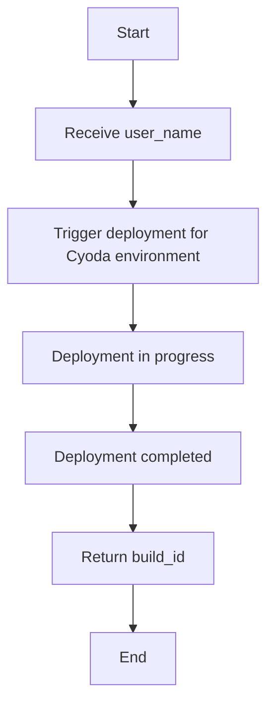
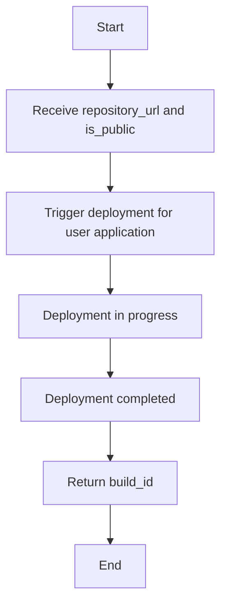

Here are the Mermaid diagrams based on the provided JSON design document. The diagrams include Entity-Relationship (ER) diagrams, class diagrams for each entity, and flowcharts for the workflows.

### Entity-Relationship Diagrams (ERD)

```mermaid
erDiagram
    CYODA_ENV {
        string user_name
    }
    USER_APP {
        string repository_url
        boolean is_public
    }
    CYODA_ENV_STATUS {
        string status
        string details
    }
    CYODA_ENV_STATISTICS {
        string build_id
        string success_rate
        string duration
    }
    USER_APP_STATUS {
        string status
        string details
    }
    USER_APP_STATISTICS {
        string build_id
        string success_rate
        string duration
    }

    CYODA_ENV ||--o{ CYODA_ENV_STATUS : has
    CYODA_ENV ||--o{ CYODA_ENV_STATISTICS : has
    USER_APP ||--o{ USER_APP_STATUS : has
    USER_APP ||--o{ USER_APP_STATISTICS : has
```

### Class Diagrams

```mermaid
classDiagram
    class CYODA_ENV {
        +string user_name
    }

    class USER_APP {
        +string repository_url
        +boolean is_public
    }

    class CYODA_ENV_STATUS {
        +string status
        +string details
    }

    class CYODA_ENV_STATISTICS {
        +string build_id
        +string success_rate
        +string duration
    }

    class USER_APP_STATUS {
        +string status
        +string details
    }

    class USER_APP_STATISTICS {
        +string build_id
        +string success_rate
        +string duration
    }
```

### Flowcharts for Workflows

#### Workflow for Deploying Cyoda Environment

```mermaid
flowchart TD
    A[Start] --> B[Receive user_name]
    B --> C[Trigger deployment for Cyoda environment]
    C --> D[Deployment in progress]
    D --> E[Deployment completed]
    E --> F[Return build_id]
    F --> G[End]
```

#### Workflow for Deploying User Application

```mermaid
flowchart TD
    A[Start] --> B[Receive repository_url and is_public]
    B --> C[Trigger deployment for user application]
    C --> D[Deployment in progress]
    D --> E[Deployment completed]
    E --> F[Return build_id]
    F --> G[End]
```

These diagrams represent the structure and workflows of your application based on the provided JSON design document. If you need any adjustments or additional diagrams, feel free to ask!