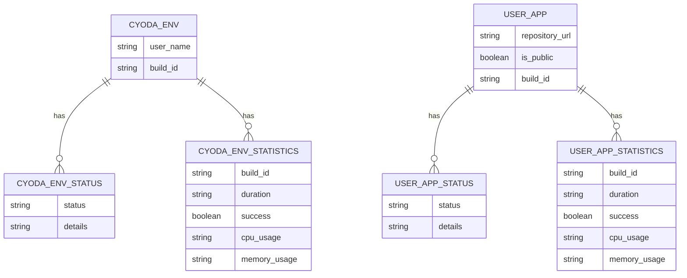
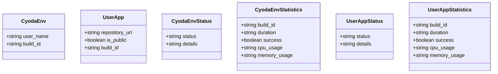
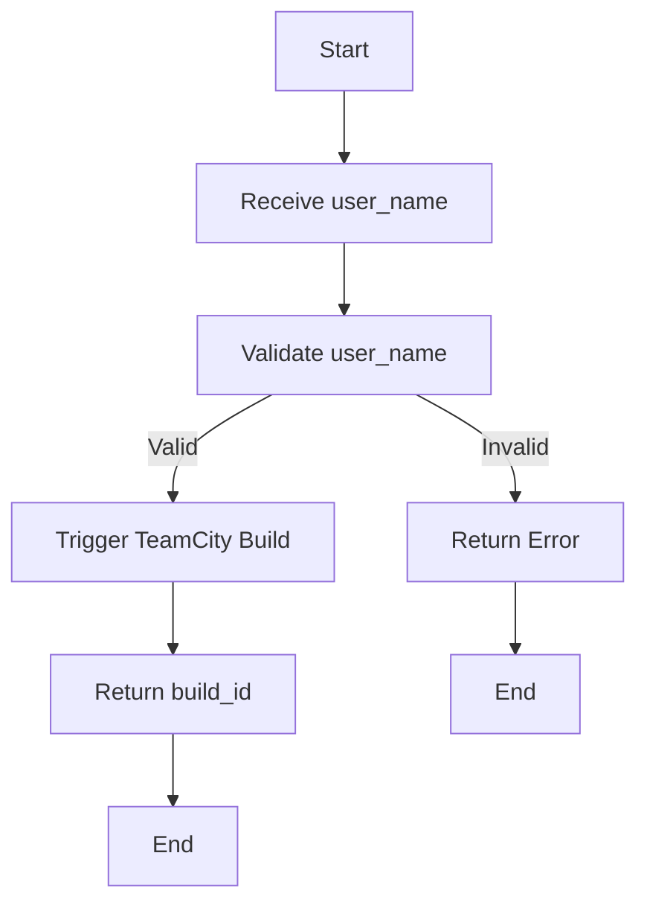
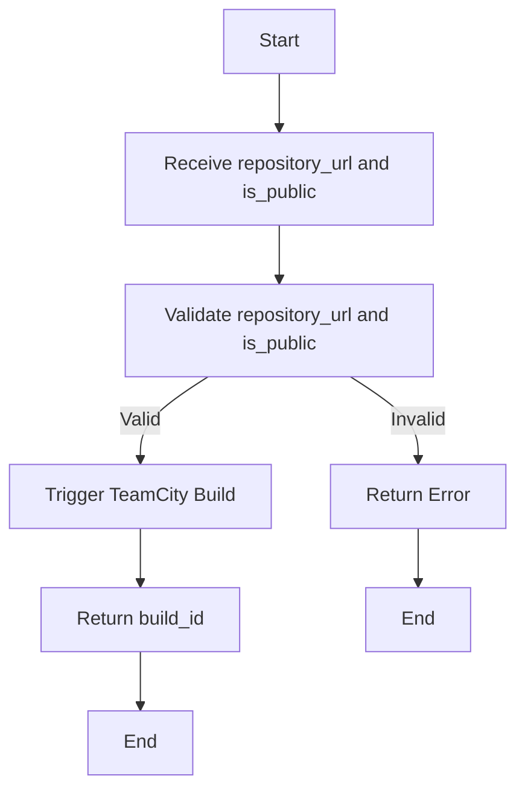

Here are the Mermaid diagrams based on the provided JSON design document, including Entity-Relationship (ER) diagrams, class diagrams for each entity, and flowcharts for each workflow.

### Entity-Relationship (ER) Diagram

```mermaid
erDiagram
    CYODA_ENV {
        string user_name
        string build_id
    }
    USER_APP {
        string repository_url
        boolean is_public
        string build_id
    }
    CYODA_ENV_STATUS {
        string status
        string details
    }
    CYODA_ENV_STATISTICS {
        string build_id
        string duration
        boolean success
        string cpu_usage
        string memory_usage
    }
    USER_APP_STATUS {
        string status
        string details
    }
    USER_APP_STATISTICS {
        string build_id
        string duration
        boolean success
        string cpu_usage
        string memory_usage
    }

    CYODA_ENV ||--o{ CYODA_ENV_STATUS : has
    CYODA_ENV ||--o{ CYODA_ENV_STATISTICS : has
    USER_APP ||--o{ USER_APP_STATUS : has
    USER_APP ||--o{ USER_APP_STATISTICS : has
```

### Class Diagrams

```mermaid
classDiagram
    class CyodaEnv {
        +string user_name
        +string build_id
    }

    class UserApp {
        +string repository_url
        +boolean is_public
        +string build_id
    }

    class CyodaEnvStatus {
        +string status
        +string details
    }

    class CyodaEnvStatistics {
        +string build_id
        +string duration
        +boolean success
        +string cpu_usage
        +string memory_usage
    }

    class UserAppStatus {
        +string status
        +string details
    }

    class UserAppStatistics {
        +string build_id
        +string duration
        +boolean success
        +string cpu_usage
        +string memory_usage
    }
```

### Flowcharts for Each Workflow

#### Workflow for Deploying Cyoda Environment

```mermaid
flowchart TD
    A[Start] --> B[Receive user_name]
    B --> C[Validate user_name]
    C -->|Valid| D[Trigger TeamCity Build]
    C -->|Invalid| E[Return Error]
    D --> F[Return build_id]
    E --> G[End]
    F --> H[End]
```

#### Workflow for Deploying User Application

```mermaid
flowchart TD
    A[Start] --> B[Receive repository_url and is_public]
    B --> C[Validate repository_url and is_public]
    C -->|Valid| D[Trigger TeamCity Build]
    C -->|Invalid| E[Return Error]
    D --> F[Return build_id]
    E --> G[End]
    F --> H[End]
```

### Notes:
- The ER diagrams illustrate the relationships between entities, indicating that each deployment entity (Cyoda environment and user application) can have associated status and statistics entities.
- The class diagrams represent the structure of each entity with their attributes.
- The flowcharts outline the workflows for deploying both the Cyoda environment and user application, showing the steps involved in processing requests and handling validation. 

Feel free to use these diagrams as part of your documentation or for further development discussions!