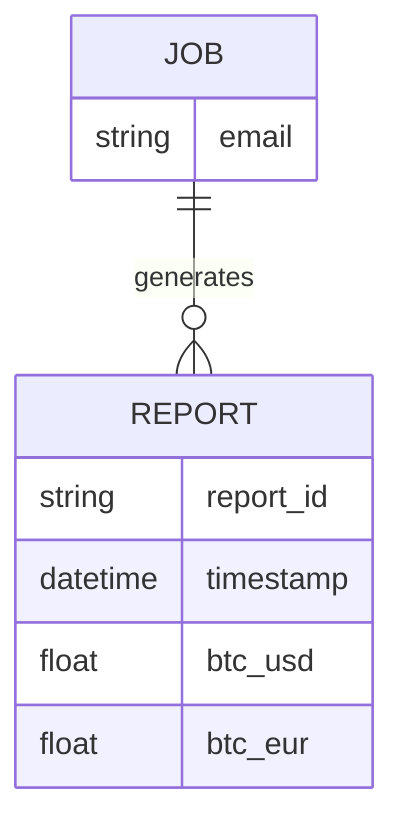
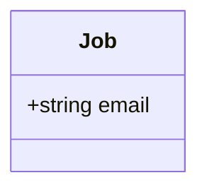
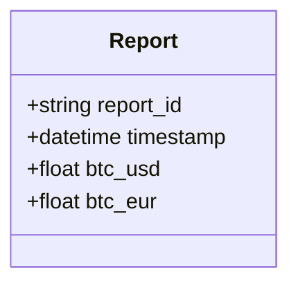
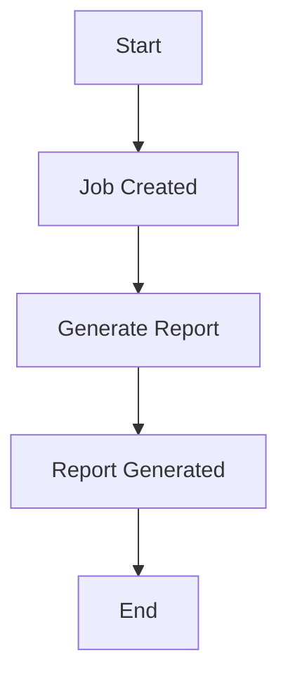

Based on the provided JSON design document, I will create the requested Mermaid diagrams: an Entity-Relationship (ER) diagram, a class diagram for each entity, and a flowchart for the workflow. 

### 1. Entity-Relationship (ER) Diagram

```mermaid
erDiagram
    JOB {
        string email
    }
    
    REPORT {
        string report_id
        datetime timestamp
        float btc_usd
        float btc_eur
    }

    JOB ||--o{ REPORT : generates
```

### 2. Class Diagrams

#### Class Diagram for Job

```mermaid
classDiagram
    class Job {
        +string email
    }
```

#### Class Diagram for Report

```mermaid
classDiagram
    class Report {
        +string report_id
        +datetime timestamp
        +float btc_usd
        +float btc_eur
    }
```

### 3. Flowchart for Workflow

Assuming a simple workflow where a job generates a report, the flowchart can be represented as follows:

```mermaid
flowchart TD
    A[Start] --> B[Job Created]
    B --> C[Generate Report]
    C --> D[Report Generated]
    D --> E[End]
```

### Summary

- The ER diagram shows the relationship between the `Job` and `Report` entities.
- Each class diagram provides the structure of the `Job` and `Report` entities.
- The flowchart illustrates a simple workflow from job creation to report generation. 

Feel free to ask if you need any modifications or additional details!