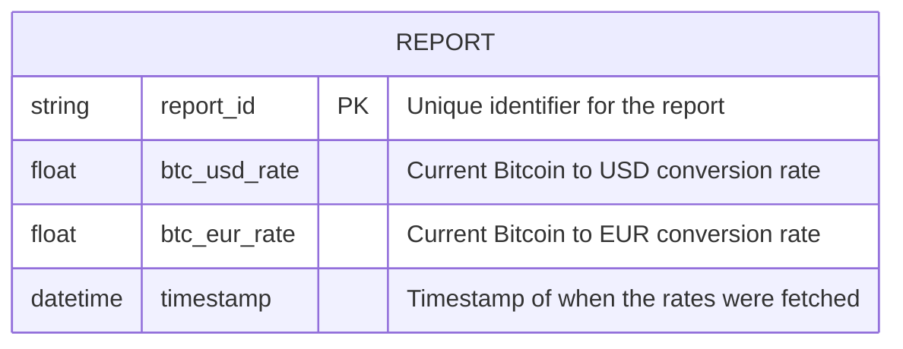
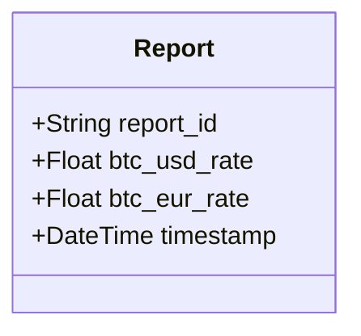
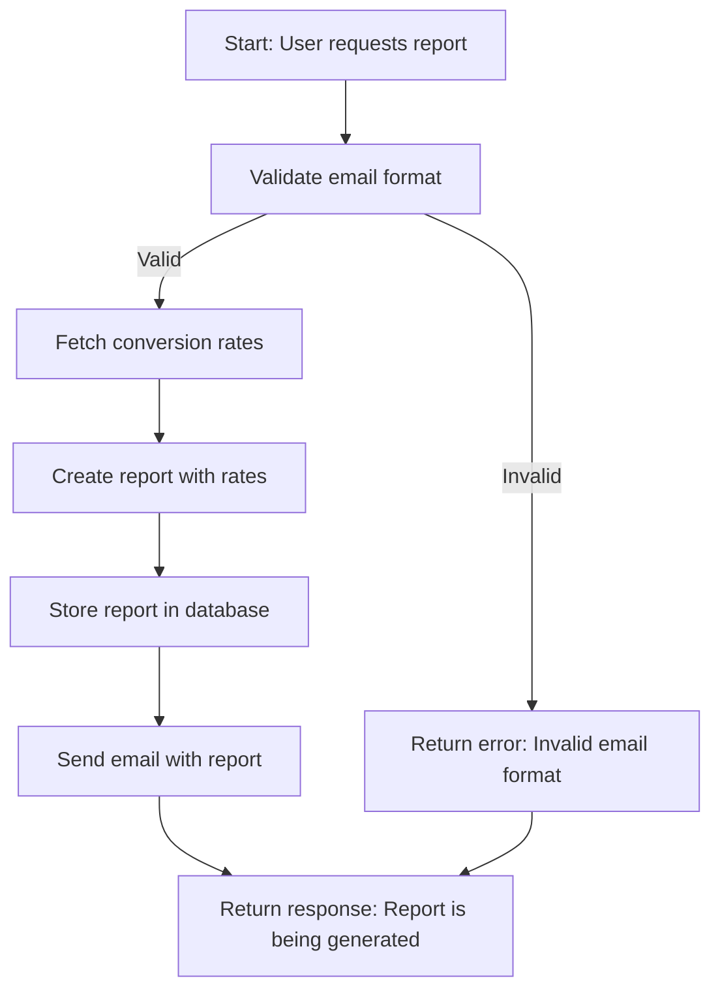

Here are the requested Mermaid diagrams based on the provided JSON design document.

### Entity-Relationship (ER) Diagram

```mermaid
erDiagram
    REPORT {
        string report_id PK "Unique identifier for the report"
        float btc_usd_rate "Current Bitcoin to USD conversion rate"
        float btc_eur_rate "Current Bitcoin to EUR conversion rate"
        datetime timestamp "Timestamp of when the rates were fetched"
    }
```

### Class Diagram

```mermaid
classDiagram
    class Report {
        +String report_id
        +Float btc_usd_rate
        +Float btc_eur_rate
        +DateTime timestamp
    }
```

### Workflow Flowchart

For the workflow associated with the `report` entity, specifically the report creation process, here’s the flowchart:

```mermaid
flowchart TD
    A[Start: User requests report] --> B[Validate email format]
    B -->|Valid| C[Fetch conversion rates]
    B -->|Invalid| D[Return error: Invalid email format]
    C --> E[Create report with rates]
    E --> F[Store report in database]
    F --> G[Send email with report]
    G --> H[Return response: Report is being generated]
    D --> H
```

### Summary

- The **ER Diagram** shows the structure of the `report` entity with its attributes.
- The **Class Diagram** represents the `Report` class with its properties.
- The **Flowchart** outlines the workflow for creating a report, including validation, fetching rates, and sending an email.

These diagrams provide a clear visual representation of the entities and workflows based on the provided design document. If you need further modifications or additional diagrams, feel free to ask!