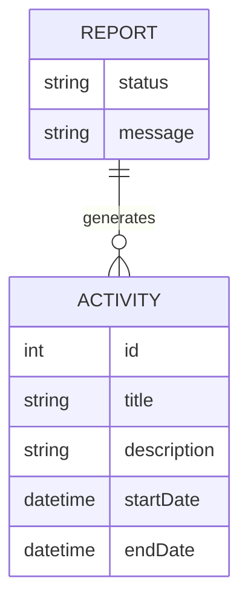
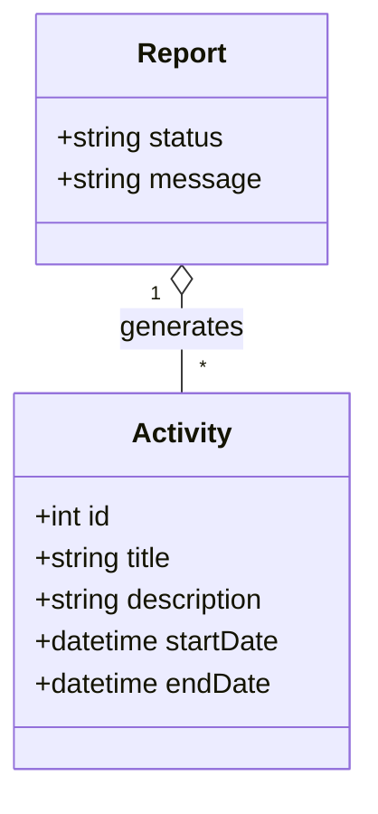
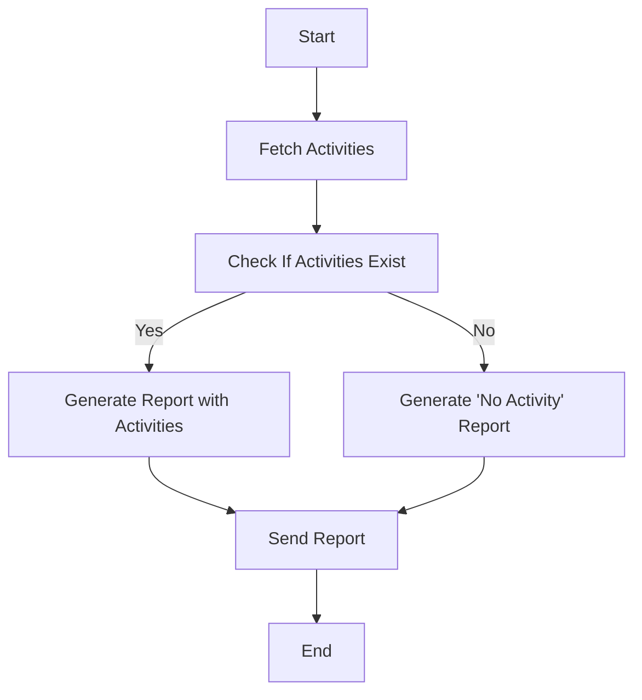

Based on the provided JSON design document, I will create the Mermaid Entity-Relationship (ER) diagrams, class diagrams, and flow charts for the specified entities and workflows.

### Entity-Relationship Diagram (ERD)

```mermaid
erDiagram
    REPORT {
        string status
        string message
    }
    
    ACTIVITY {
        int id
        string title
        string description
        datetime startDate
        datetime endDate
    }

    REPORT ||--o{ ACTIVITY : generates
```

### Class Diagram

```mermaid
classDiagram
    class Report {
        +string status
        +string message
    }

    class Activity {
        +int id
        +string title
        +string description
        +datetime startDate
        +datetime endDate
    }

    Report "1" o-- "*" Activity : generates
```

### Flowchart for Workflow

For the activities occurring in this system based on the provided JSON, we can create a basic flow chart that outlines the process of generating a report based on activities.

```mermaid
flowchart TD
    A[Start] --> B[Fetch Activities]
    B --> C[Check If Activities Exist]
    C -->|No| D[Generate 'No Activity' Report]
    C -->|Yes| E[Generate Report with Activities]
    E --> F[Send Report]
    D --> F
    F --> G[End]
```

### Summary

1. **ER Diagram**: Displays the relationship between the `Report` and `Activity` entities.
2. **Class Diagram**: Illustrates the structure of the `Report` and `Activity` classes along with their attributes and the relationship between them.
3. **Flowchart**: Visualizes the workflow for generating a report based on the activities, illustrating the decisions made during the report generation process.

These diagrams provide an overview of the entities, their relationships, and the workflows based on your JSON design document.