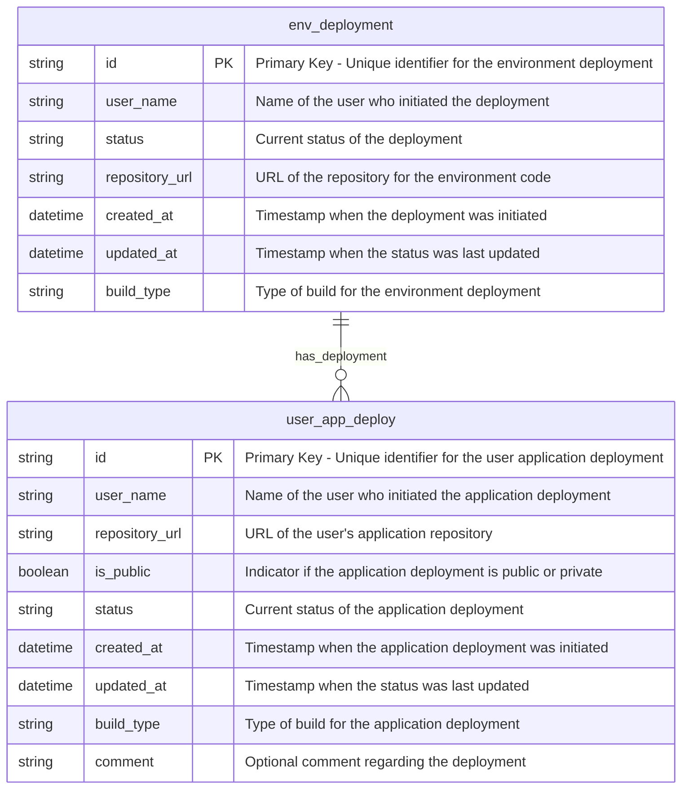

Sure! Let's outline the entities `env_deployment` and `user_app_deploy` based on your application prototype functionality. We’ll define the properties of each entity and provide a Mermaid diagram to visualize the relationships.

### Entities and Their Properties

1. **Entity: env_deployment**
   - **Properties**:
     - `id` (string): Unique identifier for the deployment (e.g., build ID).
     - `user_name` (string): Name of the user who initiated the deployment.
     - `status` (string): Current status of the deployment (e.g., "Running", "Completed", "Failed").
     - `repository_url` (string): URL of the repository for the environment code.
     - `created_at` (datetime): Timestamp when the deployment was initiated.
     - `updated_at` (datetime): Timestamp when the status was last updated.
     - `build_type` (string): Type of build (e.g., "KubernetesPipeline_CyodaSaas").

2. **Entity: user_app_deploy**
   - **Properties**:
     - `id` (string): Unique identifier for the user application deployment (e.g., build ID).
     - `user_name` (string): Name of the user who initiated the application deployment.
     - `repository_url` (string): URL of the user's application repository.
     - `is_public` (boolean): Indicator if the application deployment is public or private.
     - `status` (string): Current status of the deployment (e.g., "Running", "Completed", "Failed").
     - `created_at` (datetime): Timestamp when the application deployment was initiated.
     - `updated_at` (datetime): Timestamp when the status was last updated.
     - `build_type` (string): Type of build (e.g., "KubernetesPipeline_CyodaSaasUserEnv").
     - `comment` (string): Optional comment regarding the deployment (e.g., reason for deployment or cancellation).

### Mermaid Entity Relationship Diagram

Here's a simple MerMaind ER diagram to visualize these entities and their relationships:

### Explanation of the Relationships
- **`env_deployment` to `user_app_deploy`**: The relationship indicates that one environment deployment can have zero or more user application deployments associated with it. This can be useful if the environment is shared across multiple applications. 

This structure should fit well with the functionalities you've outlined in your prototype. Ensure to modify and expand upon these properties as needed based on more specific requirements in your application.