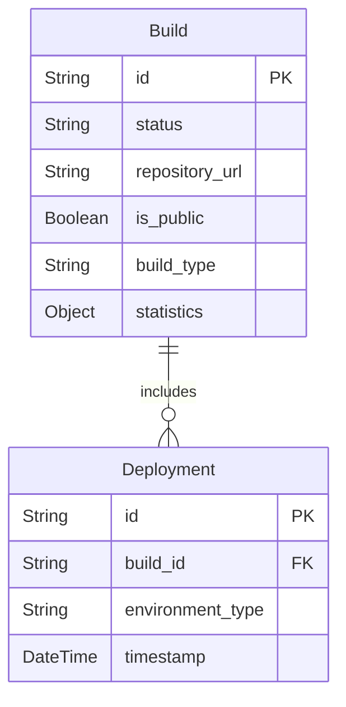

To outline the entities for your application prototype and represent them visually using Mermaid ER diagrams, I will describe the remaining entities and their properties without including the "User" entity.

### Entities and Properties

1. **Build**
   - **id**: String (Unique identifier for the build)
   - **status**: String (Current status of the build, e.g., pending, in progress, completed, canceled)
   - **repository_url**: String (URL of the repository for the user app deployment)
   - **is_public**: Boolean (Indicates if the repository is public)
   - **build_type**: String (Type of the build, e.g., Cyoda environment or user app)
   - **statistics**: Object (Holds statistics such as success and failure rates)

2. **Deployment**
   - **id**: String (Unique identifier for the deployment)
   - **build_id**: String (Reference to the corresponding Build)
   - **environment_type**: String (Type of environment deployed, e.g., Kubernetes)
   - **timestamp**: DateTime (The date and time of the deployment)

### Mermaid ER Diagram

Here's a Mermaid diagram representing the entities:

### Explanation
- The **Build** entity holds information regarding each build process, including the current status, related repository details, and build statistics.
- The **Deployment** entity references the **Build** entity through the `build_id` foreign key, linking a specific deployment to its corresponding build.
- The relationship depicted in the diagram indicates that one build can have multiple deployments (hence the one-to-many relationship).

If you need additional entities or adjustments, feel free to let me know!