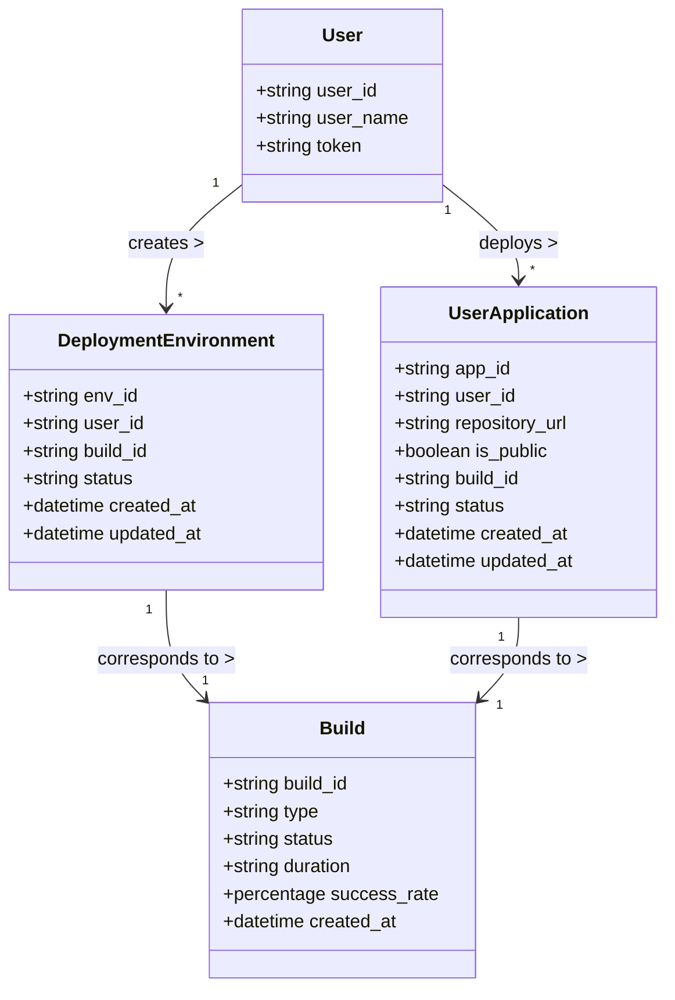

Based on the information provided about your application prototype, we can outline several key entities along with their properties. Here is a breakdown of the entities and their essential attributes that can be derived from your API and functional requirements.

### Entities and Their Properties

1. **User**
   - **user_id**: (string) Unique identifier for the user.
   - **user_name**: (string) Name of the user.
   - **token**: (string) Bearer token for authentication.

2. **DeploymentEnvironment**
   - **env_id**: (string) Unique identifier for the environment.
   - **user_id**: (string) Reference to the User entity.
   - **build_id**: (string) Identifier for the build in TeamCity.
   - **status**: (string) Current status of the deployment (e.g., `in_progress`, `completed`, `failed`).
   - **created_at**: (datetime) Timestamp when the environment was created.
   - **updated_at**: (datetime) Timestamp when the environment was last updated.

3. **UserApplication**
   - **app_id**: (string) Unique identifier for the application.
   - **user_id**: (string) Reference to the User entity.
   - **repository_url**: (string) URL of the repository for the user application.
   - **is_public**: (boolean) Flag indicating if the application is public.
   - **build_id**: (string) Identifier for the build in TeamCity.
   - **status**: (string) Current status of the application (e.g., `building`, `completed`, `failed`).
   - **created_at**: (datetime) Timestamp when the application was deployed.
   - **updated_at**: (datetime) Timestamp when the application was last updated.

4. **Build**
   - **build_id**: (string) Unique identifier for the build.
   - **type**: (string) Type of build (e.g., `Environment`, `User Application`).
   - **status**: (string) Current status of the build (e.g., `in_progress`, `completed`, `canceled`).
   - **duration**: (string) Time taken for the build to complete.
   - **success_rate**: (percentage) Success rate of the build.
   - **created_at**: (datetime) Timestamp when the build started.

### Mermaid Entity Relationship Diagram

Here’s a Mermaid diagram representing the entities and their relationships:

### Additional Considerations
- **Authentication**: The relationships indicate that a User can create multiple deployment environments and user applications.
- **Error Handling & Logs**: You might want to consider adding logging or error handling entities if needed.
- **Non-Functional Requirements**: Such as security, scalability, and performance metrics, while not laid out here, are essential aspects to consider based on your functional requirements.

This outline and diagram provide a structured approach to understanding your application prototype's architecture and can guide you in refining the application further. If there are more specific requirements or areas you want to delve deeper into, please let me know!