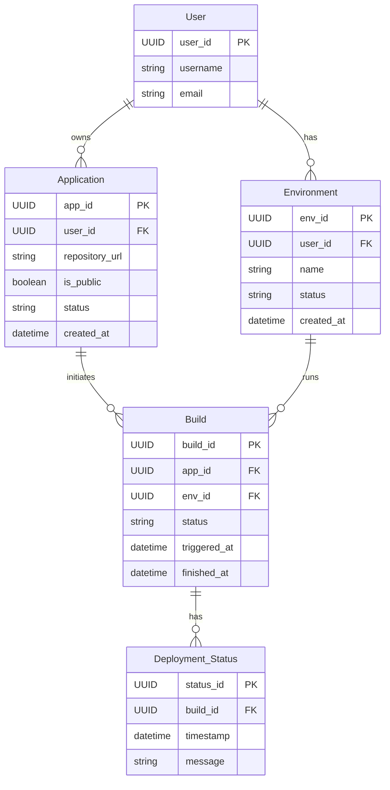

Sure! Based on the provided application prototype and functional requirements, I can help outline the entities and their properties. Let's define a few primary entities that could be relevant to your application, which focuses on deployment management.

### Proposed Entities and Their Properties

1. **User**
   - **Properties:**
     - `user_id`: Unique identifier for the user (e.g. `UUID`)
     - `username`: Name of the user (e.g. `string`)
     - `email`: Email address of the user (e.g. `string`)
  
2. **Environment**
   - **Properties:**
     - `env_id`: Unique identifier for the environment (e.g. `UUID`)
     - `user_id`: Reference to the user who owns the environment (e.g. `foreign key`)
     - `name`: Name of the environment (e.g. `string`)
     - `status`: Current status of the environment (e.g. `string`, e.g. "in progress", "finished")
     - `created_at`: Timestamp of when the environment was created (e.g. `datetime`)
  
3. **Application**
   - **Properties:**
     - `app_id`: Unique identifier for the application (e.g. `UUID`)
     - `user_id`: Reference to the user who owns the application (e.g. `foreign key`)
     - `repository_url`: URL of the application repository (e.g. `string`)
     - `is_public`: Boolean indicating if the application is public (e.g. `boolean`)
     - `status`: Current status of the deployment (e.g. `string`)
     - `created_at`: Timestamp of when the application was deployed (e.g. `datetime`)
  
4. **Build**
   - **Properties:**
     - `build_id`: Unique identifier for the build (e.g. `UUID`)
     - `app_id`: Reference to the application being built (e.g. `foreign key`)
     - `env_id`: Reference to the environment in which the build is executed (e.g. `foreign key`)
     - `status`: Status of the build (e.g. `string`)
     - `triggered_at`: Timestamp when the build was triggered (e.g. `datetime`)
     - `finished_at`: Timestamp when the build finished (optional, e.g. `datetime`)
  
5. **Deployment Status**
   - **Properties:**
     - `status_id`: Unique identifier for the status (e.g. `UUID`)
     - `build_id`: Reference to the build (e.g. `foreign key`)
     - `timestamp`: Time of status check (e.g. `datetime`)
     - `message`: Status message (e.g. `string`, e.g. "Build in progress", "Build finished")

### Entity Relationship Diagram (Mermaid)

Here's a Mermaid diagram representing the relationships among these entities.

### Summary

This high-level design outlines the entities you can consider for your application prototype, encompassing users, environments, applications, builds, and their statuses. You can expand or refine the properties and entities based on the evolving requirements of your application. If you have any specific adjustments or would like additional features, please let me know!