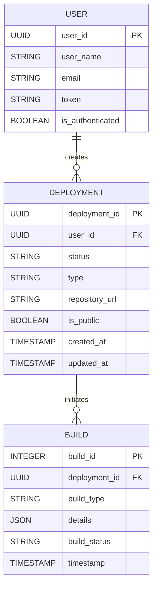

Based on your application prototype and functional requirements, we can outline several key entities with their properties. This will help in organizing the data and operations in your application more effectively. Let's begin by identifying the main entities and then represent them using a Mermaid Entity-Relationship (ER) diagram.

### Key Entities and Properties

1. **User**
   - **Properties:**
     - `user_id`: Unique identifier for the user (e.g., UUID)
     - `user_name`: Name of the user
     - `email`: Email of the user
     - `token`: Authentication token (e.g., Bearer token)
     - `is_authenticated`: Boolean representing the authentication status

2. **Deployment**
   - **Properties:**
     - `deployment_id`: Unique identifier for the deployment (e.g., UUID)
     - `user_id`: Foreign key referencing User
     - `status`: Current status of the deployment (e.g., queued, running, completed, canceled)
     - `type`: Type of deployment (e.g., Cyoda environment, User application)
     - `repository_url`: URL of the repository (for user app deployments)
     - `is_public`: Boolean indicating if the repository is public (for user app deployments)
     - `created_at`: Timestamp of when the deployment was created
     - `updated_at`: Timestamp of the last update to the deployment

3. **Build**
   - **Properties:**
     - `build_id`: Unique identifier for the build (e.g., Integer)
     - `deployment_id`: Foreign key referencing Deployment
     - `build_type`: Type of build (linked to Deployment type)
     - `details`: JSON object containing detailed information about the build (e.g., build logs)
     - `build_status`: Current status of the build (from TeamCity API)
     - `timestamp`: Timestamp of when the build was initiated

### Mermaid ER Diagram 

Here's how you can represent these entities in a Mermaid ER diagram:

### Explanation of Relationships

- **User → Deployment**: A user can create multiple deployments (one-to-many relationship).
- **Deployment → Build**: A deployment can initiate multiple builds, representing the actions taken for that particular deployment (one-to-many relationship).

### Conclusion

This structure provides a clear organization of your application's key entities and their relationships, which will help guide your further development efforts. Should you have any further needs or adjustments to consider, feel free to let me know!