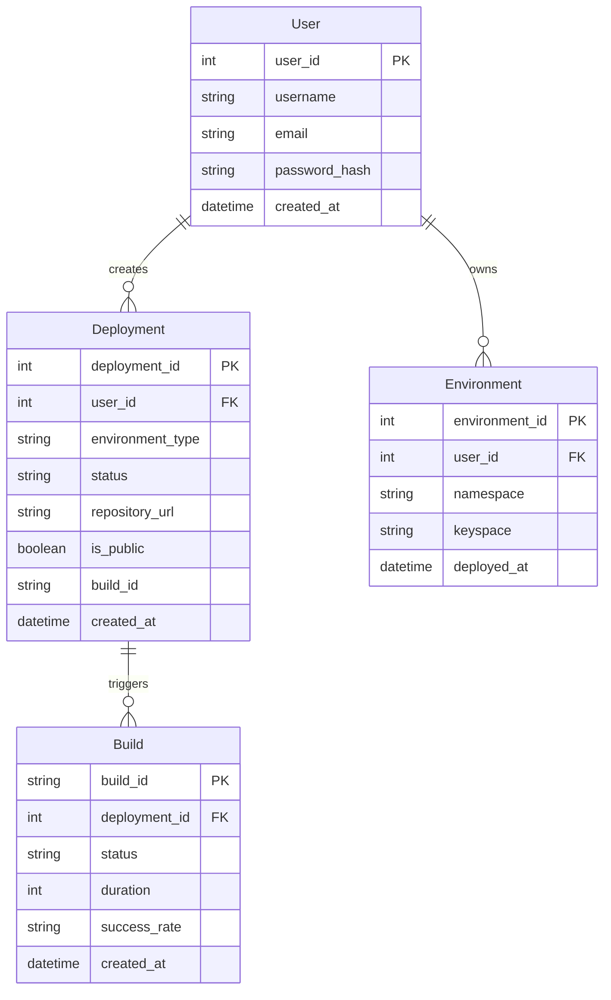

Based on the provided information and the nature of your prototype application, I'll outline the entities and their properties. Additionally, I'll create a Mermaid entity-relationship (ER) diagram to help visualize the relationships between these entities.

### Entities and Their Properties

1. **User**
   - **Properties:**
     - `user_id` (Primary Key)
     - `username` (String, unique)
     - `email` (String, unique)
     - `password_hash` (String)
     - `created_at` (Datetime)

2. **Deployment**
   - **Properties:**
     - `deployment_id` (Primary Key)
     - `user_id` (Foreign Key to User)
     - `environment_type` (String, e.g., "cyoda-env", "user-app")
     - `status` (String, e.g., "pending", "in_progress", "success", "failed")
     - `repository_url` (String, nullable)
     - `is_public` (Boolean)
     - `build_id` (String)
     - `created_at` (Datetime)

3. **Build**
   - **Properties:**
     - `build_id` (Primary Key)
     - `deployment_id` (Foreign Key to Deployment)
     - `status` (String, e.g., "queued", "running", "finished", "canceled")
     - `duration` (Integer, in seconds)
     - `success_rate` (String, e.g., "95%")
     - `created_at` (Datetime)

4. **Environment**
   - **Properties:**
     - `environment_id` (Primary Key)
     - `user_id` (Foreign Key to User)
     - `namespace` (String)
     - `keyspace` (String)
     - `deployed_at` (Datetime)

### Mermaid ER Diagram

Here's a basic Mermaid diagram to visualize the entities and their relationships:

### Explanation of Relationships

- A **User** can create multiple **Deployments**.
- A **User** can own multiple **Environments**.
- Each **Deployment** can trigger multiple **Builds**, which track the build's progress, duration, and status.

### Next Steps

- Define relationships and constraints more thoroughly according to your application's requirements.
- Consider implementing additional entities if you need more granular tracking of other features, such as logs or notifications.
- Make sure to implement error handling, validation, and security measures in your API.

Feel free to adjust the properties and entities based on your further requirements and features! If you need more help or further elaboration, just let me know.