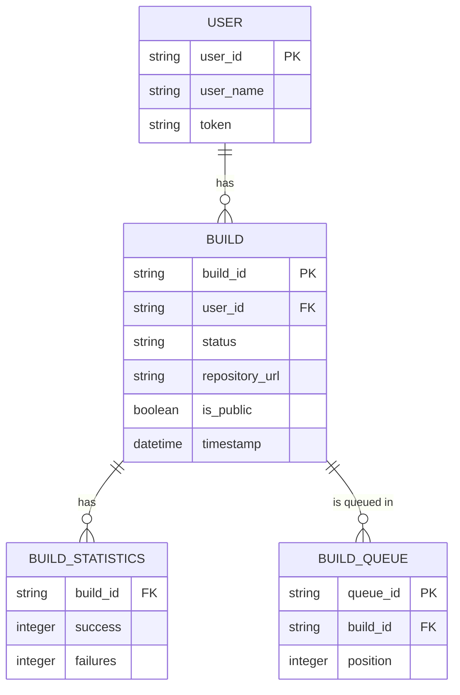
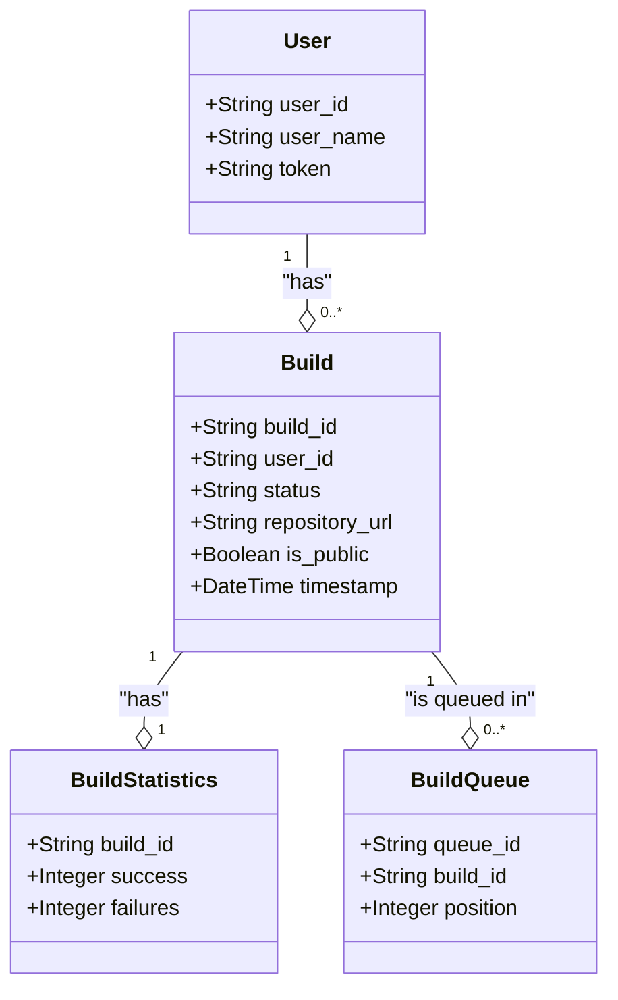

Based on the information you provided about your prototype application, we can outline the entities and their properties along with corresponding ER diagrams and class diagrams.

### Entities and Their Properties

1. **User**
   - **Properties**:
     - `user_id`: Unique identifier for each user (e.g., string or integer)
     - `user_name`: The username of the user (e.g., string)
     - `token`: Optional property for authentication (e.g., string)

2. **Build**
   - **Properties**:
     - `build_id`: Unique identifier for the build (e.g., string)
     - `user_id`: Foreign key referencing the User (e.g., string or integer)
     - `status`: Current status of the build (e.g., string: pending, in progress, completed, canceled)
     - `repository_url`: URL of the repository for deployment (e.g., string, nullable)
     - `is_public`: Boolean flag indicating if the app is public (e.g., boolean, nullable)
     - `timestamp`: Timestamp of when the build was initiated (e.g., datetime)

3. **BuildStatistics**
   - **Properties**:
     - `build_id`: Foreign key referencing Build (e.g., string)
     - `success`: Number of successful deployments (e.g., integer)
     - `failures`: Number of failed deployments (e.g., integer)

4. **BuildQueue**
   - **Properties**:
     - `queue_id`: Unique identifier for the build queue (e.g., string)
     - `build_id`: Foreign key referencing Build (e.g., string)
     - `position`: Position in the queue (e.g., integer)

### Entity Relationship Diagram (ERD)

Here’s a simplified version of the ERD using Mermaid syntax:

### Class Diagram

Here’s a class diagram representing the same entities and their relationships:

### Overview of Relationships

- A **User** can have multiple **Builds**, but each **Build** belongs to one **User** (`1` to `0..*` relationship).
- A **Build** has exactly one **BuildStatistics** record.
- A **Build** can be part of multiple entries in the **BuildQueue** (especially if you support features like cancelling builds and re-queuing).

These diagrams and entity outlines should help you represent your application's design clearly. As your application evolves, you might need to refine these entities and relationships to accommodate new requirements.