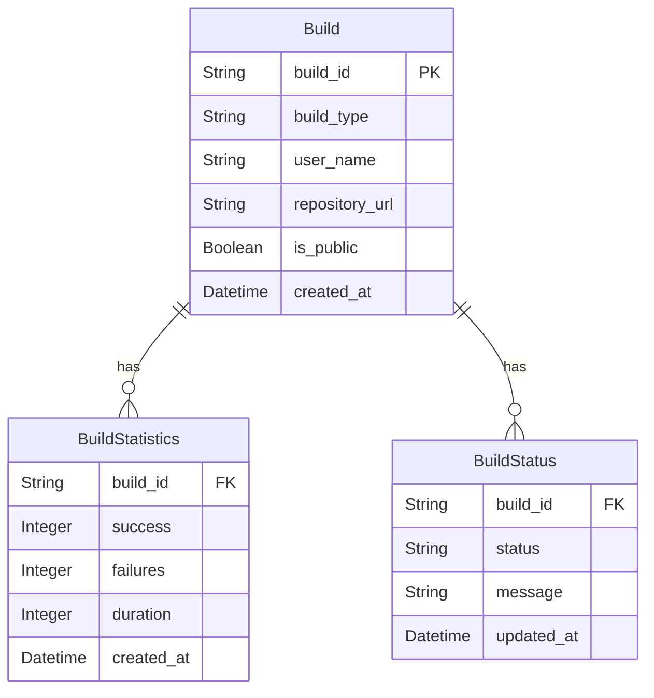

Based on your application prototype, we can outline the following entities: **Build**, **BuildStatistics**, and **BuildStatus**. Below are the properties associated with each entity, followed by a Mermaid ER diagram illustrating their relationships.

### Entities and Their Properties

1. **Build**
   - **build_id**: Unique identifier for the build (String)
   - **build_type**: The type of build (e.g., `KubernetesPipeline_CyodaSaas`, `KubernetesPipeline_CyodaSaasUserEnv`) (String)
   - **user_name**: The username associated with the build (String)
   - **repository_url**: The repository URL associated with the user app deployment (String)
   - **is_public**: Indicates if the build is for a public application (Boolean)
   - **created_at**: Timestamp indicating when the build was initiated (Datetime)

2. **BuildStatistics**
   - **build_id**: References the associated Build (String)
   - **success**: Number of successful build tasks (Integer)
   - **failures**: Number of failed build tasks (Integer)
   - **duration**: Duration of the build (e.g., in milliseconds) (Integer)
   - **created_at**: Timestamp indicating when the statistics were generated (Datetime)

3. **BuildStatus**
   - **build_id**: References the associated Build (String)
   - **status**: Current status of the build (e.g., `pending`, `in progress`, `success`, `failed`) (String)
   - **message**: Optional message related to the build status (String)
   - **updated_at**: Timestamp indicating when the status was last updated (Datetime)

### Mermaid Diagram

Here is a visual representation of the entities and their relationships using a Mermaid ER diagram:

### Explanation of the Diagram

- The `Build` entity is the primary entity that stores information about the build process, including the build type and related user repository.
- The `BuildStatistics` entity captures the performance metrics of a build, linked by `build_id`.
- The `BuildStatus` entity represents the current state of the build, also linked to the `build_id`.
- Each build can have one or more entries in both the `BuildStatistics` and `BuildStatus` entities, allowing for a detailed tracking and logging mechanism.

Feel free to modify any of the properties or relationships as needed based on your specific requirements!