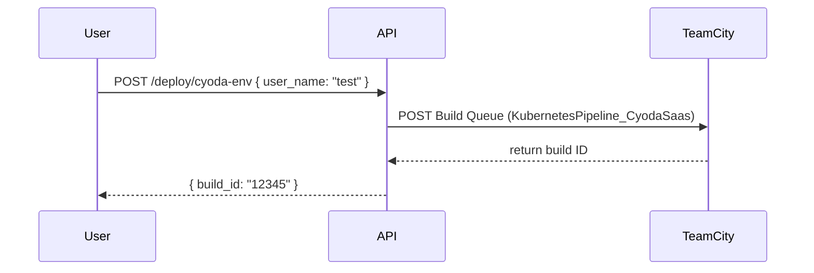
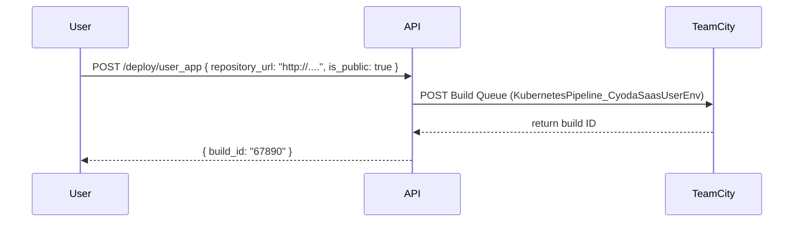
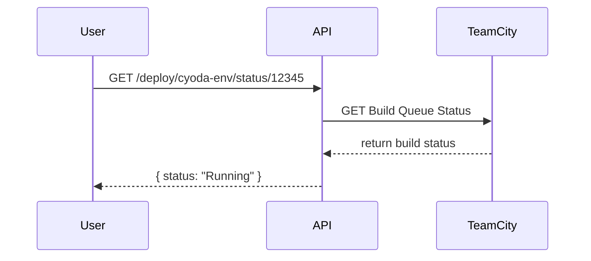
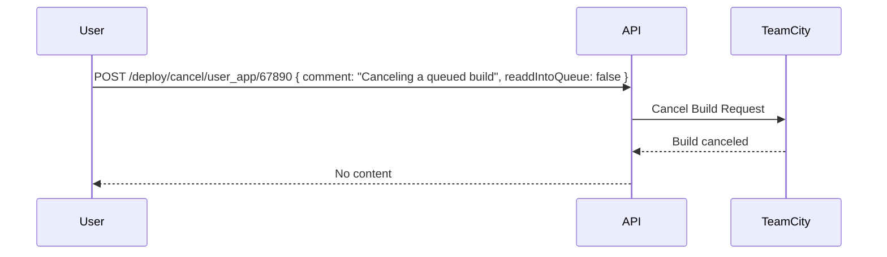

Absolutely! Migrating your application to Cyoda Cloud is a great step towards enhancing its scalability, reliability, and performance. Let’s outline the entities involved in your application along with a brief explanation of each entity's role. I’ll provide Mermaid diagrams to visualize the sequences involved in the API interactions based on your functional requirements.

### Entities Overview

1. **User**: The entity representing the person interacting with the application. Users can deploy environments and manage application deployments.
  
2. **API**: The interface through which users interact with the application. It handles requests and communicates with the TeamCity service.

3. **TeamCity**: An external service used for managing builds and deployment pipelines. The API interacts with TeamCity to queue builds, check statuses, and cancel builds.

### Mermaid Diagrams

#### 1. Manage Environment Deployment

#### 2. Deploy User Application

#### 3. Get Deployment Status

#### 4. Cancel User Application Build

### Functional Requirements Summary

1. **Deploy Environment**
   - **Endpoint**: `POST /deploy/cyoda-env`
   - **Request**: `{ "user_name": "test" }`
   - **Response Success**: `{ "build_id": "12345" }`

2. **Deploy User Application**
   - **Endpoint**: `POST /deploy/user_app`
   - **Request**: `{ "repository_url": "http://....", "is_public": "true" }`
   - **Response Success**: `{ "build_id": "67890" }`

3. **Get Deployment Status**
   - **Endpoint**: `GET /deploy/cyoda-env/status/{id}`
   - **Response Success**: `{ "status": "Running", "repository_url": "http://....", "is_public": "true" }`

4. **Cancel User Application Build**
   - **Endpoint**: `POST /deploy/cancel/user_app/{id}`
   - **Request**: `{ "comment": "Canceling a queued build", "readdIntoQueue": false }`
   - **Response**: No content on success.

These diagrams and outlines should give you a clear picture of how the application flows and the entities involved. If you have any more specific entities or require further details or adjustments, feel free to ask!