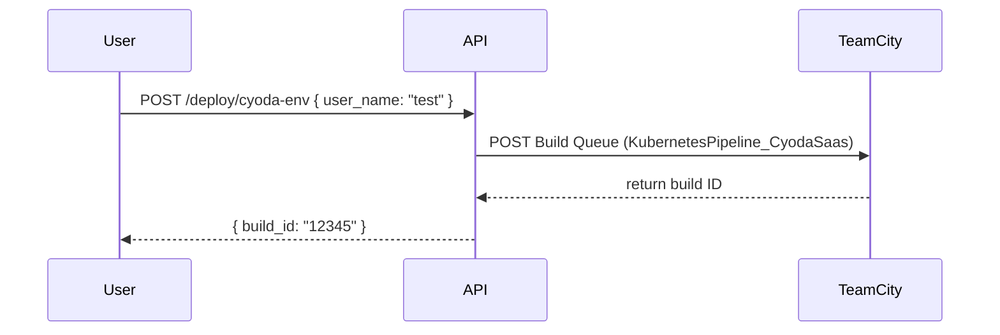
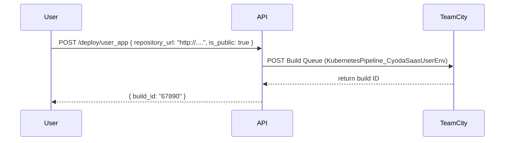
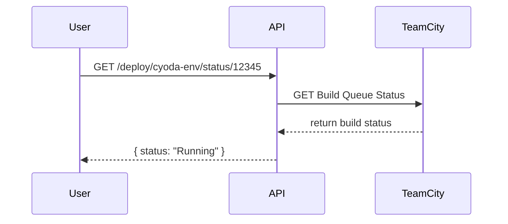
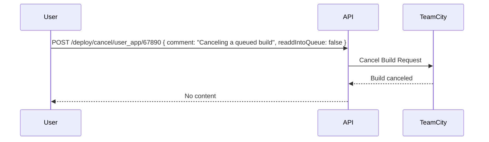

Sure! Below is a comprehensive markdown document that outlines the entities for your application prototype, including functional requirements, user stories, API specifications, and mermaid diagrams.

```markdown
# Application Prototype Entities Outline

This document outlines the entities for the application prototype developed for deployment management on Cyoda Cloud. It includes user stories, functional requirements, API specifications, and mermaid diagrams to visualize interactions.

## Functional Requirements

### User Stories

#### User Story 1: Manage Environment Deployment
**As a** user,  
**I want to** deploy an environment with my configuration,  
**So that** I can have a dedicated environment for my applications.

**Use Case: Deploy Environment**  
- **Preconditions:** User must be authenticated with a Bearer token.
- **API Endpoint:** `POST /deploy/cyoda-env`
- **Request Format:**
    ```json
    {
        "user_name": "test"
    }
    ```
- **Response Format:**
    - **Success (201):**
    ```json
    {
        "build_id": "12345"
    }
    ```
    - **Error (400):**
    ```json
    {
        "error": "Invalid user name"
    }
    ```

**Mermaid Diagram:**


---

#### User Story 2: Deploy User Application
**As a** user,  
**I want to** deploy my application,  
**So that** I can manage its environment settings.

**Use Case: Deploy User Application**  
- **Preconditions:** User must be authenticated with a Bearer token.
- **API Endpoint:** `POST /deploy/user_app`
- **Request Format:**
    ```json
    {
        "repository_url": "http://....",
        "is_public": "true"
    }
    ```
- **Response Format:**
    - **Success (201):**
    ```json
    {
        "build_id": "67890"
    }
    ```
    - **Error (400):**
    ```json
    {
        "error": "Invalid repository URL"
    }
    ```

**Mermaid Diagram:**


---

#### User Story 3: Get Deployment Status
**As a** user,  
**I want to** check the status of my deployment,  
**So that** I can know if my environment is active.

**Use Case: Get Deployment Status**  
- **Preconditions:** User must be authenticated with a Bearer token.
- **API Endpoint:** `GET /deploy/cyoda-env/status/{id}`
- **Response Format:**
    - **Success (200):**
    ```json
    {
        "status": "Running",
        "repository_url": "http://....",
        "is_public": "true"
    }
    ```
    - **Error (404):**
    ```json
    {
        "error": "Build not found"
    }
    ```

**Mermaid Diagram:**


---

#### User Story 4: Cancel User Application Build
**As a** user,  
**I want to** cancel my application's build process,  
**So that** I can stop unnecessary deployments.

**Use Case: Cancel User Application Build**  
- **Preconditions:** User must be authenticated with a Bearer token.
- **API Endpoint:** `POST /deploy/cancel/user_app/{id}`
- **Request Format:**
    ```json
    {
        "comment": "Canceling a queued build",
        "readdIntoQueue": false
    }
    ```
- **Response Format:**
    - **Success (204):** No content.
    - **Error (404):**
    ```json
    {
        "error": "Build not found"
    }
    ```

**Mermaid Diagram:**


---

### Final Functional Requirements Summary

1. **Deploy Environment**
    - Endpoint: `POST /deploy/cyoda-env`
    - Request: `{ "user_name": "test" }`
    - Response Success: `{ "build_id": "12345" }`

2. **Deploy User Application**
    - Endpoint: `POST /deploy/user_app`
    - Request: `{ "repository_url": "http://....", "is_public": "true" }`
    - Response Success: `{ "build_id": "67890" }`

3. **Get Deployment Status**
    - Endpoint: `GET /deploy/cyoda-env/status/{id}`
    - Response Success: `{ "status": "Running", "repository_url": "http://....", "is_public": "true" }`

4. **Cancel User Application Build**
    - Endpoint: `POST /deploy/cancel/user_app/{id}`
    - Request: `{ "comment": "Canceling a queued build", "readdIntoQueue": false }`
    - Response: No content on success.

---

This structure outlines the necessary functional requirements along with the API details and mermaid diagrams to visualize user interaction with the application. If you have any further questions or need adjustments, feel free to ask!
``` 

This document should serve as a comprehensive outline of your application's entities and functionalities. Let me know if you need any modifications or additional information!