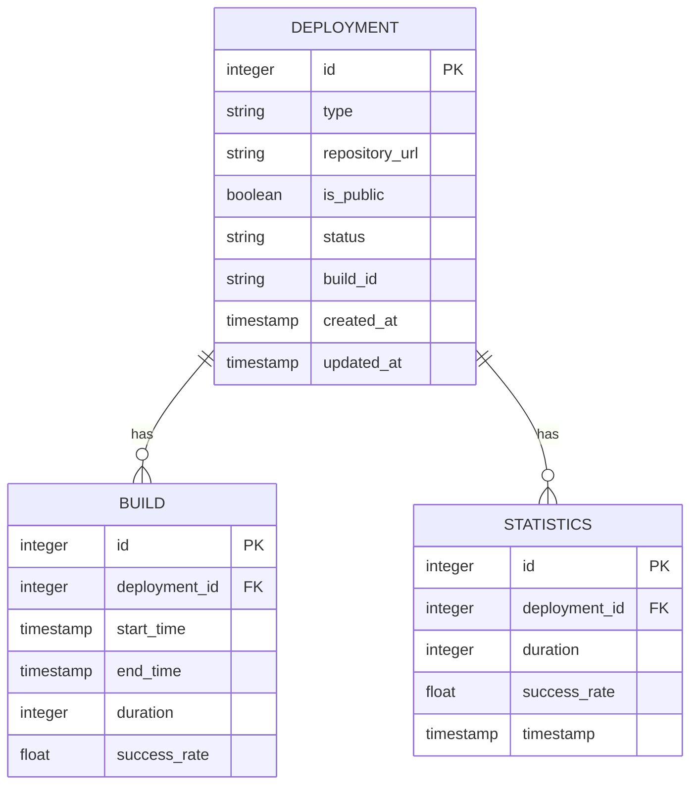

Certainly! Based on the provided API structure and functional requirements, we can outline the following entities for your application prototype. Since you mentioned to remove the user entity, I've structured the other relevant entities accordingly:

### Entities and Their Properties

1. **Deployment**
   - **Properties:**
     - `id`: Integer (Unique identifier for the deployment)
     - `type`: String (Type of deployment, e.g., "cyoda-env" or "user_app")
     - `repository_url`: String (URL of the repository for the user app)
     - `is_public`: Boolean (Indicates if the user app is public or private)
     - `status`: String (Current status of the deployment, e.g., "in_progress", "completed", "canceled")
     - `build_id`: String (Build identifier returned from the TeamCity)
     - `created_at`: Timestamp (Time the deployment was created)
     - `updated_at`: Timestamp (Time the deployment status was last updated)

2. **Build**
   - **Properties:**
     - `id`: Integer (Unique identifier for the build)
     - `deployment_id`: Integer (ID of the associated deployment)
     - `start_time`: Timestamp (Time the build started)
     - `end_time`: Timestamp (Time the build finished)
     - `duration`: Integer (Duration of the build in seconds)
     - `success_rate`: Float (Success rate percentage of the build)

3. **Statistics**
   - **Properties:**
     - `id`: Integer (Unique identifier for the statistics record)
     - `deployment_id`: Integer (ID of the associated deployment)
     - `duration`: Integer (Duration of the deployment in seconds)
     - `success_rate`: Float (Success rate percentage of the deployment)
     - `timestamp`: Timestamp (Time when the statistics were recorded)

### Mermaid Entity-Relationship Diagram

### Summary

In this structure:

- The **Deployment** entity represents a request to deploy an environment or user application and keeps track of the necessary properties.
- The **Build** entity stores information about each build initiated for those deployments, including its status and timing.
- The **Statistics** entity provides insights into the performance and success of the deployments, linked by the deployment ID.

Feel free to adapt or further customize these entities and their properties based on your application's specific needs!