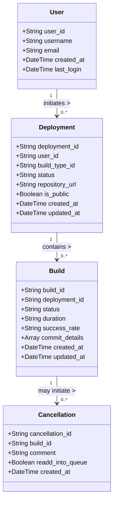

Based on the provided application prototype and functional requirements, we can outline relevant entities and their properties for your system. This should help you visualize your application’s architecture and data structure better. Below are a suggested list of entities along with their properties, followed by a Mermaid diagram representing the relationship between them.

### Entities and Their Properties

1. **User**
   - `user_id` (String, Unique Identifier)
   - `username` (String, Required)
   - `email` (String, Optional)
   - `created_at` (DateTime)
   - `last_login` (DateTime)

2. **Deployment**
   - `deployment_id` (String, Unique Identifier)
   - `user_id` (String, Foreign Key referencing User)
   - `build_type_id` (String, Required)
   - `status` (String, Enum: ['In Progress', 'Completed', 'Failed'])
   - `repository_url` (String, Required)
   - `is_public` (Boolean, Required)
   - `created_at` (DateTime)
   - `updated_at` (DateTime)

3. **Build**
   - `build_id` (String, Unique Identifier)
   - `deployment_id` (String, Foreign Key referencing Deployment)
   - `status` (String, Enum: ['In Progress', 'Completed', 'Failed'])
   - `duration` (String, Optional - e.g., '120s')
   - `success_rate` (String, Optional - e.g., '90%')
   - `commit_details` (Array of Objects, Optional)
   - `created_at` (DateTime)
   - `updated_at` (DateTime)

4. **Cancellation**
   - `cancellation_id` (String, Unique Identifier)
   - `build_id` (String, Foreign Key referencing Build)
   - `comment` (String, Optional)
   - `readd_into_queue` (Boolean, Default: False)
   - `created_at` (DateTime)

### Mermaid Entity Relationship Diagram

Here’s a simple diagram representing the relationships between the entities:

### Summary of Relationships
- **User to Deployment:** A user can initiate multiple deployments (`1` to `*` relationship).
- **Deployment to Build:** Each deployment can result in multiple builds, based on user inputs or configurations (`1` to `*` relationship).
- **Build to Cancellation:** A build can be canceled, and each cancellation is associated with one build (`1` to `1` relationship, with cancellation being optional).

This structured organization of entities and relationships should provide a solid foundation for developing your application further. Adjust the properties and relationships according to any additional requirements or domain rules you might have. If you need further refinements or additional entities, feel free to ask!