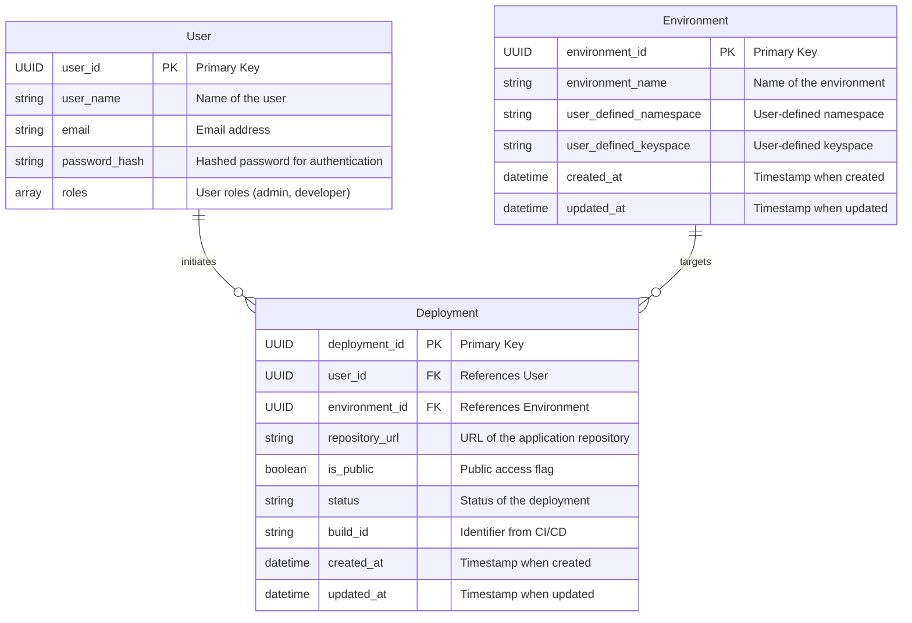

Certainly! To outline the entities for your prototype focusing on deployment and environment functionality, we will identify key entities and their properties. Given the context of your application that deals with deployment, environment management, and user interactions, we can define the following entities:

### Entities and Their Properties

1. **User**
   - `user_id`: Unique identifier for the user (e.g., UUID)
   - `user_name`: The name of the user
   - `email`: Email address of the user
   - `password_hash`: Hashed password for authentication
   - `roles`: List of roles assigned to the user (e.g., admin, developer)

2. **Deployment**
   - `deployment_id`: Unique identifier for the deployment (e.g., UUID)
   - `user_id`: References the user who initiated the deployment
   - `environment_id`: References the environment this deployment targets
   - `repository_url`: URL of the repository containing the application code
   - `is_public`: Boolean flag indicating if the deployment is public
   - `status`: Current status of the deployment (e.g., queued, in-progress, completed, failed)
   - `build_id`: The identifier received from TeamCity or another CI/CD system
   - `created_at`: Timestamp when the deployment was created
   - `updated_at`: Timestamp when the deployment status was last updated

3. **Environment**
   - `environment_id`: Unique identifier for the environment (e.g., UUID)
   - `environment_name`: Name of the environment (e.g., staging, production)
   - `user_defined_namespace`: User-defined namespace for the environment
   - `user_defined_keyspace`: User-defined keyspace for the environment
   - `created_at`: Timestamp when the environment was created
   - `updated_at`: Timestamp when the environment settings were last updated

### Mermaid Entity Relationship Diagram (ERD)

Here is the Mermaid diagram representing the relationships between the entities:

### Explanation of Relationships

- **User and Deployment**: A user can initiate multiple deployments, but each deployment is linked to a single user.
- **Environment and Deployment**: An environment can host multiple deployments, but each deployment targets a specific environment.

### Next Steps

1. **Expand upon attributes**: Customize the attributes based on your exact requirements.
2. **Add methods for behavior**: If you're implementing classes, you can further define methods that represent operations related to deployments and environments.
3. **Implement Relationships**: In your application logic, ensure to manage these relationships properly for deployment tracking and user access.

This outline provides a solid foundation to build upon as you continue developing your prototype and refining its functionality.