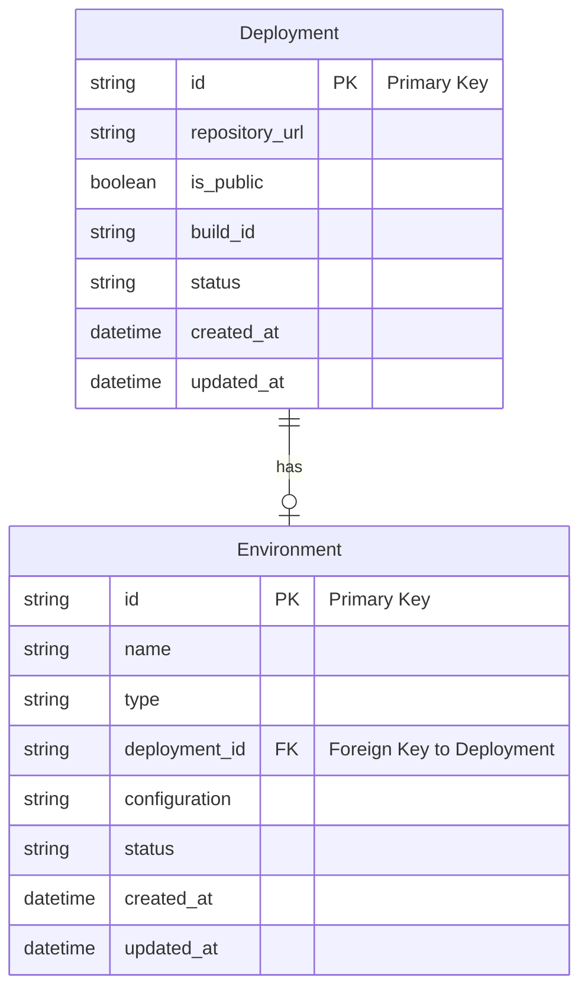
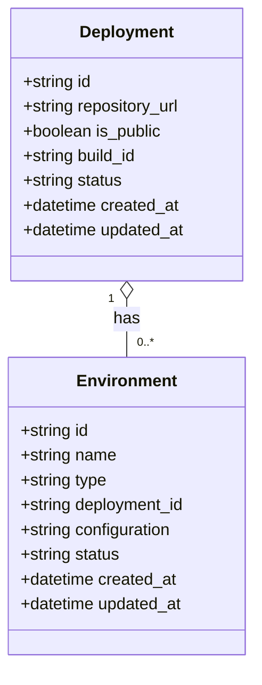

Certainly! Based on your description of a deployment and environment system without focusing on users, we can outline the following key entities:

### Entities and Their Properties

1. **Deployment**
   - **Properties:**
     - `id`: Unique identifier for the deployment (string)
     - `repository_url`: URL of the repository from which the deployment is created (string)
     - `is_public`: Visibility status of the deployment (boolean)
     - `build_id`: Identifier for the build process (string)
     - `status`: Current status of the deployment (e.g., "PENDING", "RUNNING", "SUCCESS", "FAILED") (string)
     - `created_at`: Timestamp of when the deployment was initiated (datetime)
     - `updated_at`: Timestamp of the last update to the deployment's status (datetime)

2. **Environment**
   - **Properties:**
     - `id`: Unique identifier for the environment (string)
     - `name`: Name of the environment (e.g., "production", "staging") (string)
     - `type`: Type of the environment (e.g., "Kubernetes", "Docker swarm") (string)
     - `deployment_id`: Identifier linking to the associated deployment (string)
     - `configuration`: Configuration settings used for the environment (JSON or string)
     - `status`: Current status of the environment (e.g., "ACTIVE", "INACTIVE", "ERROR") (string)
     - `created_at`: Timestamp of when the environment was created (datetime)
     - `updated_at`: Timestamp of the last update to the environment's status (datetime)

### Entity Relationship Diagram (ERD)

Here is the Mermaid code for a simple ER diagram representing these entities and their relationship:

### Class Diagram

Here is the Mermaid code for a class diagram representing these entities:

### Summary

In this breakdown, we defined two primary entities: **Deployment** and **Environment**, each with their respective properties essential for managing deployments and the environments they relate to. 

- The **Deployment** entity primarily tracks deployment details.
- The **Environment** entity represents the configurations and statuses associated with each deployment.
  
Feel free to adapt or expand these properties as needed for your application prototype!