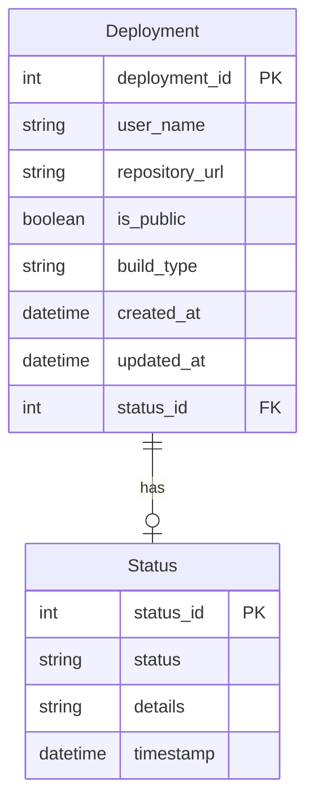

Certainly! To outline the entities for your application prototype focusing on "Deployment" and "Status," we can define their properties based on the functional requirements you've provided. Below is a description of the entities and their properties, along with a Mermaid entity-relationship (ER) diagram.

### Entities and Properties

1. **Deployment**
   - **deployment_id**: Unique identifier for each deployment (Primary Key)
   - **user_name**: Name of the user initiating the deployment
   - **repository_url**: URL for the repository (applicable for user application deployments)
   - **is_public**: Boolean indicating if the application is public
   - **build_type**: Type of build (e.g., "Cyoda Environment", "User Application")
   - **created_at**: Timestamp indicating when the deployment was created
   - **updated_at**: Timestamp for the latest update
   - **status_id**: Foreign key referencing the current status of the deployment

2. **Status**
   - **status_id**: Unique identifier for each status (Primary Key)
   - **status**: Current status (e.g., "Pending", "In Progress", "Success", "Failed")
   - **details**: Additional details about the status (can be a string or JSON object)
   - **timestamp**: Timestamp of when the status was last updated

### Mermaid ER Diagram

Here’s how the entities and their relationship can be represented in a Mermaid diagram:

### Explanation of Relationships

- The **Deployment** entity has a foreign key **status_id** that references the **Status** entity. This establishes a relationship indicating that each deployment can have one current status.
- The relationship is a "one-to-many" relationship, where one status can be associated with multiple deployments over time as deployments can be updated with new statuses through their lifecycle.

This model provides a clear structure for managing deployments and their statuses in your application. If you need more details or additional entities, feel free to ask!