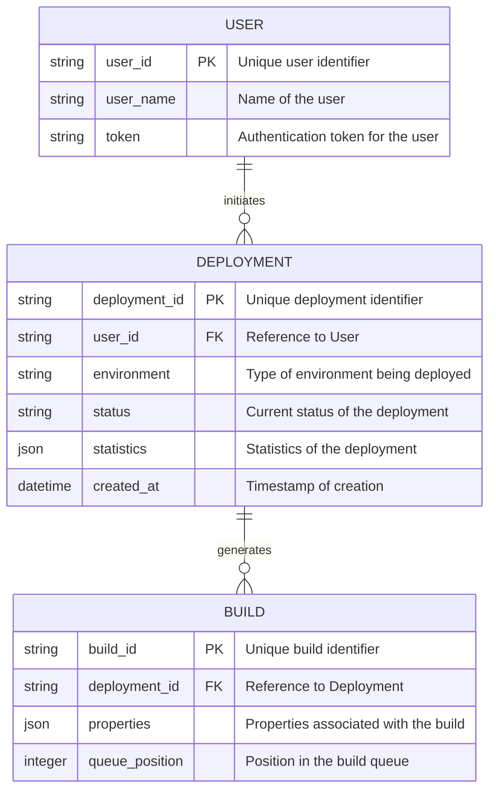

Based on the provided code and functional requirements, we can outline the entities and their properties relevant to your application. Below, I will summarize the main entities along with their properties, and then provide an Entity-Relationship (ER) diagram using Mermaid syntax.

### Entities and Properties

1. **User**
   - `user_id`: Unique identifier for the user (e.g., UUID)
   - `user_name`: The name of the user
   - `token`: Authentication token for the user session

2. **Deployment**
   - `deployment_id`: Unique identifier for the deployment (e.g., a UUID or build number)
   - `user_id`: Reference to the user initiating the deployment (foreign key from User)
   - `environment`: The type of environment being deployed (e.g., "Cyoda", "User-App")
   - `status`: Current status of the deployment (e.g., "In Progress", "Completed", "Failed")
   - `statistics`: Statistics associated with the deployment (could be a JSON object)
   - `created_at`: Timestamp of when the deployment was initiated

3. **Build**
   - `build_id`: Unique identifier for the build (e.g., a string from TeamCity)
   - `deployment_id`: Reference to the corresponding deployment (foreign key from Deployment)
   - `properties`: Properties associated with the build (could be a JSON object containing user-defined properties)
   - `queue_position`: Position in the build queue (e.g., integer)

### Mermaid Entity-Relationship Diagram

### Explanation of Diagram

- **User**: Represents users interacting with the application. Each user holds an authentication token and can initiate multiple deployments.
- **Deployment**: Represents the deployment process started by a user. Each deployment can have one or multiple associated builds and maintains relevant details such as status and statistics.
- **Build**: Represents the individual builds that result from a deployment action. Builds contain properties related to the specific deployment and maintain a position in the build queue.

This structured approach not only helps in organizing your code and database schema but also facilitates clearer communication with your development team and aids in future iterations of your application.