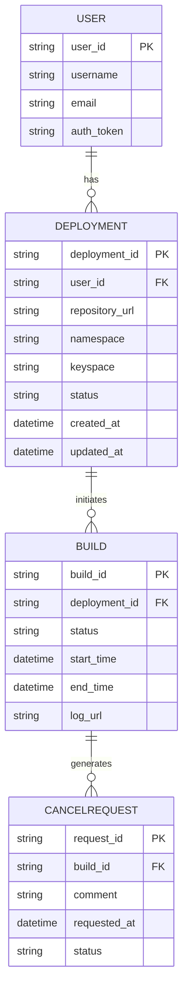

Based on the provided information, we can outline several entities for your application prototype. The core functionality seems centered around deploying applications using TeamCity with user interactions. Below, I've detailed potential entities, their properties, and a diagram to visualize the relationships.

### Entities and Properties

1. **User**
   - `user_id`: String (Unique identifier for the user)
   - `username`: String (User's chosen username)
   - `email`: String (User's email for notifications)
   - `auth_token`: String (Bearer token for authentication)
   
2. **Deployment**
   - `deployment_id`: String (Unique identifier for the deployment)
   - `user_id`: String (Foreign key linked to User)
   - `repository_url`: String (URL of the user's repository)
   - `namespace`: String (Namespace for Kubernetes)
   - `keyspace`: String (Keyspace for the application deployment)
   - `status`: String (Current status of the deployment: e.g., 'in_progress', 'completed', 'failed')
   - `created_at`: DateTime (Timestamp of when the deployment was created)
   - `updated_at`: DateTime (Timestamp of when the deployment status was last updated)

3. **Build**
   - `build_id`: String (Unique identifier for the build in TeamCity)
   - `deployment_id`: String (Foreign key linked to Deployment)
   - `status`: String (Current status of the build: e.g., 'waiting', 'running', 'canceled', 'finished')
   - `start_time`: DateTime (When the build started)
   - `end_time`: DateTime (When the build ended)
   - `log_url`: String (Link to the build logs in TeamCity)
  
4. **CancelRequest**
   - `request_id`: String (Unique identifier for the cancel request)
   - `build_id`: String (Foreign key linked to Build)
   - `comment`: String (Reason for cancellation)
   - `requested_at`: DateTime (Timestamp of the cancellation request)
   - `status`: String (Current status of the cancel request: e.g., 'requested', 'completed')

### Diagram Representation (ER Diagram)

Here is a Mermaid ER Diagram to visualize the relationships between these entities:

### Explanation of Relationships
- **User to Deployment**: A User can have multiple Deployments, each linked to a unique identifier (user_id).
- **Deployment to Build**: Each Deployment can trigger multiple Builds, handled by the TeamCity system.
- **Build to CancelRequest**: Each Build can result in multiple cancellation requests, tracking the status and reason for any cancellations.

This structured approach provides a clear overview of the data model your application will use while allowing for expansion in future development. Feel free to modify the properties and relationships as necessary based on your application's needs!