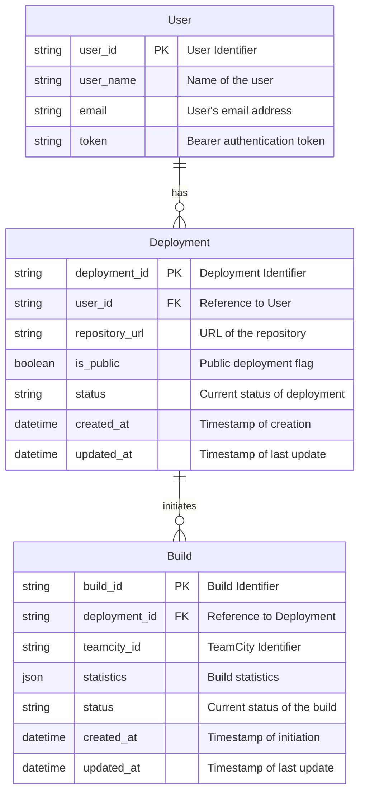
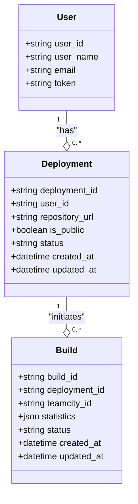

Based on the provided information, it looks like you're developing a deployment management application that interacts with a CI/CD system (TeamCity) to handle deployments of user applications and manage their statuses. To help you outline the entities for your application, I will summarize the key entities along with their properties and relationships. I will also provide a Mermaid ER diagram and class diagram to visualize the design.

### Entity Outline

1. **User**
   - **Properties**:
     - `user_id`: Unique identifier for the user (Primary Key)
     - `user_name`: Name of the user
     - `email`: Email address (optional)
     - `token`: Bearer authentication token (optional)
   
2. **Deployment**
   - **Properties**:
     - `deployment_id`: Unique identifier for the deployment (Primary Key)
     - `user_id`: Reference to the `User` entity (Foreign Key)
     - `repository_url`: URL of the repository being deployed
     - `is_public`: Boolean indicating if the deployment is public
     - `status`: Current status of the deployment (e.g., queued, running, completed, canceled)
     - `created_at`: Timestamp of when the deployment was created
     - `updated_at`: Timestamp of when the deployment was last updated
   
3. **Build**
   - **Properties**:
     - `build_id`: Unique identifier for the build (Primary Key)
     - `deployment_id`: Reference to the `Deployment` entity (Foreign Key)
     - `teamcity_id`: Identifier from TeamCity
     - `statistics`: JSON data containing build statistics (e.g., performance metrics)
     - `status`: Status of the build (e.g., running, success, failure)
     - `created_at`: Timestamp for when the build was initiated
     - `updated_at`: Timestamp for the last update of the build

### Entity Relationship Diagram (ERD)

Here's a Mermaid ER diagram to represent the relationships:

### Class Diagram

Below is a class diagram expressed in Mermaid syntax to highlight the structure of these entities and their properties:

### Conclusion

This outline of entities and their properties, alongside the corresponding ER and class diagrams, provides a structured approach for modeling your deployment management application. You can further build on this design as new requirements arise or as you develop additional features in the application.