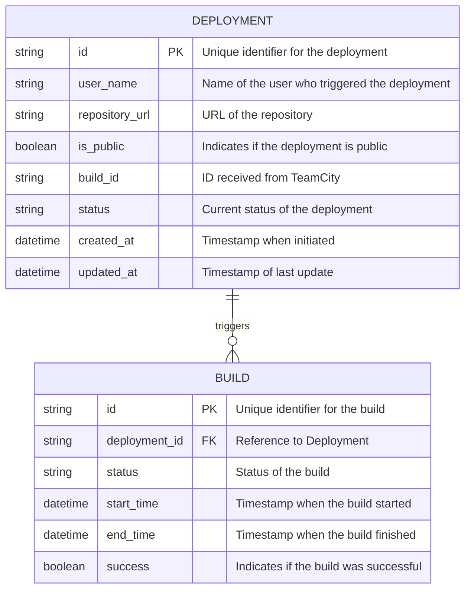

Certainly! Below is a full markdown document outlining the entities for your application prototype, excluding the user diagram.

```markdown
# Application Prototype Entities Outline

## Entity Overview

This document outlines the entities associated with the application prototype that interacts with TeamCity for deployment management. Each entity includes its attributes and relationships.

### Entity: Deployment

- **Properties:**
  - `id`: Unique identifier for the deployment (e.g., UUID)
  - `user_name`: Name of the user who triggered the deployment
  - `repository_url`: URL of the repository for the application being deployed
  - `is_public`: Boolean indicating if the deployment is public
  - `build_id`: ID received from TeamCity for the triggered build
  - `status`: Current status of the deployment (e.g., in_progress, completed, failed)
  - `created_at`: Timestamp when the deployment was initiated
  - `updated_at`: Timestamp for the last update on the deployment status

### Entity: Build

- **Properties:**
  - `id`: Unique identifier for the build (e.g., UUID)
  - `deployment_id`: Foreign key referencing the Deployment entity
  - `status`: Status of the build from TeamCity's response (e.g., queued, running, finished)
  - `start_time`: Timestamp when the build started
  - `end_time`: Timestamp when the build finished
  - `success`: Boolean indicating whether the build was successful

### Entity: User (Optional)

- **Properties:**
  - `id`: Unique identifier for the user (e.g., UUID)
  - `name`: Name of the user
  - `email`: Email address of the user
  - `token`: Authentication token used for API requests to TeamCity
  - `created_at`: Timestamp of when the user was created
  - `updated_at`: Timestamp of the last update to the user's information

### Relationships
- **Deployment** has a one-to-many relationship with **Build**:
  - A single deployment can trigger multiple builds (e.g., for different environments or configurations).
- **User** (if applicable) has a one-to-many relationship with **Deployment**:
  - A user can initiate multiple deployments.

## ER Diagram



## Conclusion

The outlined entities provide a structure for the data flows within the application prototype. It covers the core attributes and relationships necessary for managing deployments and builds effectively, ensuring that the application can monitor and control its operations regarding deployments.
```

Feel free to modify any parts of this document as necessary for your specific use case!