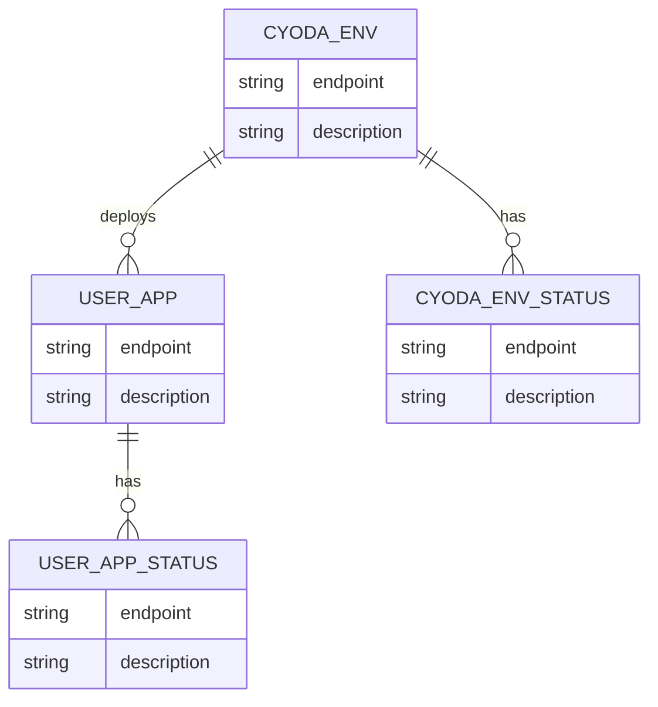

Based on the provided JSON and Markdown data, here are the Mermaid diagrams representing the entities and their relationships in both Entity-Relationship (ER) and Class diagrams. 

### Mermaid Entity-Relationship Diagram

This ER diagram includes `cyoda-env`, `user_app`, `cyoda-env-status`, and `user_app-status` as entities, with relationships to their respective endpoints.



### Mermaid Class Diagram

This Class diagram represents the classes for `cyoda-env`, `user_app`, `cyoda-env-status`, and `user_app-status`, outlining their properties and methods (i.e., API endpoints).

```mermaid
 classDiagram
    class CyodaEnv {
        +deploy()
        +fetchStatistics()
        +checkStatus()
    }

    class UserApp {
        +deploy()
        +fetchStatistics()
        +checkStatus()
    }

    class CyodaEnvStatus {
        +getStatus()
        +getStatistics()
    }

    class UserAppStatus {
        +getStatus()
        +getStatistics()
    }

    CyodaEnv "1" - "0..*" UserApp : deploys
    CyodaEnv "1" - "0..*" CyodaEnvStatus : has
    UserApp "1" - "0..*" UserAppStatus : has
```

### Explanation:

1. **ER Diagram:**
   - Represents entities as boxes, each box includes the endpoints and descriptions.
   - Relationships show how `cyoda-env` can deploy `user_app` and how both `cyoda-env` and `user_app` relate to their respective status entities.

2. **Class Diagram:**
   - Each class corresponds to an entity with methods representing API operations (like deploying or fetching statistics).
   - The relationships depict that a `CyodaEnv` can deploy one or more `UserApp` instances and can have multiple `CyodaEnvStatus`. Similarly, `UserApp` can have multiple statuses as well.

These diagrams provide a visual outline of your application's architecture, focusing on endpoints and relationships between the various components involved in deploying environments and applications.