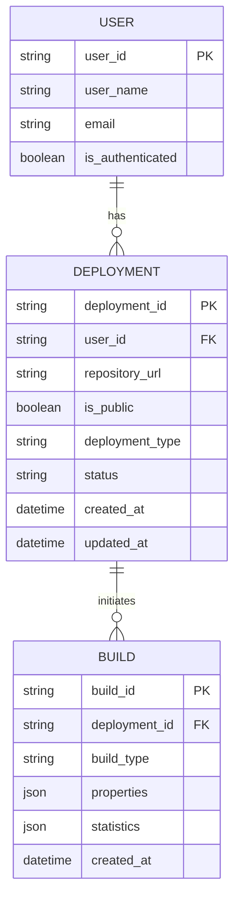

Certainly! Based on the provided code and functional requirements, I can outline some initial entities and their properties for the prototype. Given that your application focuses on deploying environments and user applications via an API interacting with TeamCity, we can define a few primary entities that encapsulate the key aspects of the system.

### Proposed Entities

1. **User**
   - `user_id`: Unique identifier for the user (e.g., UUID)
   - `user_name`: The name of the user
   - `email`: Email address associated with the user
   - `is_authenticated`: Boolean indicating if the user is authenticated

2. **Deployment**
   - `deployment_id`: Unique identifier for the deployment (e.g., Build ID)
   - `user_id`: Foreign key to the User entity
   - `repository_url`: URL of the code repository (for user application deployments)
   - `is_public`: Boolean indicating if the deployment is public
   - `deployment_type`: Enum to distinguish between different deployment types (e.g., "environment", "user_application")
   - `status`: Enum or string to indicate the current status (e.g., "pending", "in_progress", "successful", "failed")
   - `created_at`: Timestamp for when the deployment request was created
   - `updated_at`: Timestamp for when the deployment status was last updated

3. **Build**
   - `build_id`: Unique identifier for the build (from TeamCity)
   - `deployment_id`: Foreign key to the Deployment entity
   - `build_type`: Type of build (e.g., "KubernetesPipeline_CyodaSaas")
   - `properties`: JSON or key-value pairs of properties defined for the build
   - `statistics`: JSON object containing statistics related to the build (runtime, failures, success rate, etc.)
   - `created_at`: Timestamp for when the build was initiated

### Mermaid ER Diagram
Here’s a simple entity-relationship diagram that reflects the above entities and their relationships using Mermaid:

### Explanation
- **User**: This entity represents each individual using your application, tracking authentication status to ensure security.
- **Deployment**: This entity reflects the various deployments initiated by the user and contains critical information related to each deployment request.
- **Build**: This entity is specific to the build process in TeamCity and holds the results and metrics associated with each deployment attempt.

### Next Steps
1. **Database Design**: If you plan to implement a database, you can create tables based on these entities and their relationships.
2. **Authentication**: You may want to implement an authentication mechanism for the user entity to protect the API endpoints.
3. **Error Handling**: Building robust error handling around your API functionalities, such as capturing and relaying errors from TeamCity back to the user.
4. **Expand Functionality**: Based on the requirements and user feedback, you might want to expand on these entities with more properties (like logs, notifications, or environment settings).

Feel free to modify the property names, types, or relationships based on your exact requirements and domain knowledge!