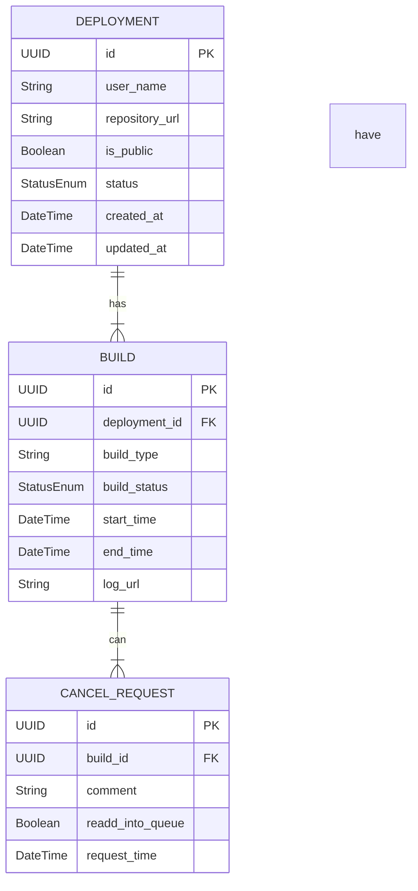

Sure! Below is a comprehensive markdown document outlining the entities for your application prototype. I've focused on the relevant entities: Deployment, Build, and Cancel Request based on your requirements.

```markdown
# Application Prototype Entity Outline

## Entities Overview 

This document outlines the primary entities for the application prototype. The focus is on three main entities: **Deployment**, **Build**, and **Cancel Request**. Each entity includes its properties and relationships to other entities, forming a foundation for the application's database structure.

---

## Entity Definitions

### 1. Deployment

**Description:** Represents the deployment of an application environment.

| Property                    | Type           | Description                                           |
|-----------------------------|----------------|-------------------------------------------------------|
| `id`                        | UUID           | Unique identifier for the deployment.                 |
| `user_name`                | String         | Name of the user who initiated the deployment.        |
| `repository_url`           | String         | URL of the repository containing the application code.|
| `is_public`                | Boolean        | Indicates whether the application is public or private. |
| `status`                   | Enum           | Current status of the deployment (e.g., "In Progress", "Completed", "Failed"). |
| `created_at`               | DateTime       | Timestamp indicating when the deployment was created. |
| `updated_at`               | DateTime       | Timestamp indicating when the deployment was last updated. |

### 2. Build

**Description:** Represents a specific build associated with a deployment.

| Property                    | Type           | Description                                           |
|-----------------------------|----------------|-------------------------------------------------------|
| `id`                        | UUID           | Unique identifier for the build.                      |
| `deployment_id`            | UUID           | Foreign key referencing the associated deployment.     |
| `build_type`               | String         | Type of build (e.g., "KubernetesPipeline_CyodaSaas").|
| `build_status`             | Enum           | Current status of the build (e.g., "Pending", "Running", "Success", "Failure"). |
| `start_time`               | DateTime       | Timestamp indicating when the build started.         |
| `end_time`                 | DateTime       | Timestamp indicating when the build ended.           |
| `log_url`                  | String         | URL to access the build logs for debugging.          |

### 3. Cancel Request

**Description:** Represents a request to cancel a specific build.

| Property                    | Type           | Description                                           |
|-----------------------------|----------------|-------------------------------------------------------|
| `id`                        | UUID           | Unique identifier for the cancel request.            |
| `build_id`                 | UUID           | Foreign key referencing the build to be canceled.    |
| `comment`                  | String         | Optional comment provided by the user for cancellation. |
| `readd_into_queue`         | Boolean        | Indicates whether the canceled build should be re-added to the queue. |
| `request_time`             | DateTime       | Timestamp indicating when the cancellation request was made. |

---

## Relationships

- **Deployment to Build:** 
  - A **Deployment** can have multiple **Builds** associated with it. Each **Build** pertains specifically to a deployment instance.
  
- **Build to Cancel Request:** 
  - Each **Build** can have one or more **Cancel Requests** associated with it; however, a **Cancel Request** pertains to a single **Build**.

---

## Entity-Relationship Diagram (ERD)



---

## Conclusion

This document serves as a structured outline of the primary entities related to your application prototype. Each entity is described with relevant properties, and relationships between the entities are defined to facilitate a deeper understanding of how they interact within the system.
```

Feel free to modify any part or request further details as needed!