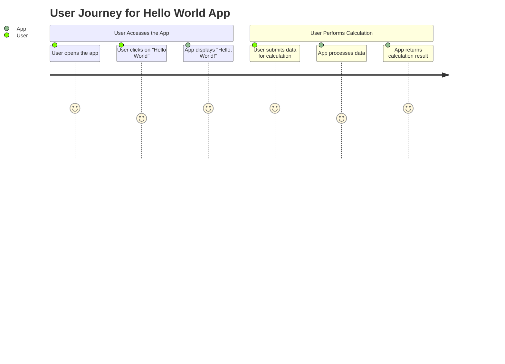
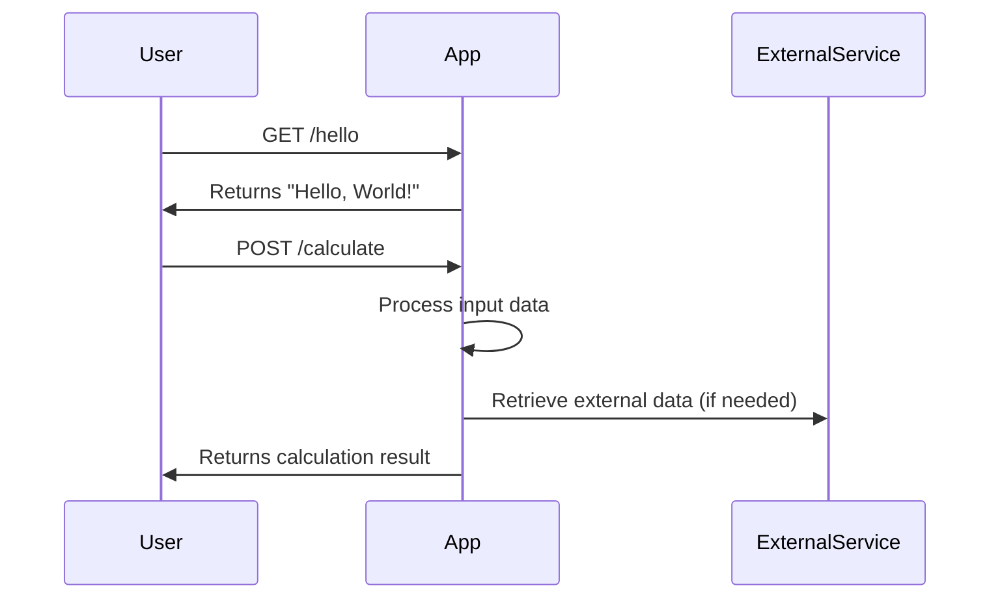

```markdown
# Functional Requirements Document

## API Endpoints

### 1. Hello World Endpoint

- **Endpoint**: `/hello`
- **Method**: GET
- **Description**: Retrieves a simple "Hello, World!" message.
- **Request Format**: None
- **Response Format**: 
  - Content-Type: application/json
  - Response Body:
    ```json
    {
      "message": "Hello, World!"
    }
    ```

### 2. Data Calculation Endpoint

- **Endpoint**: `/calculate`
- **Method**: POST
- **Description**: Accepts input data for calculations and returns the result.
- **Request Format**:
  - Content-Type: application/json
  - Request Body:
    ```json
    {
      "inputData": [number1, number2]
    }
    ```
- **Response Format**: 
  - Content-Type: application/json
  - Response Body:
    ```json
    {
      "result": number
    }
    ```

## Visual Representation of User-App Interaction

### User Journey Diagram



### Sequence Diagram


```