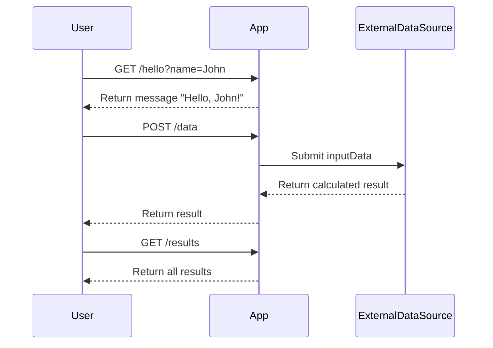

```markdown
# Final Functional Requirements Document

## API Endpoints

### 1. Endpoint: `/hello`
- **Method**: GET
- **Description**: Returns a greeting message that includes the provided name.
- **Request Format**:
  - Query Parameter: `name` (string, required)
  - Example: `/hello?name=John`
- **Response Format**:
  ```json
  {
    "message": "Hello, John!"
  }
  ```

### 2. Endpoint: `/data`
- **Method**: POST
- **Description**: Submits data to an external data source and performs necessary calculations.
- **Request Format**:
  ```json
  {
    "inputData": "string or object containing the data"
  }
  ```
- **Response Format**:
  ```json
  {
    "result": "calculated result or confirmation message",
    "status": "success or error",
    "errorMessage": "if applicable"
  }
  ```

### 3. Endpoint: `/results`
- **Method**: GET
- **Description**: Retrieves results of previous calculations submitted via the POST `/data` endpoint.
- **Request Format**: N/A (No body required)
- **Response Format**:
  ```json
  {
    "results": [
      {
        "id": "unique identifier for the result",
        "data": "result data",
        "timestamp": "timestamp of when the result was created"
      }
    ],
    "status": "success or error",
    "errorMessage": "if applicable"
  }
  ```

## User-App Interaction


```