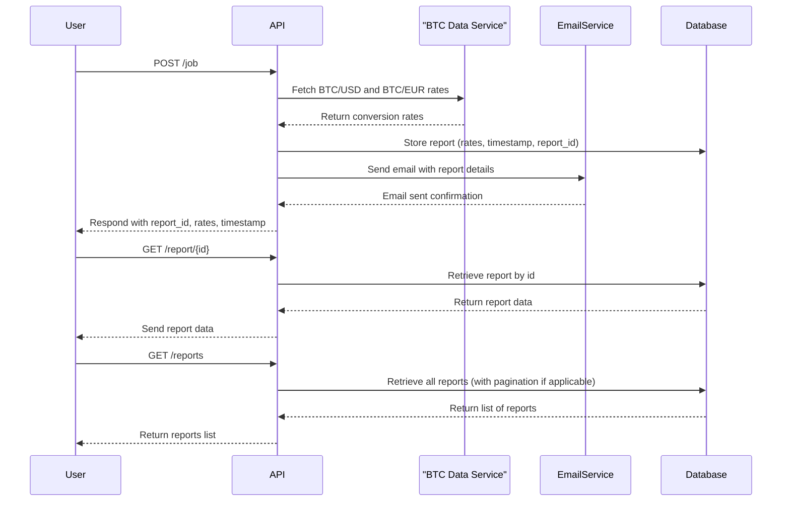
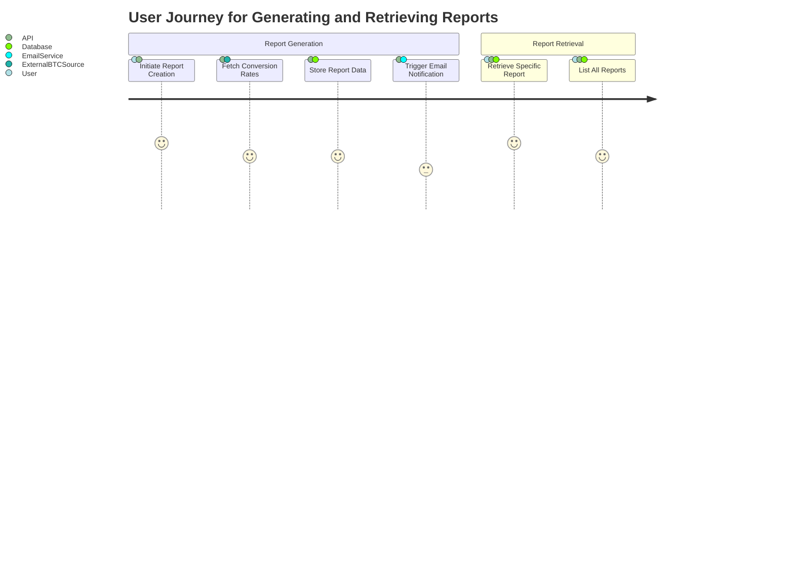

# Functional Requirements for Bitcoin Conversion Report Application

## Overview

The application provides a RESTful API for generating and retrieving Bitcoin conversion reports. It fetches current Bitcoin-to-USD and Bitcoin-to-EUR conversion rates, stores the results, and sends email reports.

## API Endpoints

### 1. POST /job

#### Description
- Initiates the report creation process.
- Fetches the latest Bitcoin conversion rates from an external service.
- Stores the report with relevant data (conversion rates, timestamp, report ID).
- Sends an email with the report details.

#### Request Format
- **Method**: POST  
- **URL**: `/job`  
- **Headers**: `Content-Type: application/json`  
- **Body**: (No payload required)

Example:
```json
{}
```

#### Response Format
- **Status**: 200 OK  
- **Body**:
```json
{
  "report_id": "unique_report_identifier",
  "status": "Report generated and email sent successfully",
  "rates": {
    "BTC_USD": "value_in_usd",
    "BTC_EUR": "value_in_eur"
  },
  "timestamp": "ISO8601_timestamp"
}
```

### 2. GET /report/{id}

#### Description
- Retrieves a specific report by its ID.
- Returns the conversion rate information and report metadata.

#### Request Format
- **Method**: GET  
- **URL**: `/report/{id}`  
- **Headers**: `Accept: application/json`  
- **Path Parameter**: `id` – Unique report identifier

#### Response Format
- **Status**: 200 OK  
- **Body**:
```json
{
  "report_id": "unique_report_identifier",
  "rates": {
    "BTC_USD": "value_in_usd",
    "BTC_EUR": "value_in_eur"
  },
  "timestamp": "ISO8601_timestamp",
  "email_status": "sent"
}
```

If the report is not found:
```json
{
  "error": "Report not found"
}
```

### 3. GET /reports

#### Description
- Retrieves all stored reports. Supports pagination if there are many reports.

#### Request Format
- **Method**: GET  
- **URL**: `/reports`  
- **Headers**: `Accept: application/json`  
- **Optional Query Parameters**:
  - `page`: Page number
  - `size`: Number of reports per page

#### Response Format
- **Status**: 200 OK  
- **Body**:
```json
{
  "reports": [
    {
      "report_id": "unique_report_identifier",
      "rates": {
        "BTC_USD": "value_in_usd",
        "BTC_EUR": "value_in_eur"
      },
      "timestamp": "ISO8601_timestamp"
    }
    // ... additional reports
  ],
  "page": 1,
  "size": 10,
  "total_reports": 100
}
```

## User-App Interaction Diagrams

### Sequence Diagram for Report Generation and Retrieval



### User Journey Diagram

