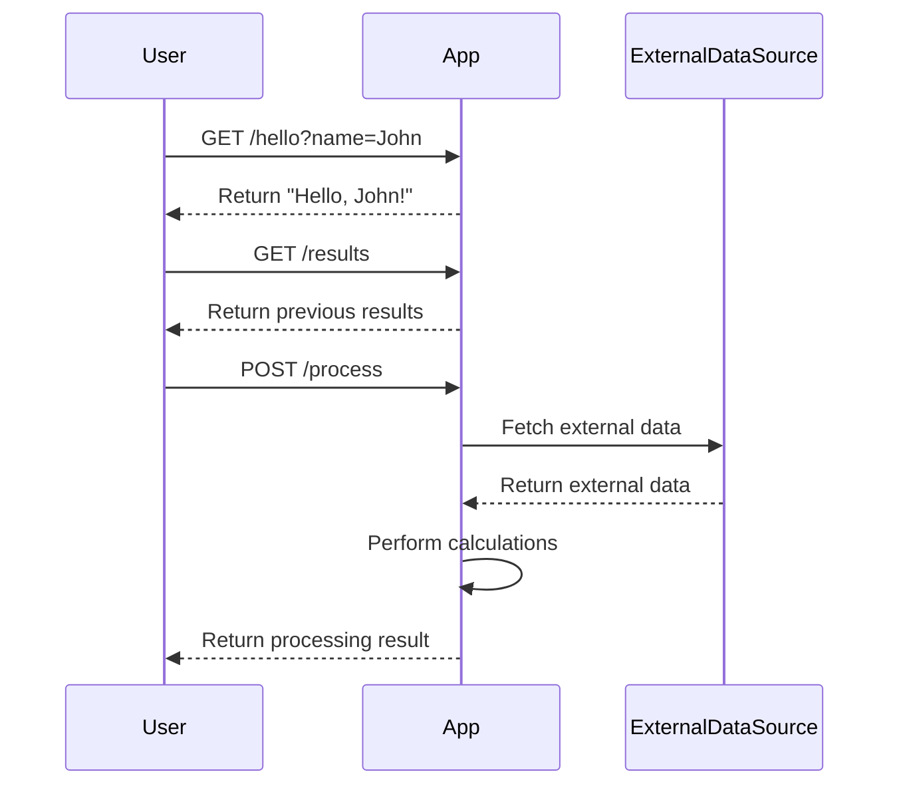
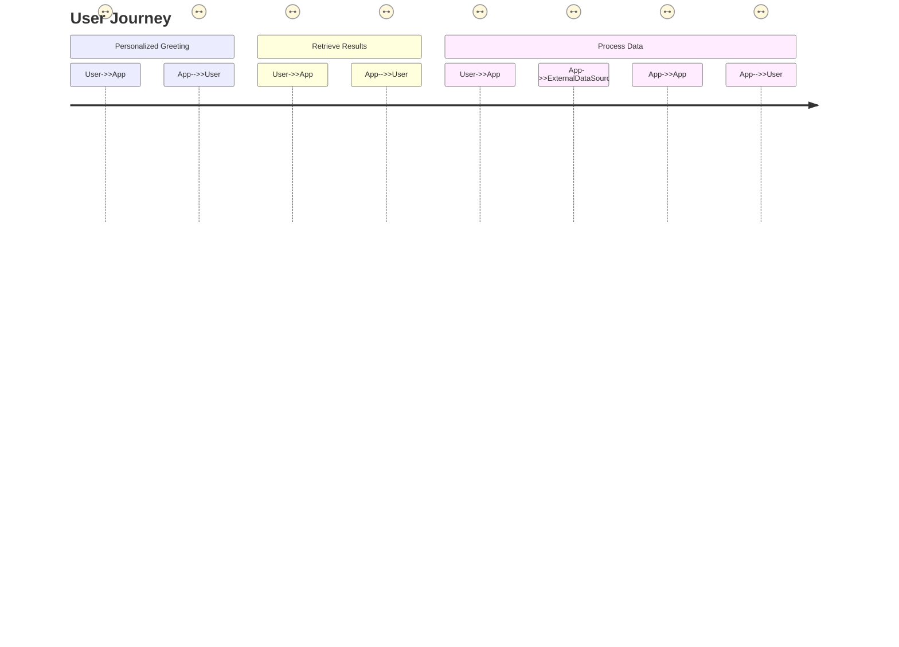

```markdown
# Final Functional Requirements for the Project

## API Endpoints

### 1. **GET /hello**
- **Description**: Return a personalized "Hello, World!" message.
- **Request Format**: 
  - Query parameter: `name` (string, optional)
- **Response Format**: 
  - If `name` is provided:
  ```json
  {
    "message": "Hello, {name}!"
  }
  ```
  - If `name` is not provided:
  ```json
  {
    "message": "Hello, World!"
  }
  ```

### 2. **GET /results**
- **Description**: Retrieve results of previous calculations or data processing.
- **Request Format**: 
  - No parameters required.
- **Response Format**: 
  ```json
  {
    "results": [
      {
        "id": "1",
        "data": "Sample result data",
        "timestamp": "2023-10-01T12:00:00Z"
      },
      ...
    ]
  }
  ```

### 3. **POST /process**
- **Description**: Process external data, perform calculations, and store results.
- **Request Format**: 
  ```json
  {
    "input_data": {
      "field1": "value1",
      "field2": "value2"
    }
  }
  ```
- **Response Format**: 
  ```json
  {
    "status": "success",
    "result_id": "1",
    "message": "Data processed successfully."
  }
  ```

## User-App Interaction




```