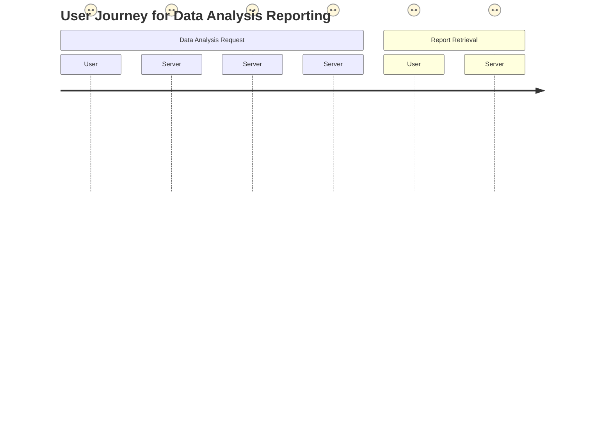
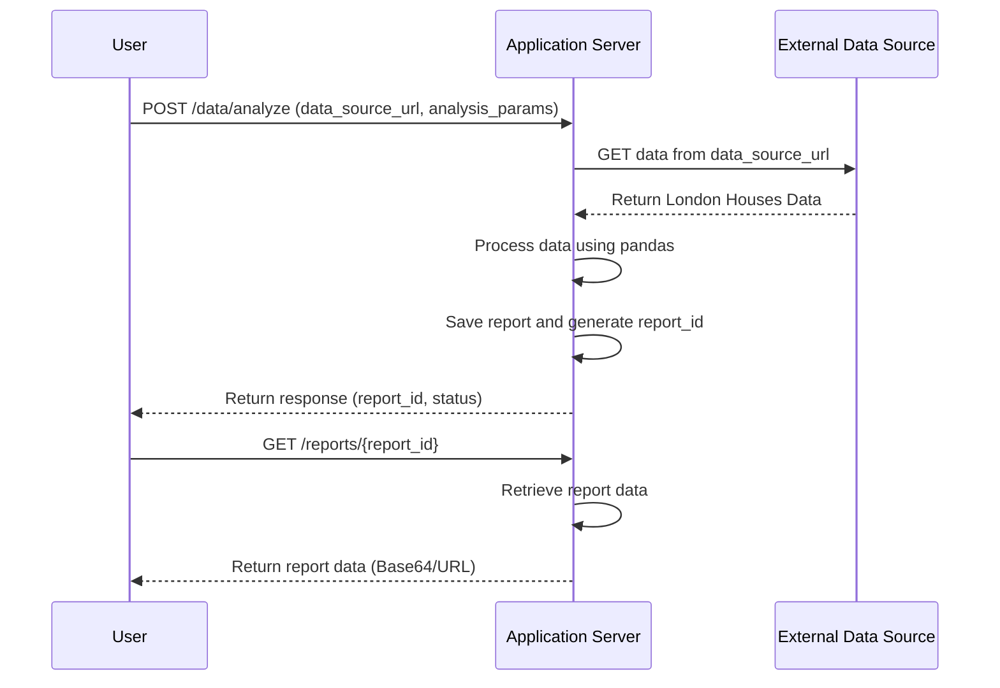

# Final Functional Requirements Document

## Overview
This document outlines the functional requirements for the backend application that will facilitate the downloading, analyzing, and reporting of London Houses Data using a RESTful API.

## API Endpoints

### 1. POST /data/analyze
- **Description**: Retrieves the "London Houses Data" from an external source, performs analysis using pandas, and saves a report.
- **Request Format** (JSON):
  ```json
  {
    "data_source_url": "http://example.com/london_houses.csv",
    "analysis_params": {
      "metrics": ["price", "area", "location"],
      "filters": {"min_price": 100000, "max_price": 1000000}
    }
  }
  ```
- **Response Format** (JSON):
  ```json
  {
    "status": "analysis_completed",
    "report_id": "abc123",
    "message": "Report generated successfully."
  }
  ```
- **Business Logic**:
  - Validate request payload.
  - Make an external HTTP request to download the data.
  - Use pandas to perform the specified analysis.
  - Save the analysis report (formats: CSV, PDF, etc.).
  - Return a unique report identifier.

### 2. GET /reports/{report_id}
- **Description**: Retrieves the previously generated report.
- **Request Format**: URL parameter for `report_id`.
- **Response Format** (JSON):
  ```json
  {
    "report_id": "abc123",
    "status": "available",
    "data": "Base64EncodedContent or URL to download the report"
  }
  ```
- **Business Logic**:
  - Retrieve the report based on `report_id`.
  - Return the report data or a download link.

### 3. GET /reports
- **Description**: Retrieves a list of all generated reports.
- **Request Format**: No payload.
- **Response Format** (JSON):
  ```json
  {
    "reports": [
      {"report_id": "abc123", "status": "available", "generated_at": "2023-10-05T10:00:00Z"},
      {"report_id": "def456", "status": "available", "generated_at": "2023-10-06T11:30:00Z"}
    ]
  }
  ```
- **Business Logic**:
  - List all the report entries from the storage/database.

## User-App Interaction Visualizations

### User Journey



### Sequence Diagram



This document provides a comprehensive overview of the functional requirements necessary for the backend application to meet the specified use case.