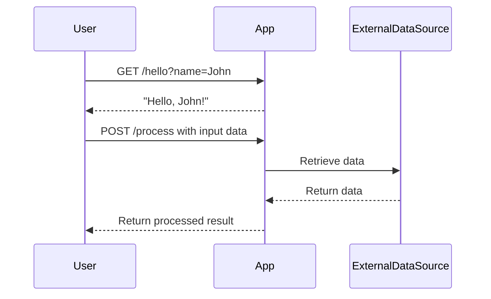

```markdown
# Functional Requirements Document

## API Endpoints

### 1. Hello World Endpoint
- **Endpoint**: `/hello`
- **Method**: GET
- **Description**: Returns a personalized "Hello, {name}!" message.
- **Request Format**: 
  - Query Parameter: `name` (string)
- **Response Format**: 
  - Content-Type: text/plain
  - Body: "Hello, {name}!"

### 2. Data Processing Endpoint
- **Endpoint**: `/process`
- **Method**: POST
- **Description**: Accepts data for processing and returns the result. This may involve external data source interaction or calculations.
- **Request Format**: 
  - Content-Type: application/json
  - Body: 
    ```json
    {
      "input_data": "your_data_here"
    }
    ```
- **Response Format**: 
  - Content-Type: application/json
  - Body: 
    ```json
    {
      "result": "processed_result_here"
    }
    ```

## User-App Interaction Diagram


```

This document is the final version of the functional requirements, including the confirmed API endpoints and user interaction diagram.