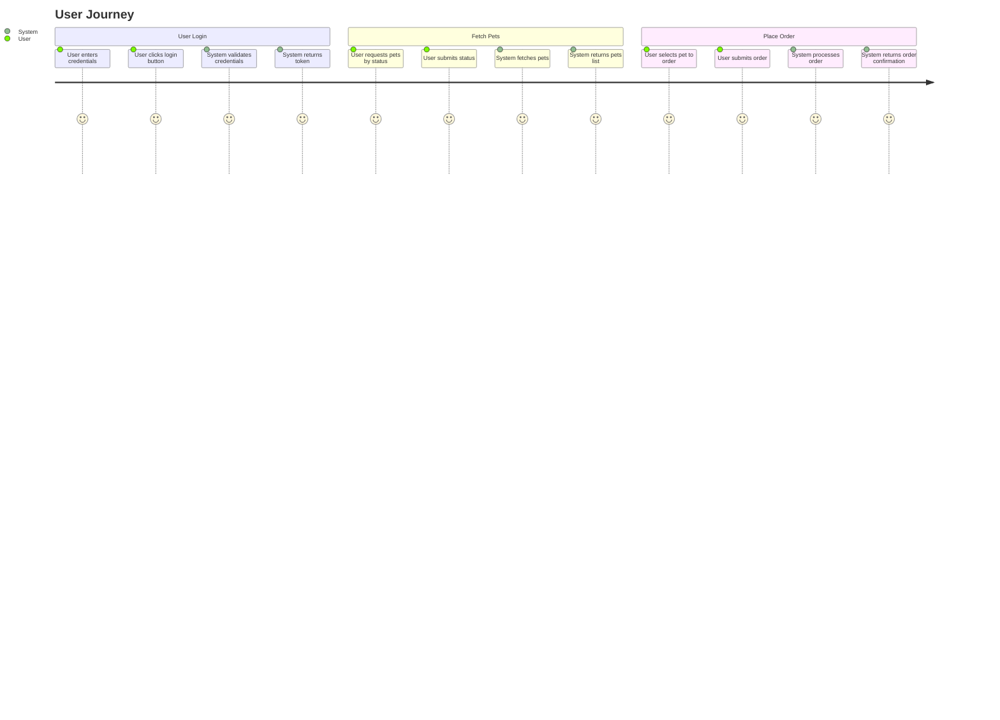
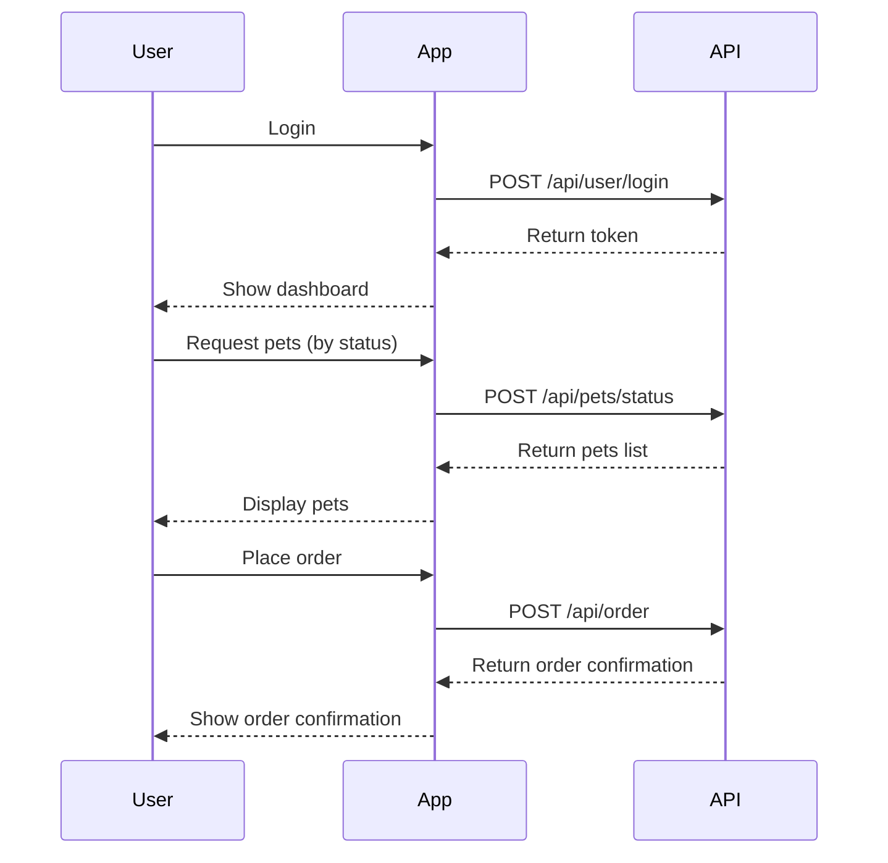

```markdown
# Final Functional Requirements Document

## API Endpoints

### 1. Fetch Pets by Status
- **Endpoint**: `/api/pets/status`
- **Method**: POST
- **Description**: Retrieves a list of pets based on their status.
- **Request Format**:
    ```json
    {
        "status": ["available", "pending", "sold"]
    }
    ```
- **Response Format**:
    ```json
    {
        "pets": [
            {
                "id": 1,
                "name": "doggie",
                "status": "available"
            }
            // Additional pets...
        ]
    }
    ```

### 2. Fetch Pets by Tags
- **Endpoint**: `/api/pets/tags`
- **Method**: POST
- **Description**: Retrieves a list of pets filtered by specified tags.
- **Request Format**:
    ```json
    {
        "tags": ["tag1", "tag2"]
    }
    ```
- **Response Format**:
    ```json
    {
        "pets": [
            {
                "id": 2,
                "name": "kitten",
                "tags": ["tag1"]
            }
            // Additional pets...
        ]
    }
    ```

### 3. Get Pet by ID
- **Endpoint**: `/api/pets/{petId}`
- **Method**: POST
- **Description**: Retrieves detailed information about a specific pet by its ID.
- **Request Format**:
    ```json
    {
        "petId": 1
    }
    ```
- **Response Format**:
    ```json
    {
        "id": 1,
        "name": "doggie",
        "status": "available"
    }
    ```

### 4. Place Order for a Pet
- **Endpoint**: `/api/order`
- **Method**: POST
- **Description**: Places an order for a specified pet.
- **Request Format**:
    ```json
    {
        "petId": 1,
        "quantity": 1
    }
    ```
- **Response Format**:
    ```json
    {
        "orderId": 123,
        "status": "placed"
    }
    ```

### 5. User Login
- **Endpoint**: `/api/user/login`
- **Method**: POST
- **Description**: Authenticates a user and returns a session token.
- **Request Format**:
    ```json
    {
        "username": "user1",
        "password": "password"
    }
    ```
- **Response Format**:
    ```json
    {
        "token": "abc123"
    }
    ```

## User-App Interaction

### User Journey Diagram


### Sequence Diagram

```