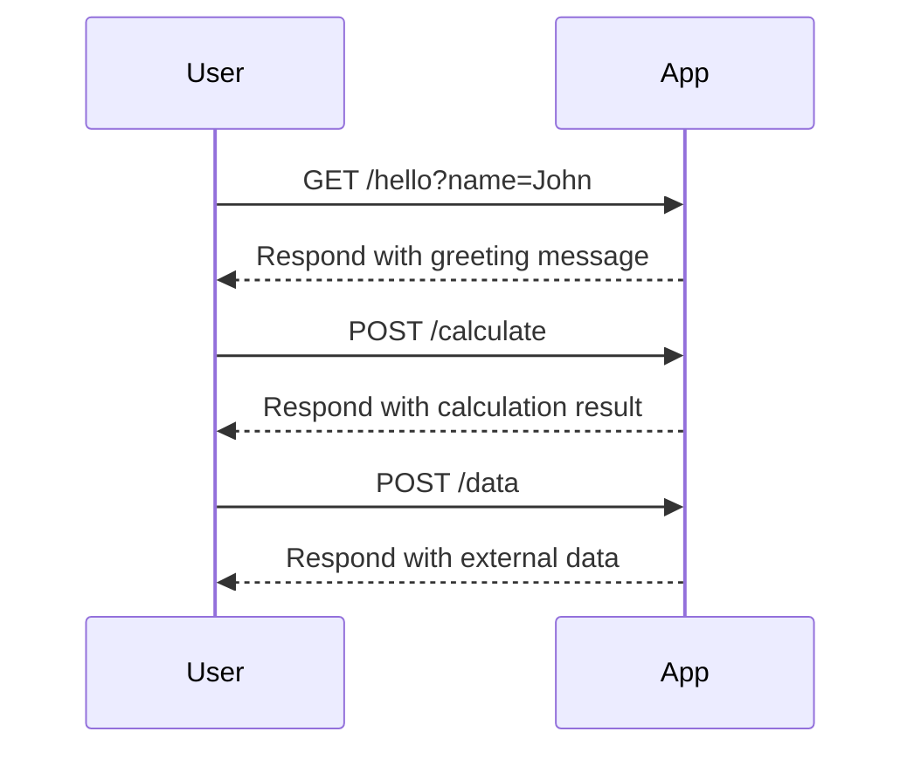
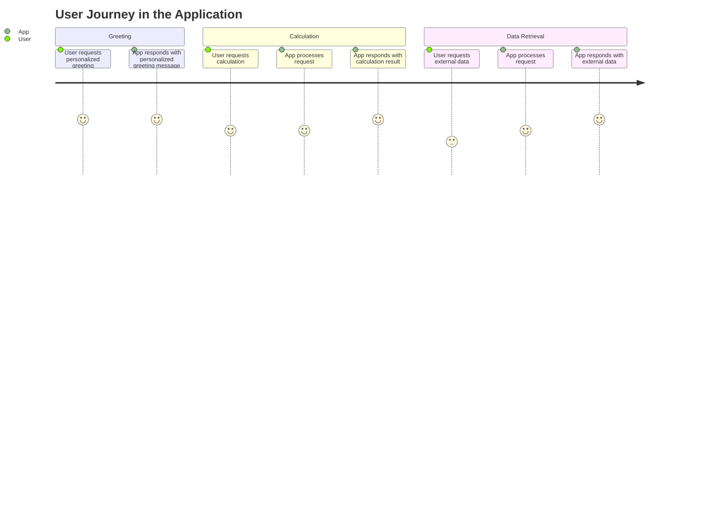

```markdown
# Functional Requirements Document

## API Endpoints

### 1. GET /hello
- **Description**: Retrieves a personalized greeting message.
- **Request Format**: 
  - Method: GET
  - Query Parameter: `name` (string) - The name of the person to greet.
- **Response Format**: 
  - Content-Type: application/json
  - Example Request: 
    ```
    GET /hello?name=John
    ```
  - Example Response:
    ```json
    {
        "message": "Hello, John!"
    }
    ```

### 2. POST /calculate
- **Description**: Performs a calculation based on provided input and retrieves external data if necessary.
- **Request Format**: 
  - Method: POST
  - Content-Type: application/json
  - Example Request:
    ```json
    {
        "operation": "add",
        "numbers": [1, 2]
    }
    ```
- **Response Format**: 
  - Content-Type: application/json
  - Example Response:
    ```json
    {
        "result": 3
    }
    ```

### 3. POST /data
- **Description**: Fetches data from an external source and processes it.
- **Request Format**: 
  - Method: POST
  - Content-Type: application/json
  - Example Request:
    ```json
    {
        "query": "SELECT * FROM users"
    }
    ```
- **Response Format**: 
  - Content-Type: application/json
  - Example Response:
    ```json
    {
        "data": [
            {
                "id": 1,
                "name": "John Doe"
            },
            {
                "id": 2,
                "name": "Jane Doe"
            }
        ]
    }
    ```

## User-App Interaction Diagram




```