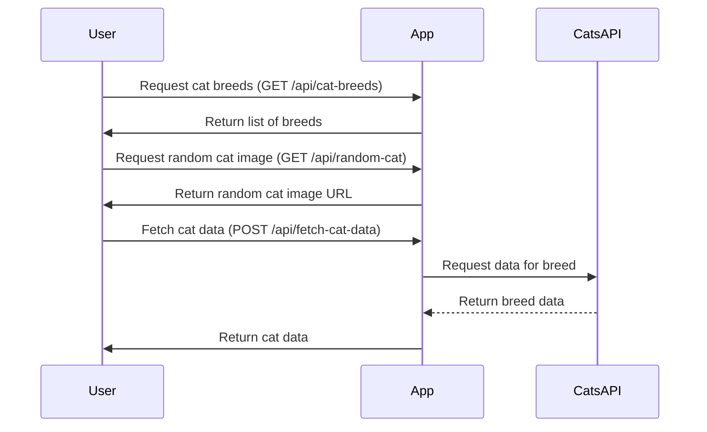

```markdown
# Final Functional Requirements for Cats API Application

## API Endpoints

### 1. Get Cat Breeds
- **Endpoint**: `/api/cat-breeds`
- **Method**: GET
- **Description**: Retrieves a list of available cat breeds.
- **Request Format**: None
- **Response Format**:
    ```json
    {
        "breeds": [
            {
                "id": "1",
                "name": "Siamese"
            },
            {
                "id": "2",
                "name": "Persian"
            }
            // Additional breeds...
        ]
    }
    ```

### 2. Get Random Cat Image
- **Endpoint**: `/api/random-cat`
- **Method**: GET
- **Description**: Retrieves a random cat image.
- **Request Format**: None
- **Response Format**:
    ```json
    {
        "image_url": "https://example.com/cat.jpg"
    }
    ```

### 3. Fetch Cat Data
- **Endpoint**: `/api/fetch-cat-data`
- **Method**: POST
- **Description**: Fetches cat data from the external Cats API.
- **Request Format**:
    ```json
    {
        "breed": "Siamese"
    }
    ```
- **Response Format**:
    ```json
    {
        "data": {
            "breed": "Siamese",
            "description": "Siamese cats are known for their striking blue almond-shaped eyes...",
            "images": [
                "https://example.com/cat1.jpg",
                "https://example.com/cat2.jpg"
            ]
        }
    }
    ```

## User-App Interaction


```