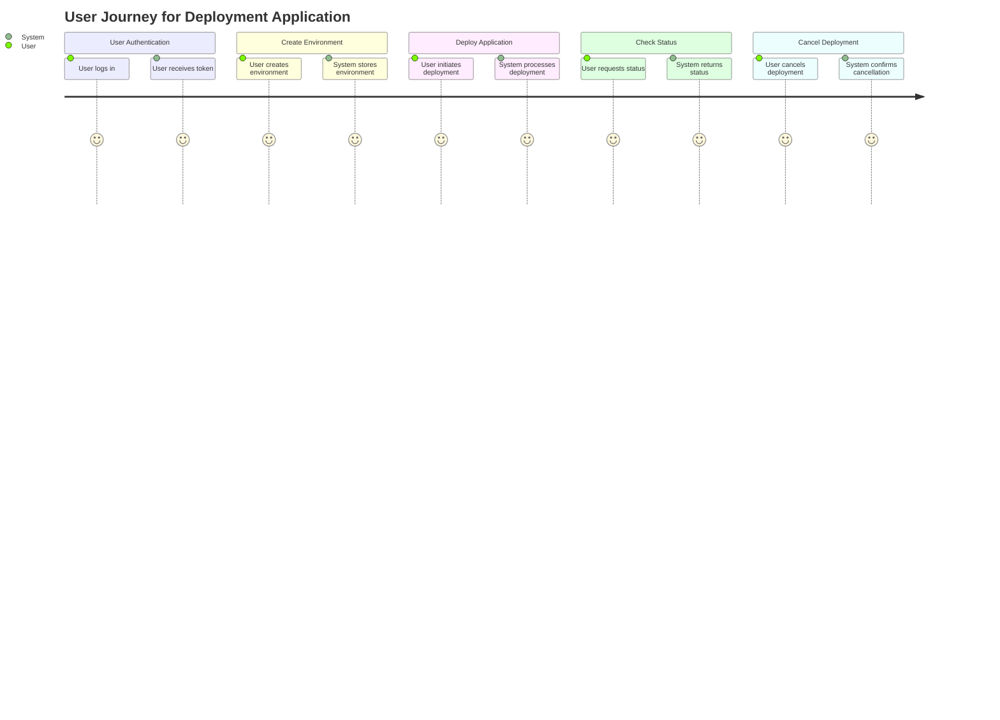
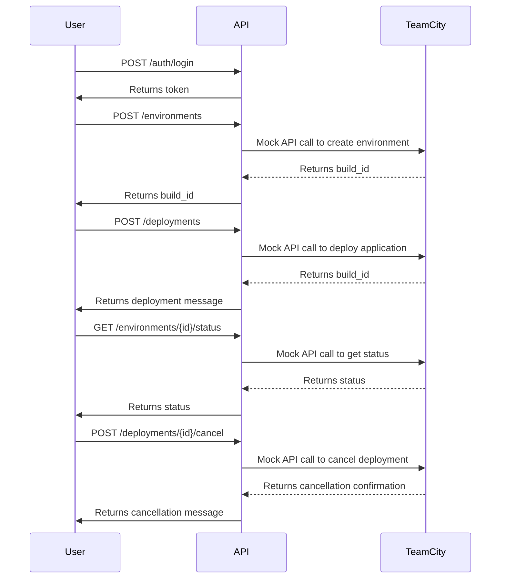

Here are the well-formatted final functional requirements for your backend application, including user stories, API endpoints, request/response formats, and visual representations:

---

## Functional Requirements for Deployment Application

### User Stories

1. **User Authentication**
   - **As a user**, I want to authenticate myself so that I can access the deployment features securely.
   - **API Endpoint**: `POST /auth/login`
     - **Request**: 
       ```json
       {
         "username": "string",
         "password": "string"
       }
       ```
     - **Response**: 
       ```json
       {
         "token": "string",
         "message": "Login successful"
       }
       ```

2. **Create Environment**
   - **As a user**, I want to create a deployment environment so that I can manage my applications.
   - **API Endpoint**: `POST /environments`
     - **Request**: 
       ```json
       {
         "user_name": "string",
         "env_config": "string"
       }
       ```
     - **Response**: 
       ```json
       {
         "build_id": "mock_build_id",
         "message": "Environment created successfully"
       }
       ```

3. **Deploy Application**
   - **As a user**, I want to deploy my application to a specified environment.
   - **API Endpoint**: `POST /deployments`
     - **Request**: 
       ```json
       {
         "repository_url": "string",
         "is_public": "boolean"
       }
       ```
     - **Response**: 
       ```json
       {
         "build_id": "mock_build_id",
         "message": "Deployment initiated"
       }
       ```

4. **Get Environment Status**
   - **As a user**, I want to check the status of my deployment environment.
   - **API Endpoint**: `GET /environments/{id}/status`
     - **Response**: 
       ```json
       {
         "status": "string",
         "repository_url": "string",
         "is_public": "boolean"
       }
       ```

5. **Get Environment Statistics**
   - **As a user**, I want to retrieve statistics for my deployment environment.
   - **API Endpoint**: `GET /environments/{id}/statistics`
     - **Response**: 
       ```json
       {
         "statistics": "object"
       }
       ```

6. **Cancel Deployment**
   - **As a user**, I want to cancel an ongoing deployment.
   - **API Endpoint**: `POST /deployments/{id}/cancel`
     - **Request**: 
       ```json
       {
         "comment": "string",
         "readdIntoQueue": "boolean"
       }
       ```
     - **Response**: 
       ```json
       {
         "message": "Build canceled successfully"
       }
       ```

### Visual Representation

#### User Journey Diagram



#### Sequence Diagram for Deployment Process



---

This document outlines the necessary functional requirements for your application and provides clear guidance for development. Let me know if you need any further assistance or modifications!